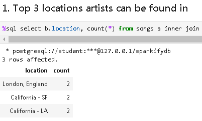
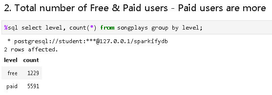
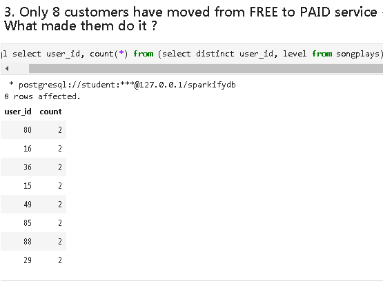
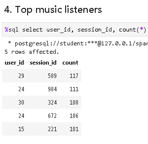
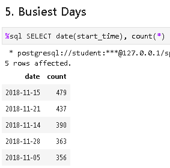
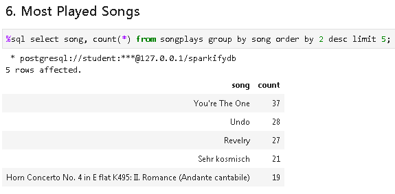
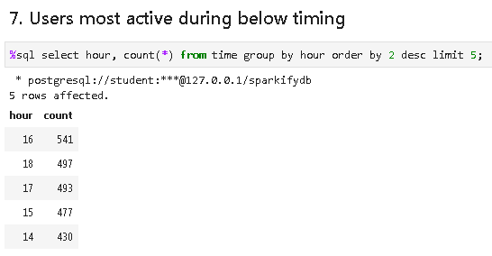

#  Data Modeling with Postgres ( Sparkify )

> ## Udacity Data Engineer Nano Degree Project 2a

### Introduction

The goal of this project is to build a PostgreSQL database utilizing the data on users activity and songs metadata. 
Building the database helps us do complex analytics regarding users activity as well as song play analysis.

### Project Goal  
1. Data : Review, Analyze Datasets  
2. Setup Database  
3. Setup ETL to the Postgres table  
4. Analytics Queries

#### 1. Data   
Data is a subset of real data from the Million Song Dataset.  

##### Gather 
Below two datasets are provided by udacity,  
**1. Song Dataset**  
	Each file is in JSON format and contains metadata about a song and the artist of that song.  

**2. Log Dataset**
	Is a json file containing activity logs from a music streaming app  

##### Assessment
**Song dataset**  
```
<class 'pandas.core.frame.DataFrame'>
RangeIndex: 1 entries, 0 to 0
Data columns (total 10 columns):
artist_id           1 non-null object
artist_latitude     0 non-null float64
artist_location     1 non-null object
artist_longitude    0 non-null float64
artist_name         1 non-null object
duration            1 non-null float64
num_songs           1 non-null int64
song_id             1 non-null object
title               1 non-null object
year                1 non-null int64
dtypes: float64(3), int64(2), object(5)
memory usage: 160.0+ bytes
```

**Log Dataset**  
```
<class 'pandas.core.frame.DataFrame'>
RangeIndex: 457 entries, 0 to 456
Data columns (total 18 columns):
artist           390 non-null object
auth             457 non-null object
firstName        445 non-null object
gender           445 non-null object
itemInSession    457 non-null int64
lastName         445 non-null object
length           390 non-null float64
level            457 non-null object
location         445 non-null object
method           457 non-null object
page             457 non-null object
registration     445 non-null float64
sessionId        457 non-null int64
song             390 non-null object
status           457 non-null int64
ts               457 non-null int64
userAgent        445 non-null object
userId           457 non-null object
dtypes: float64(2), int64(4), object(12)
memory usage: 64.3+ KB
```

**Quality**  
1. LogDataset : userID - Found users with empty string '', firstName as None  
2. LogDataset : Major of the artist_id & song_id is null
3. Artists table doesn't have list of all the artists found in log
4. Songs table doesn't have all the songs found in log
5. LogDataset : Logs are ordered by timestamp, so they need to be sorted. This enables latest user level to be updated in the users table   

**Tidiness**  
1. LogDataset : ts : timestamp column as int64 needs to converted to timestamp  
2. SongPlays table : Add new column songplay_id as serial ( auto-increment )   
3. user : table : Adding column ts  
4. songplays : table : Adding columns itemInSession, song, artist  

#### 2. Setup Database
Below is the schema for SongPlay Analysis. Its a star schema optimized for queries.

##### Fact Table
1. **songplays** - records in log data associated with song plays i.e. records with page NextSong
    - songplay_id(SERIAL PRIMARY KEY), start_time, user_id, level, song_id, artist_id, session_id, location, user_agent
##### Dimension Tables
2. **users** - users in the app
    - user_id(INT PRIMARY KEY), first_name, last_name, gender, level
3. **songs** - songs in music database  
    - song_id(TEXT PRIMARY KEY), title, artist_id, year, duration
4. **artists** - artists in music database
    - artist_id(TEXT PRIMARY KEY), name, location, latitude, longitude
5. **time** - timestamps of records in songplays broken down into specific units
    - start_time(TIMESTAMP PRIMARY KEY), hour, day, week, month, year, weekday

#### 3. Setup ETL to the Postgres table  
Below steps were followed to setup ETL pipeline
1. Create tables
```
%run ./create_tables.py
```
2. Check & Test tables using test.ipynb jupyter notebook

3. Perform the ETL pipeline testing in etl.ipynb

4. Rerun : create_tables.py

5. Run etl.py
```
%run ./etl.py
```

**INSERT setups** :    
1. Inserts for below tables are written in such a way to ignore/update rows which already exists.  
a. *users* : ON CONFLICT (user_id) DO UPDATE SET first_name = EXCLUDED.first_name, last_name = EXCLUDED.last_name, gender = EXCLUDED.gender, level = EXCLUDED.level, ts = EXCLUDED.ts;
b. *songs* : ON CONFLICT (song_id) DO NOTHING - On rerun of etl.py, duplicate rows will not be inserted.  
c. *artists* : ON CONFLICT (artist_id) DO UPDATE SET name = EXCLUDED.name, location = EXCLUDED.location, latitude = EXCLUDED.latitude, longitude = EXCLUDED.longitude;  
> Note that the special excluded table is used to reference values originally proposed for insertion  

Since PK to be inserted already exists, existing columns in the table will be updated with new values. 

d. *songplays* : ON CONFLICT DO NOTHING : Since column songplay_id is defined SERIAL ( auto-increment ), so if etl.py is rerun, rows will be again inserted using new primary key value.  

**After executing etl.py**  
Below show the counts
```
SELECT 'All' as info, count(*) FROM songplays 
union all 
SELECT 'Artist is null', count(*) FROM songplays where artist_id is null 
union all 
SELECT 'Song is null', count(*) FROM songplays where song_id is null ;
```
|  info | count |
|----------|:-------------:|
| All |  6820 |
| Artist is null | 6819 |
| Song is null | 6819 |

That one row can be found by using below SQL
```
SELECT a.songplay_id, a.song_id, a.artist_id, b.title, b.duration, c.name 
FROM songplays a inner join songs b on a.song_id = b.song_id 
inner join artists c on a.artist_id = c.artist_id 
where a.song_id is not null and a.artist_id is not null;
```
|songplay_id | song_id | artist_id | title | duration | name |
|-----------|-------|-------|-------|--------|-------|
|5989 | SOZCTXZ12AB0182364 | AR5KOSW1187FB35FF4 | Setanta matins | 269.58322 | Elena


#### 4. Analytics Queries
All the below queries can be executed from sparkify-analytic-queries.ipynb 
1. Top 3 locations artists can be found in
```
%sql select b.location, count(*) from songs a inner join artists b on a.artist_id = b.artist_id where location != '' group by b.location order by 2 desc limit 3;
```
  

2. Total number of Free & Paid users - Paid users are more
```
%sql select level, count(*) from songplays group by level;
```
  

3. Only 8 customers have moved from FREE to PAID service - Further analysis can be done on this front. What made them do it ?
```
%sql select user_id, count(*) from (select distinct user_id, level from songplays)a group by user_id having count(*) > 1 order by 2 desc limit 10;

%sql select * from songplays where user_id = '80' and level = 'free' order by start_time desc limit 2;
%sql select * from songplays where user_id = '80' and level = 'paid' order by start_time asc limit 2;
%sql select * from users where user_id in (80, 16, 36, 15, 49, 85, 88, 29);
%sql select * from songplays where user_id in ('80') order by start_time asc limit 25;

```
  

4. Top music listeners   
```
%sql select user_id, session_id, count(*) from songplays group by user_id, session_id order by 3 desc limit 5; 
```

  

5. Busiest Days
```
%sql SELECT date(start_time), count(*) FROM songplays group by date(start_time) order by 2 desc LIMIT 5;
```
  

6. Most played songs
```
%sql select song, count(*) from songplays group by song order by 2 desc limit 5;
```
  

7. Users most active during below timing
```
%sql select hour, count(*) from time group by hour order by 2 desc limit 5;
```
  

### Work notes
1. This took some time
```
# https://pandas.pydata.org/pandas-docs/stable/reference/api/pandas.Series.dt.html
# Googled series.dt and got the below link
# This helped https://pandas.pydata.org/pandas-docs/stable/reference/series.html#time-series-related
# Search for Datetime properties
t['ts'] = pd.to_datetime(t['ts'], unit='ms')
t.head()
print(t.ts[0], t.ts.dt.hour[0], t.ts.dt.day[0] , t.ts.dt.dayofweek[0] , t.ts.dt.month[0], t.ts.dt.year[0] , t.ts.dt.weekday[0])
```
2. Columns (song_id, artist_id) are alpha-numeric. user_id column contains '', so remove those rows before loading the table.

3. When you assign a panda cell as below, but when the data is inserted into table. Since we see it as null/NotANumber, we try querying as "where col is null", we don't find it. Because its stored as 'NaN' text value.
```
df_uc.loc[cnt, 'userId'] = np.nan
```
Need to assign panda cell as <class 'NoneType'> like below
```
df_uc.loc[cnt, 'userId'] = None
```
4. Weird error : AttributeError & NameError

```
---------------------------------------------------------------------------
AttributeError                            Traceback (most recent call last)
/home/workspace/hello.py in <module>()
      6 print('hello world!')
      7 print(artist_table_insert)
----> 8 print(sql_queries.hi)
      9 print(sql_queries.song_select)

AttributeError: module 'sql_queries' has no attribute 'hi'

---------------------------------------------------------------------------
NameError                                 Traceback (most recent call last)
/home/workspace/hello.py in <module>()
      5 print('hello world!')
      6 print(artist_table_insert)
----> 7 print(hi)
      8 print(song_select)

NameError: name 'hi' is not defined
```

sql_queries.py has lots of variables but below is the one that was not getting imported.
```
song_select = ("""
SELECT a.song_id, a.artist_id 
FROM songs a INNER JOIN artists b 
ON a.artist_id = b.artist_id 
WHERE a.title = %s AND b.name = %s AND a.duration = %s ;
""")
```

hello.py contains
```
from sql_queries import *

print(artist_table_insert)
print(song_select)
```
So when i ran below command, only artist_table_insert got printed. 
```
%run ./hello.py
```

After going through lots of things like below(which didn't work as well)
```
import sql_queries
print(sql_queries.song_select)
```
This helped a bit in testing hello.py but etl.ipynb still has the issue
```
from sql_queries import *
import sql_queries
from importlib import reload
reload(sql_queries)

print(sql_queries.artist_table_insert)
print(sql_queries.song_select)
```

Not really sure, whats happening. Again Time burn

5. Postgres error : current transaction is aborted, commands ignored until end of transaction block
```
Summary:

The reason you get this error is because you have entered a transaction and one of your SQL Queries failed, and you gobbled up that failure and ignored it. But that wasn't enough, THEN you used that same connection, using the SAME TRANSACTION to run another query. The exception gets thrown on the second, correctly formed query because you are using a broken transaction to do additional work. Postgresql by default stops you from doing this.

Resolution : 
Verified the SELECT query and restarted from the beginning etl.ipynb

Other resolutions : rollback
```

6. Postgres error : There is 1 other session using the database.
```
OperationalError: database "sparkifydb" is being accessed by other users
DETAIL:  There is 1 other session using the database.
```

Workaround, i had found out to get going is,
**Kernel Restart** : Below is the workaround for rerunning create_tables.py.
0. Check the users
```
%sql SELECT * FROM pg_stat_activity;
```
1. Go to etl.pynb to the end execute conn.close()
2. Execute above pg_terminate_backend statement
```
%sql select pg_terminate_backend(pid) from pg_stat_activity where datname in('studentdb','sparkifydb');
```
3. Run below exit
exit()
4. Rerun create_tables.py
```
%run ./create_tables.py
```

(or)

Do the below after opening the python console
Kernel -> Restart Kernel and clear

7. Update code in etl.ipynb to have try..catch like below 
```
try:    
    cur.execute(song_table_insert, song_data)
    conn.commit()
except Exception as e:
    conn.rollback()
    print("{} : Error Message : {}".format('Rolled back', e))
```

8. Environment problem, remember to restart kernel and retest before submitting the project. What i found out after submitting is, sql_queries.py which was executed successfully at last was from memory not fromt the actual file. So, basically submitted error'd file. Which i had found out later.  

### Learnings
1. Good link on [docstrings](https://www.geeksforgeeks.org/python-docstrings/) shared by reviewer
