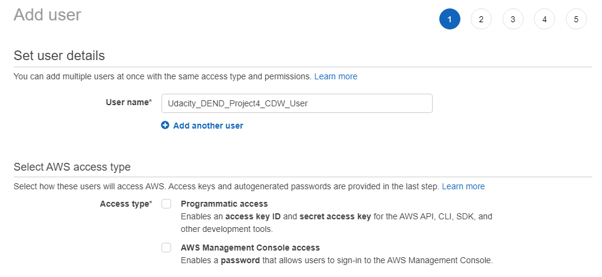
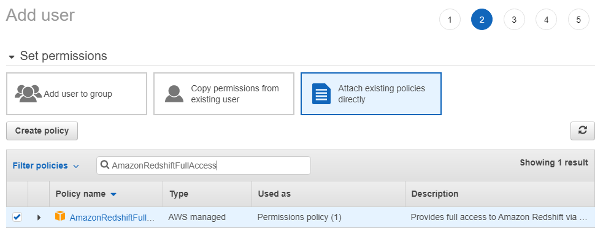
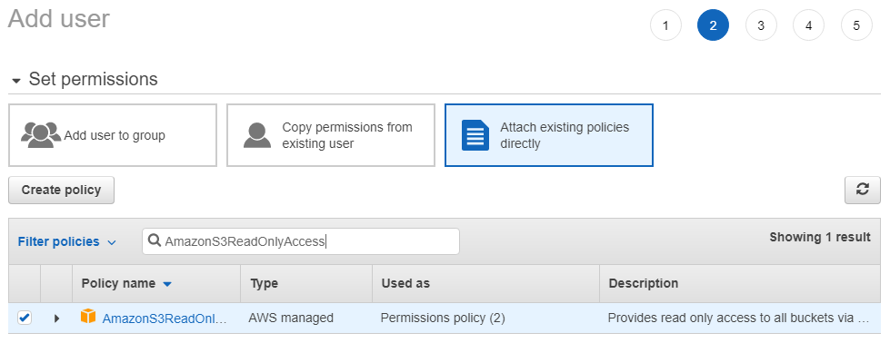
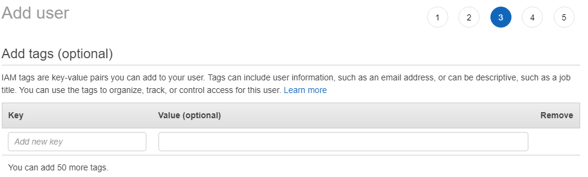
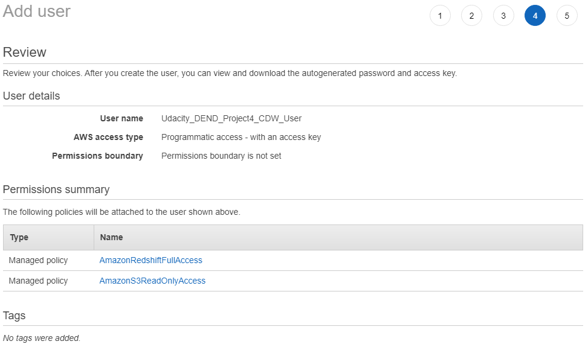
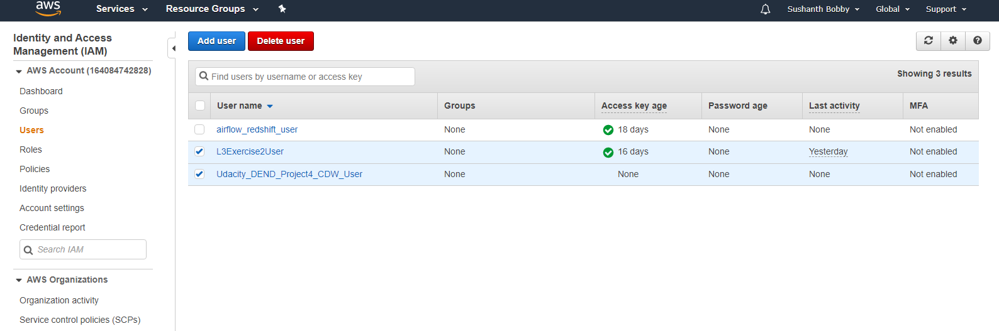
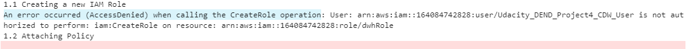
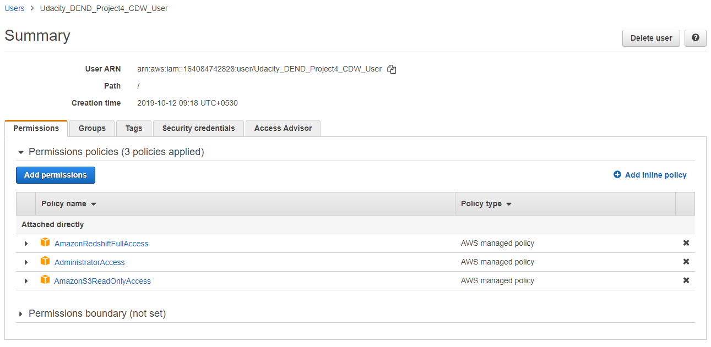

# Create new AWS user

Go to AWS IAM -> Click Add User and follow below steps to create new user

Type in user name & CHECK "Programmatic access" and Click NEXT

Select "Attach existing policies directly", find and SELECT "AmazonRedshiftFullAccess" 

then find and SELECT "AmazonS3ReadOnlyAccess" and Click NEXT

Nothing here. Click NEXT

Review the selections. Click NEXT

Save the access key ID & Secret Access key.
Recommendation : Better to copy key from here and save it in a file rather than download.

User is created

This error occured when creating a role

Above error is resolved by adding "Administrator Access" and removing other two permissions

