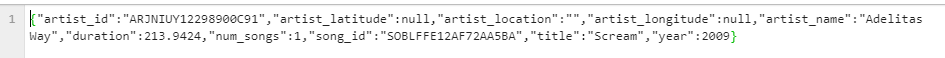
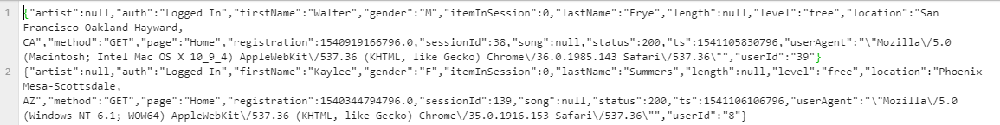
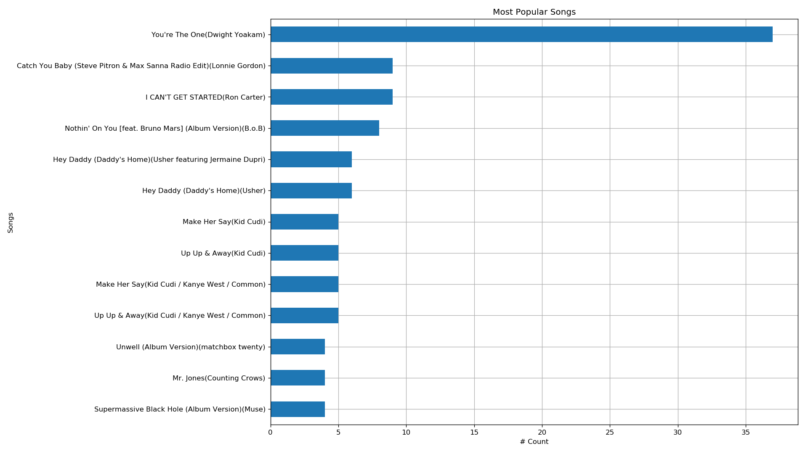
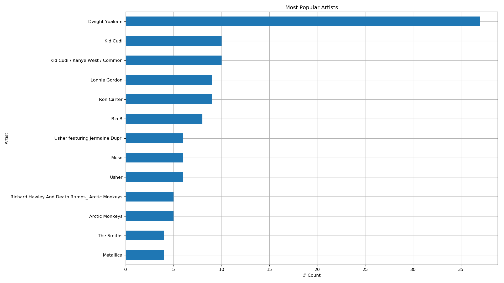
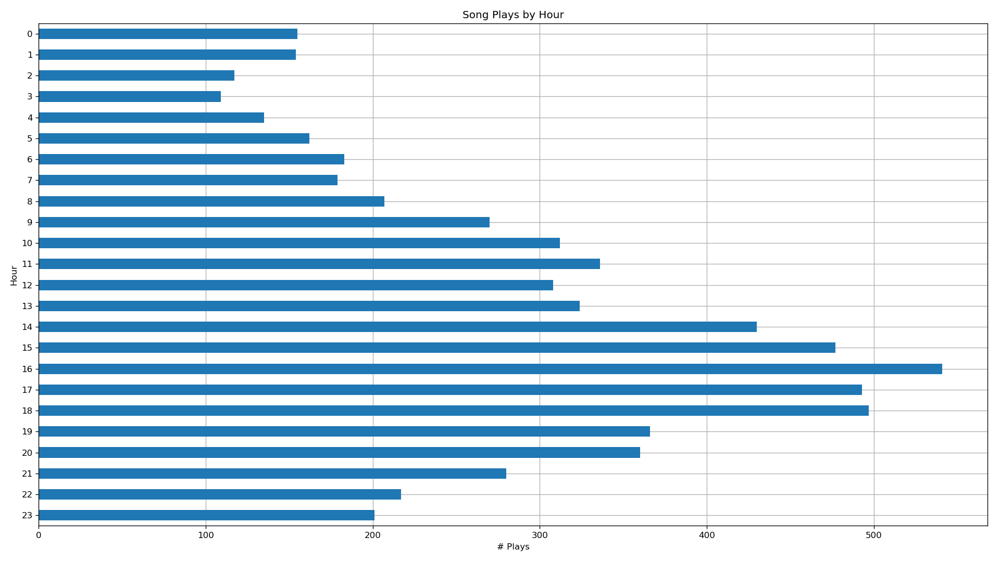
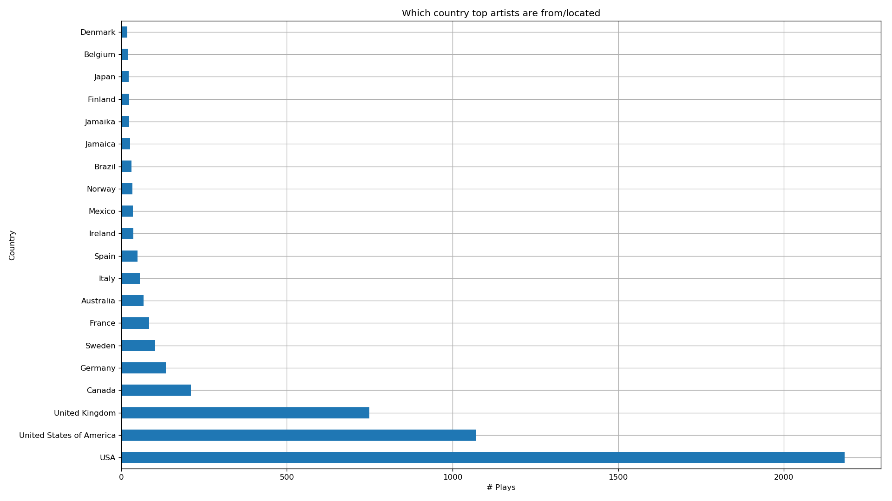
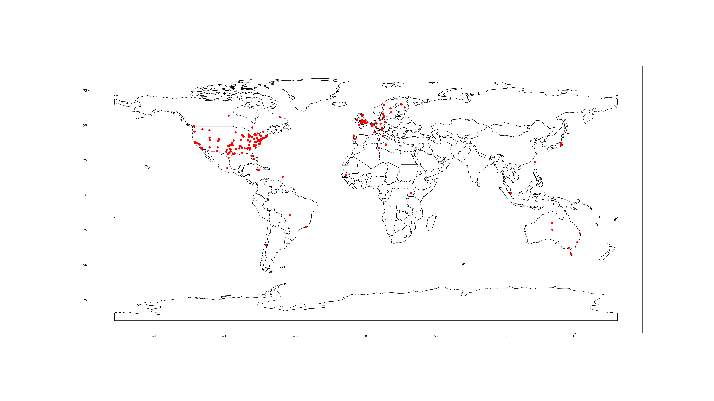

# Cloud Data Warehouses (AWS)

> ## Udacity Data Engineer Nano Degree Project 4

A music streaming startup, Sparkify, has grown their user base and song database and want to move their processes and data onto the cloud. Their data resides in S3, in a directory of JSON logs on user activity on the app, as well as a directory with JSON metadata on the songs in their app.

As their data engineer, you are tasked with building an ETL pipeline that extracts their data from S3, stages them in Redshift, and transforms data into a set of dimensional tables for their analytics team to continue finding insights in what songs their users are listening to. You'll be able to test your database and ETL pipeline by running queries given to you by the analytics team from Sparkify and compare your results with their expected results.

## Project Overview
Build an ETL pipeline for a database hosted on AWS Redshift. Load the table with data from S3 and perform some query analysis.

## Technical Overview
Project is implemented in AWS Cloud and uses following products, 
1. S3 Storage Buckets
2. Redshift

## Goal
1. Review/Analyze datasets from S3 in panda dataframes  
2. Clean datasets  
3. Create new clean datasets for loading redshift staging tables  
4. Launch a redshift cluster and create an IAM role that has read access to S3  
5. Create redshift tables (staging, fact & dimension)  
6. Load staging tables using COPY command  
7. Load fact & dimension tables  via INSERT via SELECT  
8. Prepare query for data analysis  

## How to run

Run below steps one-by-one,  
1. Update the dwh.cfg with KEY, SECRET & KEYSECRET  
2. Create Redshift Cluster  
``` %run ./create_cluster.py```

3. Create Redshift Tables  
```%run ./create_tables.py```

4. Start ETL( Local -> S3 -> Redshift )  
``` %run ./etl.py ```

5. **Manually** run the *Analytics.ipynb*

6. Delete Redshift Cluster  
```%run ./delete_cluster.py```  

## Project step-by-step Walkthrough
### [0. Data Wrangling](#data-wrangling)
### [1. Redshift Cluster Creation](#redshift-cluster-creation)
### [2. Redshift Tables](#redshift-tables)
### [3. ETL](#etl)
### [4. Analytics.ipynb](#Analytics.ipynb)
### [5. Delete Redshift Cluster](#delete-redshift-cluster)

## Detail description on the project steps
### Data Wrangling  
**Gather**  
Input datasets were in below AWS S3 Buckets,
1. Song data: s3://udacity-dend/song_data
2. Log data: s3://udacity-dend/log_data  
  - Log data json path: s3://udacity-dend/log_json_path.json

Both the files were in JSON format but number of records in the file were different like,
1. Song data : Each file had only one record


2. Log data : Each file has multiple records and not 
  

Downloaded and merged all the files from the AWS s3 bucket for assessment. Below are the files,
1. merged_song_data.json
2. merged_log_data.json

Below python program was used to gather data,
```
S3Download.py
```

**Assessment**  
Initially, project seemed like just normal ETL to cloud. But when assessing the dataset and wondering why did they give artist_location along with latitude & longitude. Had an idea why not plot the locations in the World Map using Geo Co-ordinates. Started to further analyze the location information in the song dataset as it has more location details than log. Location information can be categorized as follows, 
1. No location & lat, long information
2. Has valid latitude & longitude but no location name
3. Has valid location name but no latitude & longitude and location name was not in proper format like city, state, country. But were found in different formats like   
    * City
    * State
    * Country
    * City, State
    * City, State, Country

    There were issues with location data as well,
    * Spelling mistakes
    * Non-alphabetic characters in location names were found
    * http links


```
Waltham Cross, Hertfordshire, Eng

Vancouver, British Columbia, Cana

kjsdfsg, New Hampshire
Wellington, Aotearoa, New Zealand
Goldsmith's College, Lewisham, Lo
Bradford, W. Yorks, England
Bexleyheath, Kent, England

Maynardsville to Maynardville

remove last two if canada
Montreal, Qu�c, Canada

Spelling Mistakes
J�ping, Sweden to Koping, Sweden
Brookyln, NY to Brooklyn, NY
Saverene, France = saverne france
Halifaz,  Nova Scotia, Canada to Halifax,  Nova Scotia, Canada
Boston, Massachusettes to boston massachusetts
Bundundu, Zaire to Bandundu, Zaire
SLC/Dogden, Utah to SLC/ogden, Utah to SLC, Utah

Multiple place names in one location
Wellington, Aotearoa, New Zealand
Toronto, NYC, Oakland
Fort Lauderdale/Orlando, FL
Dagenham, Essex, England

Location with []'s
New York, NY [Queens]

Incomplete location name
NY - Upstate NY
Birmingham, West Midlands, Englan to Birmingham, West Midlands, England
Vancouver, British Columbia, Cana
Montr,  Quc, Canada

From Sunlandia to Athens, GA
From RSC Slauson Boy : CA to CA
Penarth, Wales to Los Angeles to Los Angeles
Antarctica not available in geopy
Wiädikä
Leyton, East End de Londres to Leyton, London
Knowle West, Bristol, Avon, Engla to Knowle West, England
Hillside of Vallejo, CA	to Vallejo, CA
Maynardsville, TN to Maynardville, TN
Baimorto, La Coruna, Spain to La Coruna, Spain
Guyana, West Indies to Guyana

Location name has non-alphanumeric characters 
Montreal, Qu�c, Canada to Montreal, quebec, Canada
J�ping, Sweden to Koping, Sweden
Trollh�an, Sweden to Trollhattan, Sweden

Twin Cities
Minneapolis/St. Paul, MN to Minneapolis,St. Paul, MN
Bay Area / Oakland, US
SLC/Dogden, Utah to SLC, Utah

Doesn't Exist
Hell, Alabama to Alabama

Different Language
Leyton, East End de Londres to Leyton, East End of London

Invalid
http://www.sneakerpimps.net
```

So, planned to tackle this in *Cleaning*

**Quality**
1. log_df : Only page='NextSong' is required(not filtering in dataframe)  
2. log_df : Delete rows which has userId as null/blank(not filtering in dataframe)  
3. song_df: Around 6693 rows doesn't have location & lats & long.(No Action)  
4. song_df: Around 4762 rows have Year has 0 (No Action)  
5. song_df: Format of location is not consistent. London, England/Texas/California - LA  
6. song_df: Around 2926 rows has just the location name doesn't have latitude, longitude(handled in tidiness)  
7. song_df: artist_location has None & Blank (change none to blank) and other location corrections will be handled
8. log_df : When auth='Logged Out' it doesn't have userId. But when 'Logged In', userId is captured. Due to this quality issue, you cannot say exactly how long a user id logged in. You can just make a guess by listing the longs.(No Action)  

**Tidiness**
1. log_df : convert ts from integer to timestamp  
2. song_df: column num_songs can be removed as it has only one value ( 1 ) (No Action in dataframe)  
3. log_df : convert registration column to int(has null convert to 0 then int)  
4. song_df: Add columns : corrected_location, county, city, state, country  
5. song_df: Round duration column(value is seconds, it doesn't have to be in float)

**Cleaning**
Major time was spent in running geopy getting valid location information as it was not in proper format as you would expect to split by comma delimiter. Expected format would be city, state, country. And for some data you have geo-cordinates and for some data you have artist_locations. Good thing there was geopy using which you can get geocordinates for a location and there is also reverse geopy by which for geocoordinates you can get location details. OK, looks easy but when you run it, there is a Ratelimiter, Timeout issues and you can also be blocked. So you have to break entire dataset which is already broken by geocordinates & locations to multiple sets, so that you can run them separately, so that you don't get blocked or run into repeated timeout issues. Looks easy, but to get a work on this and get a good dataset it took me about 2 weeks. Why ? All this was happening in the middle of (heart break), lots of (beers) and getting back up to normal life which is to make things complicated. [Note to self : remove last few sentences]

Added few new columns to the song dataset like county, city, state, country, country_code.

Below files were used in the above process,
```
DataWrangle.ipynb
geopy-test.ipynb
GatherLocationDetails.ipynb
```

Output files are,
```
log_df_clean.csv
song_df_clean.csv
```

### Redshift Cluster Creation  
This activity involves below steps,
1. [New IAM User](./New_IAM_User.md)

2. Prepare the configuration file
```
[AWS]
KEY=<Your AWS User KEY>
SECRET=<Your AWS User SECRET>
KEYSECRET=aws_access_key_id=<Your AWS User KEY>;aws_secret_access_key=<Your AWS User SECRET>
[CLUSTER] 
HOST='dwhcluster.cw0ameupscni.us-west-2.redshift.amazonaws.com'
DWH_DB=dwh
DWH_DB_USER=dwhuser
DWH_DB_PASSWORD=Passw0rd
DWH_PORT=5439
DWH_CLUSTER_TYPE=multi-node
DWH_NUM_NODES=4
DWH_NODE_TYPE=dc2.large
DWH_CLUSTER_IDENTIFIER=dwhCluster
[IAM_ROLE]
DWH_IAM_ROLE_NAME=dwhRole
ARN='arn:aws:iam::164084742828:role/dwhRole'
[LOCAL]
LOG_LOCAL_DATA=log_df_clean.csv
SONG_LOCAL_DATA=song_df_clean.csv
[S3]
BUCKET=dwh-cleaned-files
LOG_DATA='s3://udacity-dend/log_data'
LOG_JSONPATH='s3://udacity-dend/log_json_path.json'
SONG_DATA='s3://udacity-dend/song_data'
CLEAN_SONG_DATA='s3://dwh-cleaned-files/song_df_clean.csv'
CLEAN_LOG_DATA='s3://dwh-cleaned-files/log_df_clean.csv'
```
**create_cluster.py** does the following,  

3. Create IAM Role
4. Create Redshift Cluster
5. Open ports & Authorize Ingress

From the test exercises got to know that, it takes time to create Redshift cluster and have to manually check, if the cluster is available. So automated that process of checking if the status is available. 

Resource : [Make python wait for an event to complete](https://blog.miguelgrinberg.com/post/how-to-make-python-wait)

Output of create_cluster.py 
```
%run ./create_cluster.py
                    Param       Value
0        DWH_CLUSTER_TYPE  multi-node
1           DWH_NUM_NODES           4
2           DWH_NODE_TYPE   dc2.large
3  DWH_CLUSTER_IDENTIFIER  dwhCluster
4                  DWH_DB         dwh
5             DWH_DB_USER     dwhuser
6         DWH_DB_PASSWORD    Passw0rd
7                DWH_PORT        5439
8       DWH_IAM_ROLE_NAME     dwhRole
1.1 Creating a new IAM Role
An error occurred (EntityAlreadyExists) when calling the CreateRole operation: Role with name dwhRole already exists.
1.2 Attaching Policy
1.3 Get the IAM role ARN
      ARN : arn:aws:iam::164084742828:role/dwhRole
1.4 Starting Redshift Cluster Creation
     Waited for 0 seconds. Redshift Cluster Creation in-progress...Cluster Status =  creating
     Waited for 5 seconds. Redshift Cluster Creation in-progress...Cluster Status =  creating
     Waited for 10 seconds. Redshift Cluster Creation in-progress...Cluster Status =  creating
     Waited for 15 seconds. Redshift Cluster Creation in-progress...Cluster Status =  creating
     Waited for 20 seconds. Redshift Cluster Creation in-progress...Cluster Status =  creating
     Waited for 25 seconds. Redshift Cluster Creation in-progress...Cluster Status =  creating
     Waited for 30 seconds. Redshift Cluster Creation in-progress...Cluster Status =  creating
     Waited for 35 seconds. Redshift Cluster Creation in-progress...Cluster Status =  creating
     Waited for 40 seconds. Redshift Cluster Creation in-progress...Cluster Status =  creating
     Waited for 45 seconds. Redshift Cluster Creation in-progress...Cluster Status =  creating
     Waited for 50 seconds. Redshift Cluster Creation in-progress...Cluster Status =  creating
     Waited for 55 seconds. Redshift Cluster Creation in-progress...Cluster Status =  creating
     Waited for 60 seconds. Redshift Cluster Creation in-progress...Cluster Status =  creating
     Waited for 65 seconds. Redshift Cluster Creation in-progress...Cluster Status =  creating
     Waited for 70 seconds. Redshift Cluster Creation in-progress...Cluster Status =  creating
     Waited for 75 seconds. Redshift Cluster Creation in-progress...Cluster Status =  creating
     Waited for 80 seconds. Redshift Cluster Creation in-progress...Cluster Status =  creating
     Waited for 85 seconds. Redshift Cluster Creation in-progress...Cluster Status =  creating
     Waited for 90 seconds. Redshift Cluster Creation in-progress...Cluster Status =  creating
     Waited for 95 seconds. Redshift Cluster Creation in-progress...Cluster Status =  creating
     Waited for 100 seconds. Redshift Cluster Creation in-progress...Cluster Status =  creating
     Waited for 105 seconds. Redshift Cluster Creation in-progress...Cluster Status =  creating
     Waited for 110 seconds. Redshift Cluster Creation in-progress...Cluster Status =  creating
     Waited for 115 seconds. Redshift Cluster Creation in-progress...Cluster Status =  creating
     Waited for 120 seconds. Redshift Cluster Creation in-progress...Cluster Status =  creating
     Waited for 125 seconds. Redshift Cluster Creation in-progress...Cluster Status =  creating
     Waited for 130 seconds. Redshift Cluster Creation in-progress...Cluster Status =  creating
     Waited for 135 seconds. Redshift Cluster Creation in-progress...Cluster Status =  creating
     Waited for 140 seconds. Redshift Cluster Creation in-progress...Cluster Status =  creating
     Waited for 145 seconds. Redshift Cluster Creation in-progress...Cluster Status =  creating
     Waited for 150 seconds. Redshift Cluster Creation in-progress...Cluster Status =  creating
     Waited for 155 seconds. Redshift Cluster Creation in-progress...Cluster Status =  creating
     Waited for 160 seconds. Redshift Cluster Creation in-progress...Cluster Status =  creating
     Waited for 165 seconds. Redshift Cluster Creation in-progress...Cluster Status =  creating
     Waited for 175 seconds. Redshift Cluster Creation in-progress...Cluster Status =  creating
     Waited for 175 seconds. Redshift Cluster Creation in-progress...Cluster Status =  creating
     Waited for 180 seconds. Redshift Cluster Creation in-progress...Cluster Status =  creating
     Waited for 185 seconds. Redshift Cluster Creation in-progress...Cluster Status =  creating
     Waited for 190 seconds. Redshift Cluster Creation in-progress...Cluster Status =  creating
     Waited for 195 seconds. Redshift Cluster Creation in-progress...Cluster Status =  available
     Cluster creation completed. Took 200 seconds.
DWH_ENDPOINT ::  dwhcluster.cw0ameupscni.us-west-2.redshift.amazonaws.com
DWH_ROLE_ARN ::  arn:aws:iam::164084742828:role/dwhRole
DWH_ENDPOINT = dwhcluster.cw0ameupscni.us-west-2.redshift.amazonaws.com
DWH_ROLE_ARN = arn:aws:iam::164084742828:role/dwhRole
ec2.SecurityGroup(id='sg-253a2f65')
An error occurred (InvalidPermission.Duplicate) when calling the AuthorizeSecurityGroupIngress operation: the specified rule "peer: 0.0.0.0/0, TCP, from port: 5439, to port: 5439, ALLOW" already exists
Connected
Done!
```
### Redshift Tables  

Some key concepts about Redshift to kept in mind,  
**Distribution Style : KEY**  
Rows having similar values are placed in the same slice  

**Distribution Style : AUTO**  
"Small enough" tables are distributed with an ALL strategy
"Large" tables are distributed with EVEN strategy

**Distribution Style : ALL**  
Replicates a table on all slices

**Distribution Style : EVEN**  
Round-robin over all slices to achieve load-balancing. Good if a table won't be joined.

As per the project requirement below table & columns to be created  

**fact_songplay**  
songplay_id, start_time, user_id, level, song_id, artist_id, session_id, location, user_agent

Rows containing "page" column value "NextSong" is only required.

Primary Key : songplay_id defined as INTEGER IDENTITY(0,1)  
SORTKEY, DISTKEY : artist_id as most of the times artist_id is used in joins

**dim_users**  
user_id, first_name, last_name, gender, level

Primary Key : user_id

**dim_songs**  
song_id, title, artist_id, year, duration

Primary Key : song_id  
SORTKEY, DISTKEY : artist_id as most of the times artist_id is used in joins

**dim_artists**  
artist_id, name, location, lattitude, longitude

Primary Key, SORTKEY and DISTKEY : artist_id as most of the times artist_id is used in joins

**dim_time**  
start_time, hour, day, week, month, year, weekday  

Primary Key, SORTKEY and DISTKEY : start_time as data will be sorted. 

**Additional tables : Staging tables**  
* staging_events  
  - DISTSTYLE : even  
  - DISTKEY : "page" as only "NextSong" column value is required all data is expected to be on the same slice.  
  - SORTKEY : ts as it is a log dataset, its better to be in ordered by timestamp

* staging_songs ( contains additional columns corrected_location, county, city, state, country, country_code)

  - SORTKEY : artist_id
  - DISTSTYLE : EVEN as its a big table, it can be spread across. 

**NOTE 1** : Had another thought of setting DISTSTYLE as ALL for all dimension tables as well, if the queries were slow. Since the queries were very did not go for that option. 

**NOTE 2** : [Amazon Redshift doesn't support upsert](https://docs.aws.amazon.com/redshift/latest/dg/c_best-practices-upsert.html)

>Amazon Redshift doesn't support a single merge statement (update or insert, also known as an upsert) to insert and update data from a single data source. However, you can effectively perform a merge operation. To do so, load your data into a staging table and then join the staging table with your target table for an UPDATE statement and an INSERT statement.

**create_tables.py** drops & creates above tables.

Output of create_tables.py 
```
%run ./create_tables.py
Setting the schema path
     Since schema itself is not there. Guessing table wont be there as well.
DROP schema
CREATE schema
Setting the schema path
CREATE staging_events
CREATE staging_songs
CREATE fact_songplay
CREATE dim_users
CREATE dim_songs
CREATE dim_artists
CREATE dim_time
```

### ETL  
**etl.py** does the following, 
1. Creates a s3 bucket 
2. Uploads cleaned csv files from Udacity workspace to s3
3. Executes Redshift COPY command to load staging tables
4. Executes INSERTs via SELECT to load fact & dimension tables
5. Counts number of rows in the table for verification

Output of etl.py 
```
%run ./etl.py
1. Creating new S3 Bucket :  dwh-cleaned-files
     Exception in creating s3 bucket : An error occurred (BucketAlreadyOwnedByYou) when calling the CreateBucket operation: Your previous request to create the named bucket succeeded and you already own it.
2. Uploading file log_df_clean.csv to S3
3. Uploading file song_df_clean.csv to S3
4. Loading Staging tables
     * Setting the schema path
     * COPY staging_events
     * COPY staging_songs
5. Insert into Fact & Dimension tables
     * Setting the schema path
     * INSERT fact_songplay
     * INSERT dim_users
     * INSERT dim_songs
     * INSERT dim_artists
     * INSERT dim_time
6. Count Rows
     * Setting the schema path
     * Rows in Staging Events
         8056
     * Rows in Staging Songs
         14900
     * Rows in fact_SongPlay
         333
     * Rows in dim_Users
         104
     * Rows in dim_Songs
         14896
     * Rows in dim_Artists
         10035
     * Rows in dim_Time
         6813
     * Rows in Union All
         dim_songs - 14896
         dim_artists - 10035
         fact_songplay - 333
         dim_time - 6813
         dim_users - 104
Done!
```
### Analytics.ipynb  
This executes the below analytics query & creates below charts,  
Query 1 : Most Popular Song
```
select a.title||'('||c.name||')' as title, b.count 
from dwh.dim_songs a inner join (
  select song_id, count(*) count from dwh.fact_songplay group by song_id order by 2 desc limit 10
  )b
on a.song_id = b.song_id
inner join dwh.dim_artists c
on a.artist_id = c.artist_id
order by b.count
```


Query 2 : Most Popular Artist
```
select a.name, b.count 
from dwh.dim_artists a inner join (
  select artist_id, count(*) count from dwh.fact_songplay group by artist_id order by 2 desc limit 10
  )b
on a.artist_id = b.artist_id
order by b.count
```


Query 3 : User & Service(Free & Paid)
```
select level||'('||gender||')' LG, count(*) 
from dwh.dim_users 
group by gender, level
order by gender
```
")

Query 4 : Song Plays by Hour
```
select hour, count(*) count from dwh.dim_time
group by hour
order by hour desc
```


Query 5 : Which country top artistics are from/located
```
select country, count(*) 
from dwh.dim_artists
where country is not null
group by country
order by 2 desc
limit 20;
```


Query 6 : Plots the artists location in world map
```
select latitude, longitude from dwh.dim_artists where latitude is not null;
```


### Delete Redshift Cluster  
**delete_cluster.py** does the following, 
1. Deletes the Redshift cluster  
2. Detach the role policy & Delets the IAM Role
3. Deletes the files in the s3 Bucket
4. Deletes the s3 Bucket

Output of delete_cluster.py 
```

                    Param       Value
0        DWH_CLUSTER_TYPE  multi-node
1           DWH_NUM_NODES           4
2           DWH_NODE_TYPE   dc2.large
3  DWH_CLUSTER_IDENTIFIER  dwhCluster
4                  DWH_DB         dwh
5             DWH_DB_USER     dwhuser
6         DWH_DB_PASSWORD    Passw0rd
7                DWH_PORT        5439
8       DWH_IAM_ROLE_NAME     dwhRole
1. Delete Redshift Cluster
     Waited for 0 seconds. Redshift Cluster Deletion in-progress...Cluster Status =  deleting
     Waited for 5 seconds. Redshift Cluster Deletion in-progress...Cluster Status =  deleting
     Waited for 10 seconds. Redshift Cluster Deletion in-progress...Cluster Status =  deleting
     Waited for 15 seconds. Redshift Cluster Deletion in-progress...Cluster Status =  deleting
     Waited for 20 seconds. Redshift Cluster Deletion in-progress...Cluster Status =  deleting
     Waited for 25 seconds. Redshift Cluster Deletion in-progress...Cluster Status =  deleting
     Waited for 35 seconds. Redshift Cluster Deletion in-progress...Cluster Status =  deleting
     Waited for 35 seconds. Redshift Cluster Deletion in-progress...Cluster Status =  deleting
     Waited for 40 seconds. Redshift Cluster Deletion in-progress...Cluster Status =  deleting
     Waited for 45 seconds. Redshift Cluster Deletion in-progress...Cluster Status =  deleting
     Waited for 50 seconds. Redshift Cluster Deletion in-progress...Cluster Status =  deleting
     Waited for 55 seconds. Redshift Cluster Deletion in-progress...Cluster Status =  deleting
     Waited for 60 seconds. Redshift Cluster Deletion in-progress...Cluster Status =  deleting
     Waited for 65 seconds. Redshift Cluster Deletion in-progress...Cluster Status =  deleting
     Waited for 75 seconds. Redshift Cluster Deletion in-progress...Cluster Status =  deleting
     Waited for 75 seconds. Redshift Cluster Deletion in-progress...Cluster Status =  deleting
     Waited for 80 seconds. Redshift Cluster Deletion in-progress...Cluster Status =  deleting
     Waited for 85 seconds. Redshift Cluster Deletion in-progress...Cluster Status =  deleting
     Waited for 90 seconds. Redshift Cluster Deletion in-progress...Cluster Status =  deleting
     Waited for 95 seconds. Redshift Cluster Deletion in-progress...Cluster Status =  deleting
     Waited for 100 seconds. Redshift Cluster Deletion in-progress...Cluster Status =  deleting
     Waited for 105 seconds. Redshift Cluster Deletion in-progress...Cluster Status =  deleting
     Waited for 110 seconds. Redshift Cluster Deletion in-progress...Cluster Status =  deleting
     Waited for 115 seconds. Redshift Cluster Deletion in-progress...Cluster Status =  deleting
     Waited for 120 seconds. Redshift Cluster Deletion in-progress...Cluster Status =  deleting
     Waited for 130 seconds. Redshift Cluster Deletion in-progress...Cluster Status =  deleting
     Waited for 130 seconds. Redshift Cluster Deletion in-progress...Cluster Status =  deleting
     Waited for 135 seconds. Redshift Cluster Deletion in-progress...Cluster Status =  deleting
     Waited for 140 seconds. Redshift Cluster Deletion in-progress...Cluster Status =  deleting
     Waited for 145 seconds. Redshift Cluster Deletion in-progress...Cluster Status =  deleting
     Waited for 150 seconds. Redshift Cluster Deletion in-progress...Cluster Status =  deleting
     Waited for 155 seconds. Redshift Cluster Deletion in-progress...Cluster Status =  deleting
     Waited for 160 seconds. Redshift Cluster Deletion in-progress...Cluster Status =  deleting
     Waited for 165 seconds. Redshift Cluster Deletion in-progress...Cluster Status =  deleting
     Waited for 170 seconds. Redshift Cluster Deletion in-progress...Cluster Status =  deleting
     Waited for 175 seconds. Redshift Cluster Deletion in-progress...Cluster Status =  deleting
     Waited for 185 seconds. Redshift Cluster Deletion in-progress...Cluster Status =  deleting
     Waited for 185 seconds. Redshift Cluster Deletion in-progress...Cluster Status =  deleting
     Waited for 190 seconds. Redshift Cluster Deletion in-progress...Cluster Status =  deleting
     Waited for 195 seconds. Redshift Cluster Deletion in-progress...Cluster Status =  deleting
     Waited for 200 seconds. Redshift Cluster Deletion in-progress...Cluster Status =  deleting
     Waited for 205 seconds. Redshift Cluster Deletion in-progress...Cluster Status =  deleting
     Waited for 210 seconds. Redshift Cluster Deletion in-progress...Cluster Status =  deleting
     Waited for 215 seconds. Redshift Cluster Deletion in-progress...Cluster Status =  deleting
     Waited for 220 seconds. Redshift Cluster Deletion in-progress...Cluster Status =  deleting
     Waited for 225 seconds. Redshift Cluster Deletion in-progress...Cluster Status =  deleting
     Waited for 235 seconds. Redshift Cluster Deletion in-progress...Cluster Status =  deleting
     Waited for 235 seconds. Redshift Cluster Deletion in-progress...Cluster Status =  deleting
     Waited for 240 seconds. Redshift Cluster Deletion in-progress...Cluster Status =  deleting
     Waited for 245 seconds. Redshift Cluster Deletion in-progress...Cluster Status =  deleting
     Waited for 250 seconds. Redshift Cluster Deletion in-progress...Cluster Status =  deleting
     Waited for 255 seconds. Redshift Cluster Deletion in-progress...Cluster Status =  deleting
     Waited for 260 seconds. Redshift Cluster Deletion in-progress...Cluster Status =  deleting
     Waited for 265 seconds. Redshift Cluster Deletion in-progress...Cluster Status =  deleting
     Waited for 270 seconds. Redshift Cluster Deletion in-progress...Cluster Status =  deleting
     Waited for 275 seconds. Redshift Cluster Deletion in-progress...Cluster Status =  deleting
     Waited for 280 seconds. Redshift Cluster Deletion in-progress...Cluster Status =  deleting
     Waited for 290 seconds. Redshift Cluster Deletion in-progress...Cluster Status =  deleting
     Waited for 290 seconds. Redshift Cluster Deletion in-progress...Cluster Status =  deleting
     Waited for 295 seconds. Redshift Cluster Deletion in-progress...Cluster Status =  deleting
     Waited for 300 seconds. Redshift Cluster Deletion in-progress...Cluster Status =  deleting
     Waited for 305 seconds. Redshift Cluster Deletion in-progress...Cluster Status =  deleting
     Waited for 310 seconds. Redshift Cluster Deletion in-progress...Cluster Status =  deleting
     Waited for 315 seconds. Redshift Cluster Deletion in-progress...Cluster Status =  deleting
     Waited for 320 seconds. Redshift Cluster Deletion in-progress...Cluster Status =  deleting
     Waited for 325 seconds. Redshift Cluster Deletion in-progress...Cluster Status =  deleting
     Waited for 330 seconds. Redshift Cluster Deletion in-progress...Cluster Status =  deleting
     Waited for 335 seconds. Redshift Cluster Deletion in-progress...Cluster Status =  deleting
     Waited for 340 seconds. Redshift Cluster Deletion in-progress...Cluster Status =  deleting
     Waited for 350 seconds. Redshift Cluster Deletion in-progress...Cluster Status =  deleting
     Waited for 350 seconds. Redshift Cluster Deletion in-progress...Cluster Status =  deleting
     Waited for 355 seconds. Redshift Cluster Deletion in-progress...Cluster Status =  deleting
     Waited for 360 seconds. Redshift Cluster Deletion in-progress...Cluster Status =  deleting
     Waited for 365 seconds. Redshift Cluster Deletion in-progress...Cluster Status =  deleting
     Waited for 370 seconds. Redshift Cluster Deletion in-progress...Cluster Status =  deleting
     Waited for 375 seconds. Redshift Cluster Deletion in-progress...Cluster Status =  deleting
     Waited for 380 seconds. Redshift Cluster Deletion in-progress...Cluster Status =  deleting
     Waited for 385 seconds. Redshift Cluster Deletion in-progress...Cluster Status =  deleting
     Waited for 390 seconds. Redshift Cluster Deletion in-progress...Cluster Status =  deleting
     Waited for 395 seconds. Redshift Cluster Deletion in-progress...Cluster Status =  deleting
     Waited for 405 seconds. Redshift Cluster Deletion in-progress...Cluster Status =  deleting
     Waited for 405 seconds. Redshift Cluster Deletion in-progress...Cluster Status =  deleting
     Waited for 410 seconds. Redshift Cluster Deletion in-progress...Cluster Status =  deleting
     Waited for 415 seconds. Redshift Cluster Deletion in-progress...Cluster Status =  deleting
     Waited for 420 seconds. Redshift Cluster Deletion in-progress...Cluster Status =  deleting
     Waited for 425 seconds. Redshift Cluster Deletion in-progress...Cluster Status =  deleting
     Waited for 430 seconds. Redshift Cluster Deletion in-progress...Cluster Status =  deleting
     Waited for 435 seconds. Redshift Cluster Deletion in-progress...Cluster Status =  deleting
     Waited for 440 seconds. Redshift Cluster Deletion in-progress...Cluster Status =  deleting
     Waited for 445 seconds. Redshift Cluster Deletion in-progress...Cluster Status =  deleting
     Waited for 450 seconds. Redshift Cluster Deletion in-progress...Cluster Status =  deleting
     Waited for 455 seconds. Redshift Cluster Deletion in-progress...Cluster Status =  deleting
     Waited for 460 seconds. Redshift Cluster Deletion in-progress...Cluster Status =  deleting
     Waited for 470 seconds. Redshift Cluster Deletion in-progress...Cluster Status =  deleting
     Waited for 470 seconds. Redshift Cluster Deletion in-progress...Cluster Status =  deleting
     Waited for 475 seconds. Redshift Cluster Deletion in-progress...Cluster Status =  deleting
     Waited for 480 seconds. Redshift Cluster Deletion in-progress...Cluster Status =  deleting
     Waited for 485 seconds. Redshift Cluster Deletion in-progress...Cluster Status =  deleting
     Waited for 490 seconds. Redshift Cluster Deletion in-progress...Cluster Status =  deleting
     Waited for 495 seconds. Redshift Cluster Deletion in-progress...Cluster Status =  deleting
     Waited for 500 seconds. Redshift Cluster Deletion in-progress...Cluster Status =  deleting
     Waited for 505 seconds. Redshift Cluster Deletion in-progress...Cluster Status =  deleting
     Waited for 510 seconds. Redshift Cluster Deletion in-progress...Cluster Status =  deleting
     Waited for 515 seconds. Redshift Cluster Deletion in-progress...Cluster Status =  deleting
     Waited for 520 seconds. Redshift Cluster Deletion in-progress...Cluster Status =  deleting
     Waited for 525 seconds. Redshift Cluster Deletion in-progress...Cluster Status =  deleting
     Waited for 530 seconds. Redshift Cluster Deletion in-progress...Cluster Status =  deleting
     Waited for 540 seconds. Redshift Cluster Deletion in-progress...Cluster Status =  deleting
     Waited for 540 seconds. Redshift Cluster Deletion in-progress...Cluster Status =  deleting
     Waited for 545 seconds. Redshift Cluster Deletion in-progress...Cluster Status =  deleting
     Waited for 550 seconds. Redshift Cluster Deletion in-progress...Cluster Status =  deleting
     Waited for 555 seconds. Redshift Cluster Deletion in-progress...Cluster Status =  deleting
     Waited for 560 seconds. Redshift Cluster Deletion in-progress...Cluster Status =  none
     Cluster deletion completed. Took 565 seconds.
2. Detach Policy
3. Delete Role : dwhRole
4. Deleting S3 Bucket
Done!
```


## References

### Reading Materials
[1. Warehousing Concepts & Terminologies - Reference Notes](Cloud_Data_Warehouses_Reference_Notes.md)  
[2. AWS & Redshift - Reference Notes](AWS_and_Redshift.md)  
[3. How to make python wait](https://blog.miguelgrinberg.com/post/how-to-make-python-wait)  

### Video References
1. ETL Notes from Introduction to Data Warehouses : ETL Demo:Step 3 : Data Analysis

2. ETL Notes from Introduction to Data Warehouses : ETL Demo:Step 4 : Create facts & dimensions table

3. ETL Notes from Introduction to Data Warehouses : ETL Demo:Step 5 : Inserts to facts & dimensions table

4. ETL Notes from Introduction to Data Warehouses : ETL Demo:Step 6 : Fact & Dimension Analysis

### StackOverFlow 
1. [How can I safely create a nested directory?](
https://stackoverflow.com/questions/273192/how-can-i-safely-create-a-nested-directory)

2. [Download a folder from S3 using Boto3](
https://stackoverflow.com/questions/49772151/download-a-folder-from-s3-using-boto3)

3. [This technique is used for reading log_data
Reading the JSON File with multiple objects in Python](
https://stackoverflow.com/questions/40712178/reading-the-json-file-with-multiple-objects-in-python)


Refering Earlier Project Codes
* "Project 2a - Data Modeling with Postgres" deals with reading *.json files. 

## Learnings
1. **CAUTION : Listing all objects from udacity-dend bucket in S3**  
    ```
    s3 = boto3.resource('s3',
                        region_name="us-west-2",
                        aws_access_key_id=KEY,
                        aws_secret_access_key=SECRET
                        )

    sampleDbBucket =  s3.Bucket("udacity-dend")

    for my_bucket_object in sampleDbBucket.objects.all():
        print(my_bucket_object)
    ```
2. **Installing Python Packages from a Jupyter Notebook**
some packags cannot be imported via *import* statement, they have to [installed](https://jakevdp.github.io/blog/2017/12/05/installing-python-packages-from-jupyter/).

If you try running below command in iPython  

```
pip install geopy

The following command must be run outside of the IPython shell:

    $ pip install geopy

The Python package manager (pip) can only be used from outside of IPython.
Please reissue the `pip` command in a separate terminal or command prompt.

See the Python documentation for more information on how to install packages:

    https://docs.python.org/3/installing/
```   


Do this to install Python package in Jupyter Notebooks
```
import sys
!{sys.executable} -m pip install geopy
```

3. **Map Plotting**
https://geopandas.readthedocs.io/en/latest/gallery/create_geopandas_from_pandas.html  


4. **Use Dictionary for JSON**  
Dictionary .get() can be used to retreive data from json object. If a key is not found, it will return null. Below some address{}, doesn't have city key.
```
loc_details['city'] = geoData['address'].get('city')
loc_details['state'] = geoData['address'].get('state')
loc_details['country'] = geoData['address'].get('country')
```

Data
```
{'place_id': 497005, 'licence': 'Data © OpenStreetMap contributors, ODbL 1.0. https://osm.org/copyright', 'osm_type': 'node', 'osm_id': 158851303, 'lat': '40.0884475', 'lon': '-74.3995939', 'display_name': 'Woodair Estates, Ocean County, New Jersey, USA', 'address': {'hamlet': 'Woodair Estates', 'county': 'Ocean County', 'state': 'New Jersey', 'country': 'USA', 'country_code': 'us'}, 'boundingbox': ['40.0484475', '40.1284475', '-74.4395939', '-74.3595939']}
```

5. [geopy Timeout issue](https://gis.stackexchange.com/questions/173569/avoid-time-out-error-nominatim-geopy-open-street-maps)

6. [Check if a value in a column is null or not](
https://stackoverflow.com/questions/41287171/iterate-through-dataframe-and-select-null-values)

7. [Replace integer column value with string](
https://stackoverflow.com/questions/51422062/how-can-i-replace-int-values-with-string-values-in-a-dataframe)

8. GeocoderServiceError: HTTP Error 429: Too Many Requests

## Issues, Resolutions & Workarounds
1. Geopy Issues
    * geopy takes around 1hr to process 500-700 rows and then RateLimiter kicks in and have to wait more than 2-3hours for RateLimiter to reset(something like that)

    * geopy.exc.GeocoderQuotaExceeded: HTTP Error 429: Too Many Requests
    * Too Many Requests
```
RateLimiter caught an error, retrying (0/2 tries). Called with (*('34.220389, 70.3800314',), **{'language': 'en'}).
Traceback (most recent call last):
...
urllib.error.HTTPError: HTTP Error 429: Too Many Requests
```

2. Redshift Load Error Checking
Message : Load into table 'staging_events' failed.  Check 'stl_load_errors' system table for details.

Used below query to get error information
```
select * from pg_catalog."stl_load_errors"
order by starttime desc
limit 10;
```

Error row line_number in the above table is misleading. First record itself was failing and but the line number specified in the error was 111. So, had to change the input file to load only 2 records and figured out the column where the error was. ( Due to data column userId defined as Integer and data when read from file into dataframe it became float earlier it was of OBJECT type, had to eliminate null to 0's and then later write to file -> Upload to s3 -> Load to Redshift)

3. Encountered below authentication issue
Input : 
```
staging_events_copy_query = ("""
    COPY staging_events FROM {}
    CREDENTIALS 'aws_iam_role={}'
    TRUNCATECOLUMNS BLANKSASNULL EMPTYASNULL
    CSV 
    delimiter ',' 
    IGNOREHEADER 1
    COMPUPDATE OFF REGION 'us-west-2';
    """).format(CLEAN_LOG_DATA, DWH_IAM_ROLE_NAME)
```
a. Tried detaching policy and attaching it back ( Did not work )
b. Restarted cluster ( Did not work )
c. Below technique worked, 
   * concatenating aws_access_key_id=$KEY$;aws_secret_access_key=$SECRET$
   * add KEYSECRET in dwh.cfg file in above format
staging_songs_copy_query = ("""
    COPY staging_songs FROM {}
    CREDENTIALS '{}'
    TRUNCATECOLUMNS BLANKSASNULL EMPTYASNULL
    CSV 
    delimiter ',' 
    IGNOREHEADER 1
    COMPUPDATE OFF REGION 'us-west-2';
    """).format(CLEAN_SONG_DATA, KEYSECRET)

4. Authentication Issue
```
User arn:aws:redshift:us-west-2:164084742828:dbuser:dwhcluster/dwhuser is not authorized to assume IAM Role dwhRole
DETAIL:  
  -----------------------------------------------
  error:  User arn:aws:redshift:us-west-2:164084742828:dbuser:dwhcluster/dwhuser is not authorized to assume IAM Role dwhRole
  code:      8001
  context:   IAM Role=dwhRole
  query:     1003
  location:  xen_aws_credentials_mgr.cpp:321
  process:   padbmaster [pid=24709]
  -----------------------------------------------
```
Turnaround: Remove all existing permissions & Add "Administrator Access"

5. etl.py program was not able to properly read variables imported from sql_queries. Adding the below code resolved the issue.
```
from importlib import reload
reload(sql_queries)
from sql_queries import schema_queries, copy_table_queries, insert_table_queries, count_rows_queries
```