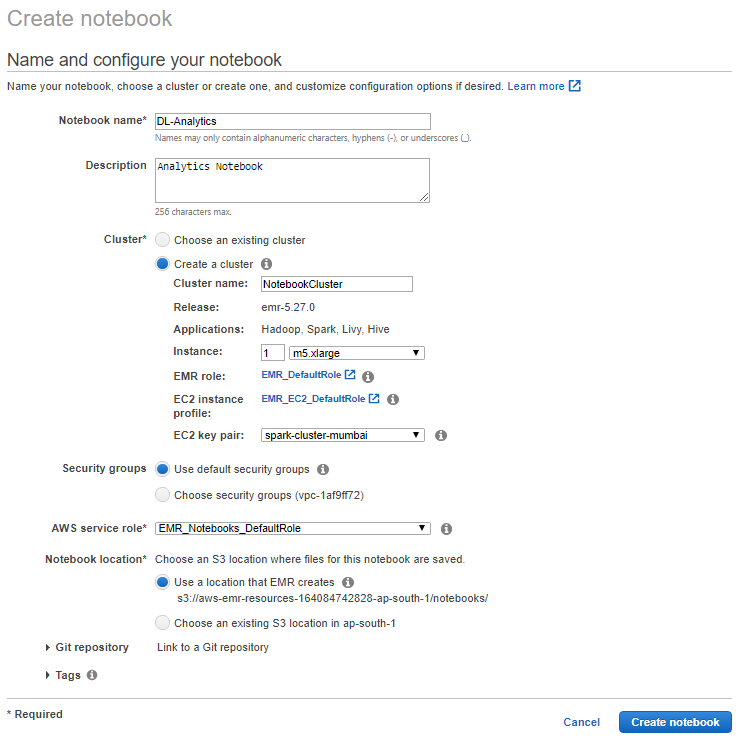
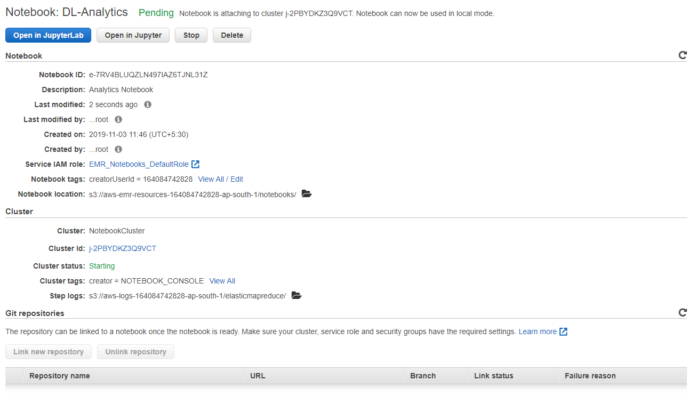
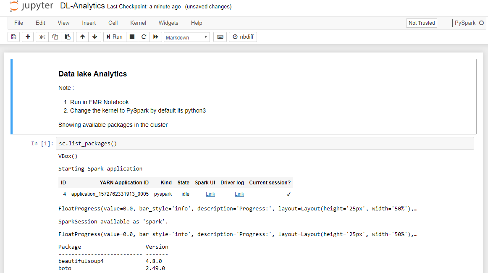
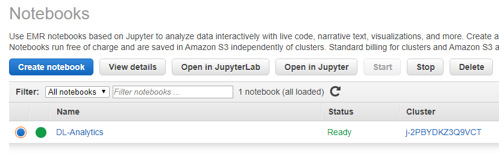
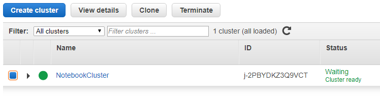

# EMR Jupyter Notebooks

Setting up EMR Jupyter Notebooks for testing in AWS. Click Create notebook  

You have two options here either to use existing cluster or create a new cluster. Sometimes do note that Notebooks might not be available in certain zones. When you come across those scenarios, you will have to create EC2 Keypair again for that zone and proceed creating the notebook  

Once you click the Create Cluster, it will be in the pending state sometimes for verification purposes this will be about 5mins or so.  

Once the state changes to 'Ready' you are good to open the jupyter notebook.  

In EMR Notebooks, its best to change the kernel from Python to PySpark and use PySpark commands to install the packages.   

After using the Notebook, come to the notebooks main screen and click Stop to stop the notebook  

Once the status changes to Stopped you can proceed to Terminate the cluster  

Terminate the cluster created for the notebook  

EMR Notebook terminated  

## Thats all about EMR Jupyter Notebooks  