# AWS Athena

### About Presto & Athena
Presto (or PrestoDB) is an open source, distributed SQL query engine, designed from the ground up for fast analytic queries against data of any size. It supports both non-relational sources, such as the Hadoop Distributed File System (HDFS), Amazon S3, Cassandra, MongoDB, and HBase, and relational data sources such as MySQL, PostgreSQL, Amazon Redshift, Microsoft SQL Server, and Teradata.

Presto can query data where it is stored, without needing to move data into a separate analytics system. Query execution runs in parallel over a pure memory-based architecture, with most results returning in seconds. You’ll find it used by many well-known companies like Facebook, Airbnb, Netflix, Atlassian, and Nasdaq.

Amazon Athena lets you deploy Presto using the AWS Serverless platform, with no servers, virtual machines, or clusters to setup, manage, or tune. Simply point to your data at Amazon S3, define the schema, and start querying using the built-in query editor, or with your existing Business Intelligence (BI) tools. Athena automatically parallelizes your query, and dynamically scales resources for queries to run quickly. You pay only for the queries that you run.

Athena is "Managed Presto"

Athena doesn't support
1. DML Operations
1. Stored Procedures or MQT
  
## Setting up AWS Athena tables  

**Goal** : Use SQL to query S3 parquet files  

### 1. Pre-requistes - Plan a bit. 
Decide on the database name(datalake) and create a S3 Bucket for the results like 
```
Format : database-results
Database name : datalake
S3 Results Bucket name : datalake-results
```


### 2. S3 Table Files in parquet format
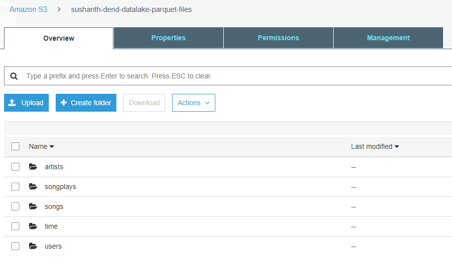

### 3. In Athena, select CREATE TABLE and select "from s3 bucket data"
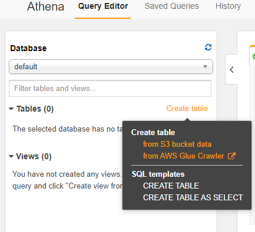

### 4. Create a new database(datalake) & table(artists) and mention S3 path. Click Next
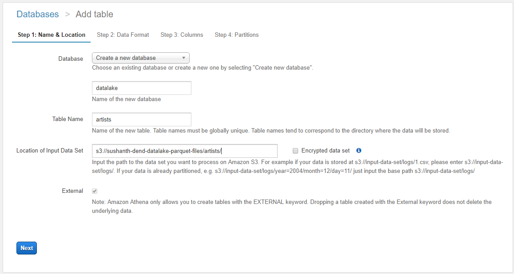

### 5. Select the input format "Parquet"
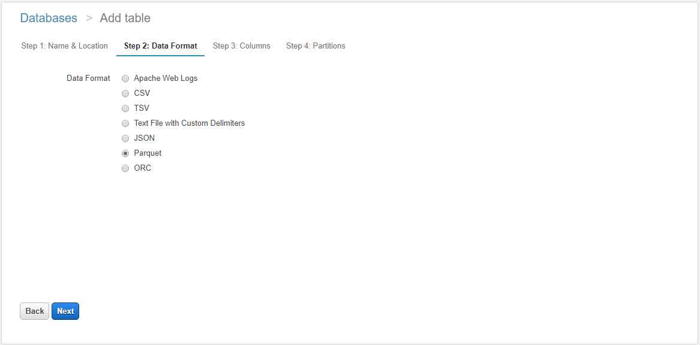

### 6. In Column section, select "Add bulk columns" and type in column details in format(column_name datatype). Skip partitioned columns, that needs to be filled in the next screen.
```
artist_id string, name string, location string, latitude float, longitude float
```
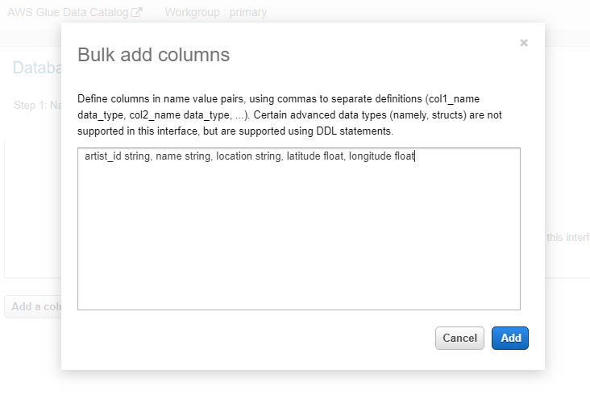

### 7. Fill partition columns if any. Artists table is not partitioned, so leaving it blank. Click "Create table"

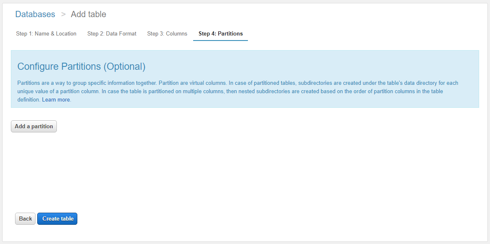

If the table is partitioned. Like for example table time partitioned by year & month. Skip the year & month in "bulk add columns" screen like below,  
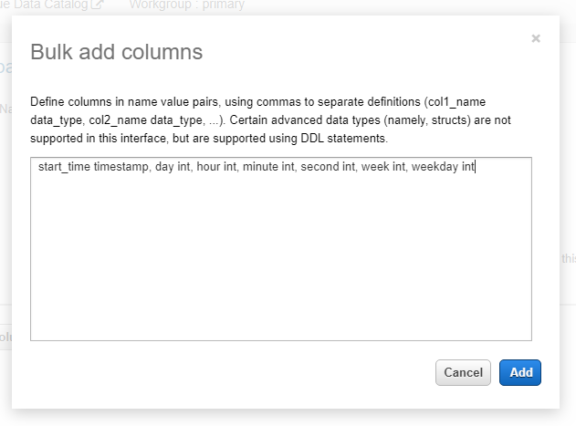

Mention the partition column in the same order as in when parquet file was created as the folder structure will be in that order.  
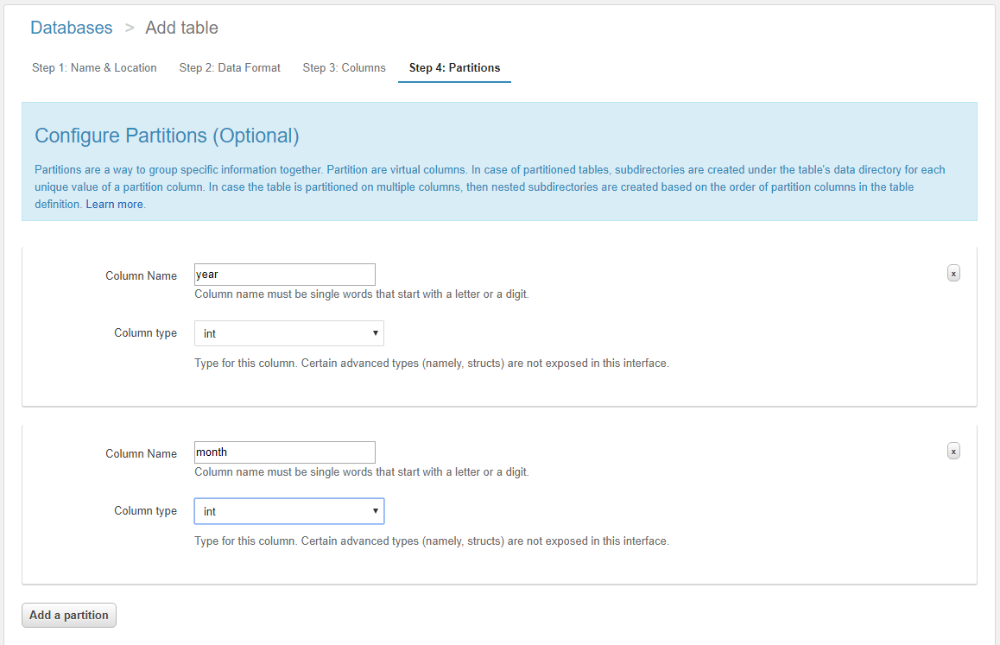

### 8. This will take you to the query editor and if there isn't any error, CREATE statement will get executed. 

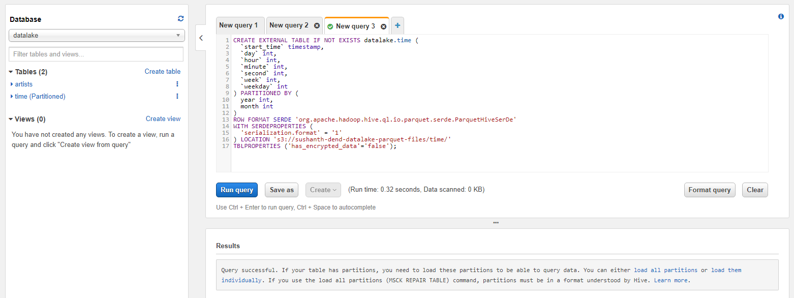

### 9. Table will get loaded for non-partitioned tables, but for partitioned you get 2 options
a) Load all partitions
```
MSCK REPAIR TABLE datalake.songs
```
The MSCK REPAIR TABLE command will load all partitions into the table. Click on Run Query to start. This command can take a while to run depending on the number of partitions to be loaded. You can monitor the status of load under History.

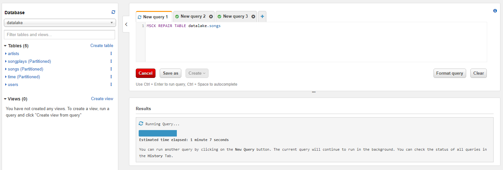

Query History
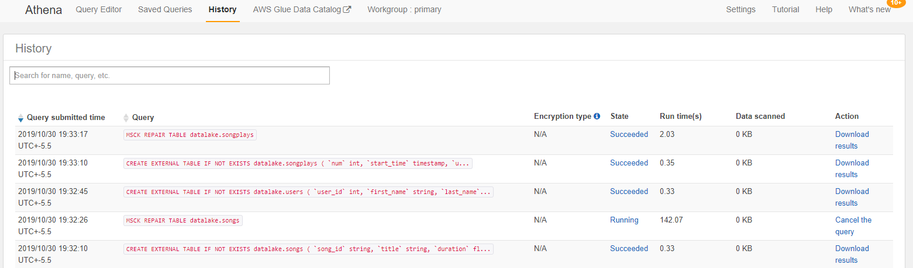

b) Load individual partitions
```
ALTER TABLE datalake.time add partition (year=2018, month=11)
location "s3://sushanth-dend-datalake-parquet-files/time/year=2018/";
```
Using below command we can check partition values(ie., table_name is 'time' in below example)
```
show partitions time
```
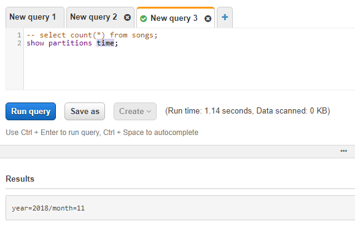

## Query Execution
```
select 'users' as Tables, count(*) as Rows from users
union all
select 'songs', count(*) from songs
union all
select 'artists', count(*) from artists
union all
select 'time', count(*) from time
union all
select 'songplays', count(*) from songplays
```
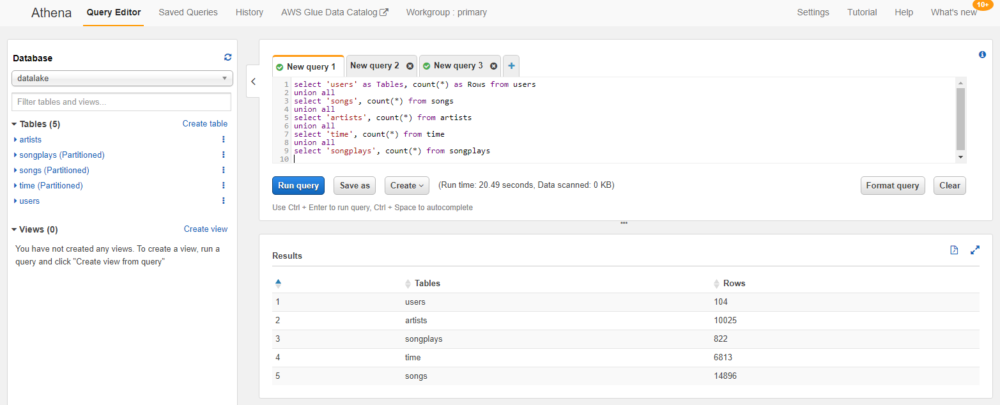

## Athena DDLs of all the tables

**Database** : datalake  
**S3 Bucket** : "datalake-results" has to be created.

### **Artists** 
**Design** : Non-partitioned
``` 
artist_id string, name string, location string, latitude float, longitude float
```

DDL
```
CREATE EXTERNAL TABLE IF NOT EXISTS datalake.artists (
`artist_id` string,
`name` string,
`location` string,
`latitude` float,
`longitude` float
)
ROW FORMAT SERDE 'org.apache.hadoop.hive.ql.io.parquet.serde.ParquetHiveSerDe'
WITH SERDEPROPERTIES (
'serialization.format' = '1'
) LOCATION 's3://sushanth-dend-datalake-parquet-files/artists/'
TBLPROPERTIES ('has_encrypted_data'='false')
```

### **Songs**
**Design** : Paritioned table. 
All the columns in the table
```
song_id string, title string, artist_id string, year int, duration float
```
In AWS Athena, when adding columns only below columns are mentioned
```
song_id string, title string, duration float
```
Below columns are mentioned in the paritioning screen
```
year int, artist_id string
```

DDL
```
CREATE EXTERNAL TABLE IF NOT EXISTS datalake.songs (
`song_id` string,
`title` string,
`duration` float
) PARTITIONED BY (
year int,
artist_id string
)
ROW FORMAT SERDE 'org.apache.hadoop.hive.ql.io.parquet.serde.ParquetHiveSerDe'
WITH SERDEPROPERTIES (
'serialization.format' = '1'
) LOCATION 's3://sushanth-dend-datalake-parquet-files/songs/'
TBLPROPERTIES ('has_encrypted_data'='false')
```
Since the table is paritioned, its not loaded right away. 
```
-- The MSCK REPAIR TABLE command will load all partitions into the table. Click on Run Query to start.

-- This command can take a while to run depending on the number of partitions to be loaded.

-- You can monitor the status of load under History.

MSCK REPAIR TABLE datalake.songs
```

### **users**
**Design** : Non-partitioned table

Below are the columns
```
user_id int, first_name string, last_name string, gender string, level string
```

DDL
```
CREATE EXTERNAL TABLE IF NOT EXISTS datalake.users (
`user_id` int,
`first_name` string,
`last_name` string,
`gender` string,
`level` string
)
ROW FORMAT SERDE 'org.apache.hadoop.hive.ql.io.parquet.serde.ParquetHiveSerDe'
WITH SERDEPROPERTIES (
'serialization.format' = '1'
) LOCATION 's3://sushanth-dend-datalake-parquet-files/users/'
TBLPROPERTIES ('has_encrypted_data'='false')
```

### **time**
**Design Decision** : Paritioned table. Below are all the columns in the table. 
```
start_time timestamp, day int, hour int, minute int, second int, week int, weekday int
```
Table is partitioned by below columns
```
year int, month int
```

DDL
```
CREATE EXTERNAL TABLE IF NOT EXISTS datalake.time (
  `start_time` timestamp,
  `day` int,
  `hour` int,
  `minute` int,
  `second` int,
  `week` int,
  `weekday` int 
) PARTITIONED BY (
  year int,
  month int 
)
ROW FORMAT SERDE 'org.apache.hadoop.hive.ql.io.parquet.serde.ParquetHiveSerDe'
WITH SERDEPROPERTIES (
  'serialization.format' = '1'
) LOCATION 's3://sushanth-dend-datalake-parquet-files/time/'
TBLPROPERTIES ('has_encrypted_data'='false');

ALTER TABLE datalake.time add partition (year=2018, month=11)
location "s3://sushanth-dend-datalake-parquet-files/time/year=2018/";
```

### **songplays**
**Design decision** : Partitioned table. Below are all the columns in the table
```
num int, start_time timestamp, user_id int, level string, song_id string, artist_id string, session_id int, location string, user_agent string
```
Below are the partitioned columns,
```
year integer, month integer
```

DDL
```
CREATE EXTERNAL TABLE IF NOT EXISTS datalake.songplays (
  `num` int,
  `start_time` timestamp,
  `user_id` int,
  `level` string,
  `song_id` string,
  `artist_id` string,
  `session_id` int,
  `location` string,
  `user_agent` string 
) PARTITIONED BY (
  year int,
  month int 
)
ROW FORMAT SERDE 'org.apache.hadoop.hive.ql.io.parquet.serde.ParquetHiveSerDe'
WITH SERDEPROPERTIES (
  'serialization.format' = '1'
) LOCATION 's3://sushanth-dend-datalake-parquet-files/songplays/'
TBLPROPERTIES ('has_encrypted_data'='false');

MSCK REPAIR TABLE datalake.songplays;
```

### **Below are some sample DROP statements**
```
drop table if exists datalake.songplays;
drop table if exists datalake.songs;
drop table if exists datalake.time;
drop table if exists datalake.users;
drop table if exists datalake.artists;

-- Database can be deleted only if its empty
DROP database IF EXISTS datalake;
```

### **Reading materials**
* [Tutorial: Build your Data-Lake using AWS S3 & Athena](https://medium.com/swlh/tutorial-build-your-data-lake-using-aws-s3-athena-150c1aaa44cf)

* [Analyzing Data in S3 using Amazon Athena](https://aws.amazon.com/blogs/big-data/analyzing-data-in-s3-using-amazon-athena/)

 
 
# Thats all about AWS Athena  
