## Data Pipelines / Apache Airflow

**What is a data pipeline?**  
A series of steps in which data is processed

**Extract Transform Load (ETL) and Extract Load Transform (ELT):**  
ETL is normally a continuous, ongoing process with a well-defined workflow. ETL first extracts data from homogeneous or heterogeneous data sources. Then, data is cleansed, enriched, transformed, and stored either back in the lake or in a data warehouse.

ELT (Extract, Load, Transform) is a variant of ETL wherein the extracted data is first loaded into the target system. Transformations are performed after the data is loaded into the data warehouse. ELT typically works well when the target system is powerful enough to handle transformations. Analytical databases like Amazon Redshift and Google BigQ.

**Data Validation**  
Data Validation is the process of ensuring that data is present, correct & meaningful. Ensuring the quality of your data through automated validation checks is a critical step in building data pipelines at any organization.
Examples
a) Ensuring that the number of rows in Redshift match the number of records in S3
b) Ensuring that the number of rows in a table are greater than zero

**Directed Acyclic Graphs (DAGs)**: DAGs are a special subset of graphs in which the edges between nodes have a specific direction, and no cycles exist. When we say “no cycles exist” what we mean is the nodes cant create a path back to themselves.
* Nodes: A step in the data pipeline process.
* Edges: The dependencies or relationships other between nodes.

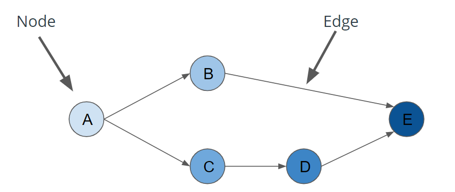

## **Apache Airflow**  

Apache Airflow is an open-source tool which structures data pipelines as DAGs. Created in Airbnb and it was open-sourced in 2015 with the goal of creating a DAG-based schedulable, data-pipeline tool that could run in mission-critical environments.

It is a platform to programmatically author, schedule and monitor workflows. Use airflow to author workflows as directed acyclic graphs (DAGs) of tasks. The airflow scheduler executes your tasks on an array of workers while following the specified dependencies. Rich command line utilities make performing complex surgeries on DAGs a snap. The rich user interface makes it easy to visualize pipelines running in production, monitor progress, and troubleshoot issues when needed. When workflows are defined as code, they become more maintainable, versionable, testable, and collaborative.

Airflow allows users to write DAGs in python that run on a schdule and/or from an external trigger. Its simple to maintrain and can run data analysis itself or trigger external tools(Redshift, Spark, Presto, Hadoop) during execution.   

Airflow is used coordinate data movements between other data storage and data processing tools. 

* [Apache Airflow Concepts](http://airflow.apache.org/concepts.html)

### Airflow’s Architecture
At its core, Airflow is simply a queuing system built on top of a metadata database. The database stores the state of queued tasks and a scheduler uses these states to prioritize how other tasks are added to the queue. This functionality is orchestrated by four primary components (refer to the Left Subpanel of Figure 3.2):  

1. Metadata Database: this database stores information regarding the state of tasks. Database updates are performed using an abstraction layer implemented in SQLAlchemy. This abstraction layer cleanly separates the function of the remaining components of Airflow from the database.  

2. Scheduler: The Scheduler is a process that uses DAG definitions in conjunction with the state of tasks in the metadata database to decide which tasks need to be executed, as well as their execution priority. The Scheduler is generally run as a service.  
3. Executor: The Executor is a message queuing process that is tightly bound to the Scheduler and determines the worker processes that actually execute each scheduled task. There are different types of Executors, each of which uses a specific class of worker processes to execute tasks. For example, the LocalExecutor executes tasks with parallel processes that run on the same machine as the Scheduler process. Other Executors, like the CeleryExecutor execute tasks using worker processes that exist on a separate cluster of worker machines.  
4. Workers: These are the processes that actually execute the logic of tasks, and are determined by the Executor being used.

## What is Dag?
DAGs are a special subset of graphs in which the edges between nodes have a specific direction, and no cycles exist. When we say “no cycles exist” what we mean is the nodes cant create a path back to themselves.
* Nodes: A step in the data pipeline process.
* Edges: The dependencies or relationships other between nodes.

In Airflow all workflows are DAGs. A Dag consists of operators. An operator defines an individual task that needs to be performed. There are different types of operators available( As given on Airflow Website):  
* BashOperator - executes a bash command
* PythonOperator - calls an arbitrary Python function
* EmailOperator - sends an email
* SimpleHttpOperator - sends an HTTP request
* MySqlOperator, SqliteOperator, PostgresOperator, MsSqlOperator, OracleOperator, JdbcOperator, etc. - executes a SQL command
* Sensor - waits for a certain time, file, database row, S3 key, etc…  

You can also come up with a custom operator as per your need.

Sample Code
```
# Instructions
# Define a function that uses the python logger to log a function. Then finish filling in the details of the DAG down below. Once you’ve done that, run "/opt/airflow/start.sh" command to start the web server. Once the Airflow web server is ready,  open the Airflow UI using the "Access Airflow" button. Turn your DAG “On”, and then Run your DAG. If you get stuck, you can take a look at the solution file or the video walkthrough on the next page.

import datetime
import logging

from airflow import DAG
from airflow.operators.python_operator import PythonOperator


#
# TODO: Define a function for the PythonOperator to call and have it log something
#
def hello_world():
    logging.info("Hello World!")

# Create DAG
dag = DAG(
        'lesson1.exercise1',
        start_date=datetime.datetime.now())

# Create Task
greet_task = PythonOperator(
    task_id="hello_world_task",
    python_callable=hello_world,
    dag=dag
)
```

Command to start Airflow server run 
``` /opt/airflow/start.sh ```

Output of above command 
```
root@b8a1c2256051:/home/workspace# /opt/airflow/start.sh
[2019-11-14 13:12:16,003] {settings.py:174} INFO - settings.configure_orm(): Using pool settings. pool_size=5, pool_recycle=1800, pid=248
[2019-11-14 13:12:17,580] {__init__.py:51} INFO - Using executor LocalExecutor
  ____________       _____________
 ____    |__( )_________  __/__  /________      __
____  /| |_  /__  ___/_  /_ __  /_  __ \_ | /| / /
___  ___ |  / _  /   _  __/ _  / / /_/ /_ |/ |/ /
 _/_/  |_/_/  /_/    /_/    /_/  \____/____/|__/
 
[2019-11-14 13:12:19,834] {settings.py:174} INFO - settings.configure_orm(): Using pool settings. pool_size=5, pool_recycle=1800, pid=253
[2019-11-14 13:12:21,058] {__init__.py:51} INFO - Using executor LocalExecutor
  ____________       _____________
 ____    |__( )_________  __/__  /________      __
____  /| |_  /__  ___/_  /_ __  /_  __ \_ | /| / /
___  ___ |  / _  /   _  __/ _  / / /_/ /_ |/ |/ /
 _/_/  |_/_/  /_/    /_/    /_/  \____/____/|__/
 
[2019-11-14 13:12:22,313] {models.py:273} INFO - Filling up the DagBag from /home/workspace/airflow/dags
[2019-11-14 13:12:22,319] {models.py:360} INFO - File /home/workspace/airflow/dags/__init__.py assumed to contain no DAGs. Skipping.
Running the Gunicorn Server with:
Workers: 4 sync
Host: 0.0.0.0:3000
Timeout: 120
Logfiles: - -
=================================================================            
Waiting for Airflow web server...
Airflow web server is ready
root@b8a1c2256051:/home/workspace#  
```

Airflow Homepage

One of the first things to start is to switch ON the toggle and then click "Trigger dag" in "Links" on the right-side. 

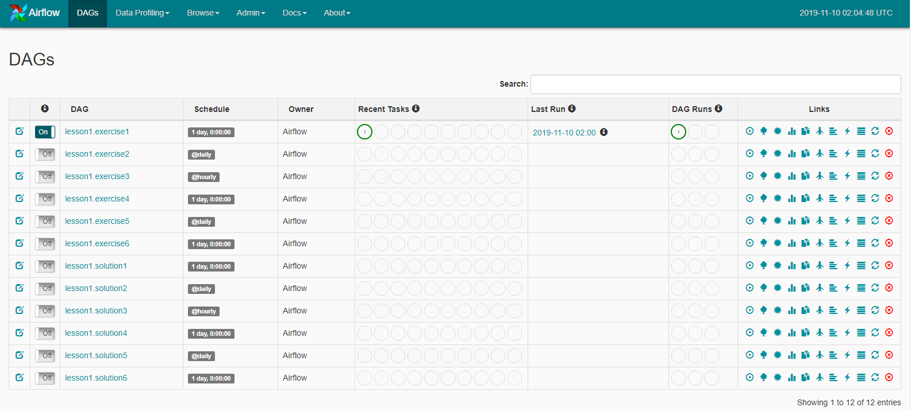  

Airflow link icons  
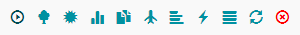  
* Trigger dag
* Tree view
* Graph view
* Tasks duration
* Task Tries
* Landing times
* Gantt view 
* Code view 
* Logs
* Refresh
* Delete dag

DAG Status  
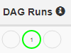  
* Success
* Running
* Failed

Recent Tasks  
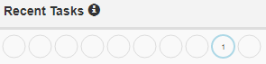  
* Success
* Running
* Failed
* upstream_failed
* skipped
* up_for_retry
* up_for_reschedule
* queued
* 
* scheduled

Logging information can be seen in Airflow Log  
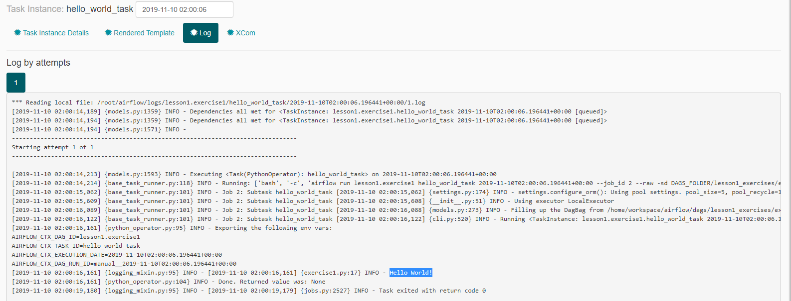  

Airflow made up of 5 operational components,   

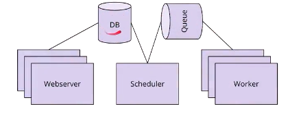  

| Components | Description |
| ------------- |:-------------|
| Scheduler | scheduler is responsible for tracking the progress of DAGS and their tasks as well as ensuring that they are triggered properly. Basically start DAGs based on triggers |
| Work Queue | Queue holds the state of running DAGS and tasks. |
| Worker Processes | Airflow worker processes take data off the queue and actually execute the integral individual tasks and your DAG. Basically runs and records the outcome of individual pipeline tasks. |
| Database | stores your credentials, configuration, connections, and history, what we refer to this as metadata. |
| Web Interface | web server is the web interface that we've been interacting with so far. |


Order of Operations For an Airflow DAG  
* The Airflow Scheduler starts DAGs based on time or external triggers.  
* Once a DAG is started, the Scheduler looks at the steps within the DAG and determines which steps can run by looking at their dependencies.  
* The Scheduler places runnable steps in the queue.  
* Workers pick up those tasks and run them.  
* Once the worker has finished running the step, the final status of the task is recorded and additional tasks are placed by the scheduler until all tasks are complete.  
* Once all tasks have been completed, the DAG is complete.  

Operators & Tasks  
Operators define the atomic steps of work that make up a DAG. Airflow comes with many Operators that can perform common operations. Here are a handful of common ones:
* PythonOperator
* PostgresOperator
* RedshiftToS3Operator
* S3ToRedshiftOperator
* BashOperator
* SimpleHttpOperator
* Sensor
* Task Dependencies  

In Airflow DAGs:
* Nodes = Tasks
* Edges = Ordering and dependencies between tasks
Task dependencies can be described programmatically in Airflow using >> and <<  
* a >> b means a comes before b
* a << b means a comes after b
```
hello_world_task = PythonOperator(task_id=’hello_world’, ...)
goodbye_world_task = PythonOperator(task_id=’goodbye_world’, ...)
...
# Use >> to denote that goodbye_world_task depends on hello_world_task
hello_world_task >> goodbye_world_task
```
Tasks dependencies can also be set with “set_downstream” and “set_upstream”  
* a.set_downstream(b) means a comes before b
* a.set_upstream(b) means a comes after b

```
hello_world_task = PythonOperator(task_id=’hello_world’, ...)
goodbye_world_task = PythonOperator(task_id=’goodbye_world’, ...)
...
hello_world_task.set_downstream(goodbye_world_task)
```

Task Dependencies  
```
import datetime
import logging

from airflow import DAG
from airflow.operators.python_operator import PythonOperator


def hello_world():
    logging.info("Hello World")


def addition():
    logging.info(f"2 + 2 = {2+2}")


def subtraction():
    logging.info(f"6 -2 = {6-2}")


def division():
    logging.info(f"10 / 2 = {int(10/2)}")


dag = DAG(
    "lesson1.solution3",
    schedule_interval='@hourly',
    start_date=datetime.datetime.now() - datetime.timedelta(days=1))

hello_world_task = PythonOperator(
    task_id="hello_world",
    python_callable=hello_world,
    dag=dag)

addition_task = PythonOperator(
    task_id="addition",
    python_callable=addition,
    dag=dag)

subtraction_task = PythonOperator(
    task_id="subtraction",
    python_callable=subtraction,
    dag=dag)

division_task = PythonOperator(
    task_id="division",
    python_callable=division,
    dag=dag)

# Configure Task Dependencies
hello_world_task >> addition_task
hello_world_task >> subtraction_task

subtraction_task >> division_task
addition_task >> division_task
```
Command to start server
```
/opt/airflow/start.sh
```

Connection via Airflow Hooks  
Connections can be accessed in code via hooks. Hooks provide a reusable interface to external systems and databases. With hooks, you don’t have to worry about how and where to store these connection strings and secrets in your code.
```
from airflow import DAG
from airflow.hooks.postgres_hook import PostgresHook
from airflow.operators.python_operator import PythonOperator

def load():
# Create a PostgresHook option using the `demo` connection
    db_hook = PostgresHook(‘demo’)
    df = db_hook.get_pandas_df('SELECT * FROM rides')
    print(f'Successfully used PostgresHook to return {len(df)} records')

load_task = PythonOperator(task_id=’load’, python_callable=hello_world, ...)
```
Airflow comes with many Hooks that can integrate with common systems. Here are a few common ones:

* HttpHook
* PostgresHook (works with RedShift)
* MySqlHook
* SlackHook
* PrestoHook

NOTE : DONT PUT SSH KEYS IN VARIABLES

Connection and Hooks
```
import datetime
import logging

from airflow import DAG
from airflow.models import Variable
from airflow.operators.python_operator import PythonOperator
from airflow.hooks.S3_hook import S3Hook

#
# TODO: There is no code to modify in this exercise. We're going to create a connection and a
# variable.
# 1. Open your browser to localhost:8080 and open Admin->Variables
# 2. Click "Create"
# 3. Set "Key" equal to "s3_bucket" and set "Val" equal to "udacity-dend"
# 4. Set "Key" equal to "s3_prefix" and set "Val" equal to "data-pipelines"
# 5. Click save
# 6. Open Admin->Connections
# 7. Click "Create"
# 8. Set "Conn Id" to "aws_credentials", "Conn Type" to "Amazon Web Services"
# 9. Set "Login" to your aws_access_key_id and "Password" to your aws_secret_key
# 10. Click save
# 11. Run the DAG

def list_keys():
    hook = S3Hook(aws_conn_id='aws_credentials')
    bucket = Variable.get('s3_bucket')
    prefix = Variable.get('s3_prefix')
    logging.info(f"Listing Keys from {bucket}/{prefix}")
    keys = hook.list_keys(bucket, prefix=prefix)
    for key in keys:
        logging.info(f"- s3://{bucket}/{key}")


dag = DAG(
        'lesson1.exercise4',
        start_date=datetime.datetime.now())

list_task = PythonOperator(
    task_id="list_keys",
    python_callable=list_keys,
    dag=dag
)
```

Variables
   

Connections - aws_credentials  
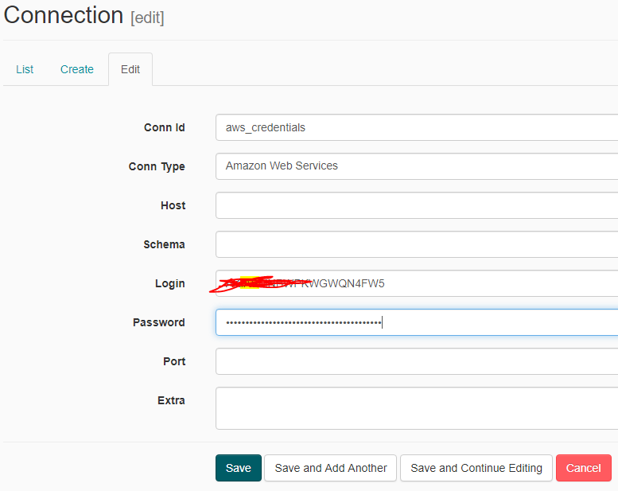  

Connections - redshift  
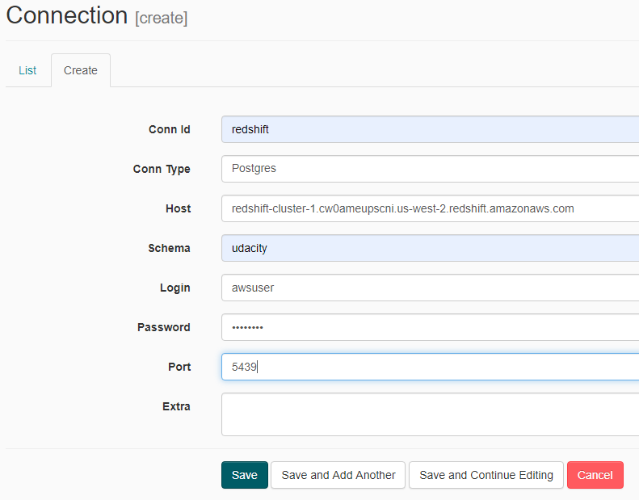  


Log
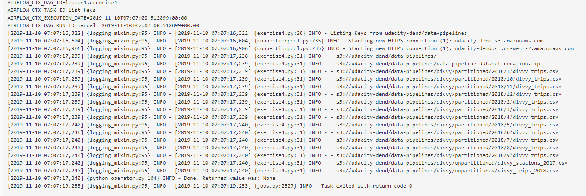  

Context and Templating  
```
import datetime
import logging

from airflow import DAG
from airflow.models import Variable
from airflow.operators.python_operator import PythonOperator
from airflow.hooks.S3_hook import S3Hook


def log_details(*args, **kwargs):
    #
    # TODO: Extract ds, run_id, prev_ds, and next_ds from the kwargs, and log them
    # NOTE: Look here for context variables passed in on kwargs:
    #       https://airflow.apache.org/macros.html
    #
    ds = {kwargs['ds']}
    run_id = {kwargs['run_id']}
    previous_ds = kwargs.get('prev_ds')
    next_ds = kwargs.get('next_ds')

    logging.info(f"Execution date is {ds}")
    logging.info(f"My run id is {run_id}")
    if previous_ds:
        logging.info(f"My previous run was on {previous_ds}")
    if next_ds:
        logging.info(f"My next run will be {next_ds}")

dag = DAG(
    'lesson1.exercise5',
    schedule_interval="@daily",
    start_date=datetime.datetime.now() - datetime.timedelta(days=2)
)

list_task = PythonOperator(
    task_id="log_details",
    python_callable=log_details,
    provide_context=True,
    dag=dag
)
```

Log output

```
AIRFLOW_CTX_DAG_ID=lesson1.exercise5
AIRFLOW_CTX_TASK_ID=log_details
AIRFLOW_CTX_EXECUTION_DATE=2019-11-09T00:00:00+00:00
AIRFLOW_CTX_DAG_RUN_ID=scheduled__2019-11-09T00:00:00+00:00
[2019-11-10 08:47:58,329] {logging_mixin.py:95} INFO - [2019-11-10 08:47:58,329] {exercise5.py:24} INFO - Execution date is {'2019-11-09'}
[2019-11-10 08:47:58,329] {logging_mixin.py:95} INFO - [2019-11-10 08:47:58,329] {exercise5.py:25} INFO - My run id is {'scheduled__2019-11-09T00:00:00+00:00'}
[2019-11-10 08:47:58,329] {logging_mixin.py:95} INFO - [2019-11-10 08:47:58,329] {exercise5.py:27} INFO - My previous run was on 2019-11-08
[2019-11-10 08:47:58,329] {logging_mixin.py:95} INFO - [2019-11-10 08:47:58,329] {exercise5.py:29} INFO - My next run will be 2019-11-10
[2019-11-10 08:47:58,329] {python_operator.py:104} INFO - Done. Returned value was: None
[2019-11-10 08:48:01,243] {logging_mixin.py:95} INFO - [2019-11-10 08:48:01,243] {jobs.py:2527} INFO - Task exited with return code 0
```

Load from S3 to Redshift tables

Below are the pre-requistes
1. Create IAM Role ( myRedshiftRole )
    * ARN(not used anywhere) : arn:aws:iam::164084742828:role/myRedshiftRole
    * Attach policies  
        * AmazonRedshiftQueryEditor  
        * AmazonS3ReadOnlyAccess                  
1. Create Redshift Cluster ( Click Quick Launch Cluster )
    * Cluster Name : redshift-cluster-1
    * Node Type : dc2.large
    * Nodes : 2
    * Zone : us-west-2d
    * Endpoint : redshift-cluster-1.cw0ameupscni.us-west-2.redshift.amazonaws.com
    * Port : 5439
    * Database Name : udacity
    * User : awsuser
    * Password : C******1
    * Network : Default VPC

1. Create Airflow Connections
    * aws-creditials - IAM User
    * redshift - Database user & password

```
# Instructions
# Similar to what you saw in the demo, copy and populate the trips table. Then, add another operator which creates a traffic analysis table from the trips table you created. Note, in this class, we won’t be writing SQL -- all of the SQL statements we run against Redshift are predefined and included in your lesson.

import datetime
import logging

from airflow import DAG
from airflow.contrib.hooks.aws_hook import AwsHook
from airflow.hooks.postgres_hook import PostgresHook
from airflow.operators.postgres_operator import PostgresOperator
from airflow.operators.python_operator import PythonOperator

import sql_statements


def load_data_to_redshift(*args, **kwargs):
    aws_hook = AwsHook("aws_credentials")
    credentials = aws_hook.get_credentials()
    redshift_hook = PostgresHook("redshift")
    redshift_hook.run(sql_statements.COPY_ALL_TRIPS_SQL.format(credentials.access_key, credentials.secret_key))


dag = DAG(
    'lesson1.exercise6',
    start_date=datetime.datetime.now()
)

create_table = PostgresOperator(
    task_id="create_table",
    dag=dag,
    postgres_conn_id="redshift",
    sql=sql_statements.CREATE_TRIPS_TABLE_SQL
)

copy_task = PythonOperator(
    task_id='load_from_s3_to_redshift',
    dag=dag,
    python_callable=load_data_to_redshift
)

location_traffic_task = PostgresOperator(
    task_id="calculate_location_traffic",
    dag=dag,
    postgres_conn_id="redshift",
    sql=sql_statements.LOCATION_TRAFFIC_SQL
)

create_table >> copy_task
copy_task >> location_traffic_task
```

Data Lineage  
The data lineage of a dataset describes the discrete steps involved in the creation, movement and calculation of that dataset.

Deep understanding of the movement and transformation of data also enables simplified debugging when errors occur.

Pre-requistes before running the below code, 
1. Create Redshift Cluster( follow instructions mentioned earlier )
2. Setup Connections in Airflow ( aws_credentials, redshift )

Command to start Airflow server run 
``` /opt/airflow/start.sh ```

```
#Instructions
#1 - Run the DAG as it is first, and observe the Airflow UI
#2 - Next, open up the DAG and add the copy and load tasks as directed in the TODOs
#3 - Reload the Airflow UI and run the DAG once more, observing the Airflow UI

import datetime
import logging

from airflow import DAG
from airflow.contrib.hooks.aws_hook import AwsHook
from airflow.hooks.postgres_hook import PostgresHook
from airflow.operators.postgres_operator import PostgresOperator
from airflow.operators.python_operator import PythonOperator

import sql_statements


def load_trip_data_to_redshift(*args, **kwargs):
    aws_hook = AwsHook("aws_credentials")
    credentials = aws_hook.get_credentials()
    redshift_hook = PostgresHook("redshift")
    sql_stmt = sql_statements.COPY_ALL_TRIPS_SQL.format(
        credentials.access_key,
        credentials.secret_key,
    )
    redshift_hook.run(sql_stmt)


def load_station_data_to_redshift(*args, **kwargs):
    aws_hook = AwsHook("aws_credentials")
    credentials = aws_hook.get_credentials()
    redshift_hook = PostgresHook("redshift")
    sql_stmt = sql_statements.COPY_STATIONS_SQL.format(
        credentials.access_key,
        credentials.secret_key,
    )
    redshift_hook.run(sql_stmt)


dag = DAG(
    'lesson2.exercise1',
    start_date=datetime.datetime.now()
)

create_trips_table = PostgresOperator(
    task_id="create_trips_table",
    dag=dag,
    postgres_conn_id="redshift",
    sql=sql_statements.CREATE_TRIPS_TABLE_SQL
)

copy_trips_task = PythonOperator(
    task_id='load_trips_from_s3_to_redshift',
    dag=dag,
    python_callable=load_trip_data_to_redshift,
)

create_stations_table = PostgresOperator(
    task_id="create_stations_table",
    dag=dag,
    postgres_conn_id="redshift",
    sql=sql_statements.CREATE_STATIONS_TABLE_SQL,
)

copy_stations_task = PythonOperator(
    task_id='load_stations_from_s3_to_redshift',
    dag=dag,
    python_callable=load_station_data_to_redshift,
)

create_trips_table >> copy_trips_task
# TODO: First, load the Airflow UI and run this DAG once.
# TODO: Next, configure the task ordering for stations data to have the create run before
#       the copy. Then, run this DAG once more and inspect the run history. to see the
#       differences.
create_stations_table >> copy_stations_task
```

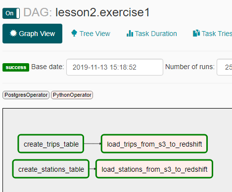

**Schedules**  
Piplines are ofen driven by schedules which determine what data should be analyzed and when,

```
dag = DAG(
	"lesson1.demo2",
	start_date=datetime.datetime.now() - datetime.timedelta(days=60),
	schedule_interval="@monthly")
```

Schedules are optional, and may be defined with cron strings or Airflow Presets. Airflow defaults DAGs to running once a day. Airflow provides the following presets:
| schedule | description |
| --- | --- |
| @once | Run a DAG once and then never again |
@hourly | Run the DAG every hour |
@daily | Run the DAG every day |
@weekly | Run the DAG every week |
@monthly | Run the DAG every month |
@yearly| Run the DAG every year |
None | Only run the DAG when the user initiates it |

Start Date: If your start date is in the past, Airflow will schedule and run your DAG as many times as there are schedule intervals between that start date and the current date.

End Date(optional): Unless you specify an optional end date, Airflow will continue to run your DAGs until you disable or delete the DAG.


```max_active_runs=1``` - Lets you parallelize tasks in dags not entire dags. 

Partitioning  
Schedule partitioning  
Not only are schedules great for reducing the amount of data our pipelines have to process, but they also help us guarantee that we can meet timing guarantees that our data consumers may need.

Logical partitioning  
Conceptually related data can be partitioned into discrete segments and processed separately. This process of separating data based on its conceptual relationship is called logical partitioning. With logical partitioning, unrelated things belong in separate steps. Consider your dependencies and separate processing around those boundaries.

Also worth mentioning, the data location is another form of logical partitioning. For example, if our data is stored in a key-value store like Amazon's S3 in a format such as: s3://<bucket>/<year>/<month>/<day> we could say that our date is logically partitioned by time.

Size Partitioning  
Size partitioning separates data for processing based on desired or required storage limits. This essentially sets the amount of data included in a data pipeline run. Size partitioning is critical to understand when working with large datasets, especially with Airflow.

Recommendation : Trigger external processing framework like SPARK for processing large datasets.   

Why Data Partitioning?  
Pipelines designed to work with partitioned data fail more gracefully. Smaller datasets, smaller time periods, and related concepts are easier to debug than big datasets, large time periods, and unrelated concepts. Partitioning makes debugging and rerunning failed tasks much simpler. It also enables easier redos of work, reducing cost and time.

Another great thing about Airflow is that if your data is partitioned appropriately, your tasks will naturally have fewer dependencies on each other. Because of this, Airflow will be able to parallelize execution of your DAGs to produce your results even faster.

Common types of partitioning are 
* size
* time
* location
* logical

Data Quality Requirements  
* Data must be a certain size
* Data must be accurate to some margin of error
* Data must arrive within a given timeframe from the start of execution
* Pipelines must run on a particular schedule
* Data must not contain any sensitive information

Airflow to delete the running tasks  
```Browse > Task Instances```   
Set the state to Clear, this will make the scheduler restart the tasks. 

To stop it from running, set it to 'Success'

SLAs  
Service Level Agreements, or time by which a task or DAG should have succeeded, can be set at a task level as a timedelta. If one or many instances have not succeeded by that time, an alert email is sent detailing the list of tasks that missed their SLA. The event is also recorded in the database and made available in the web UI under Browse->SLA Misses where events can be analyzed and documented.

SLAs can be configured for scheduled tasks by using the sla parameter. In addition to sending alerts to the addresses specified in a task’s email parameter, the sla_miss_callback specifies an additional Callable object to be invoked when the SLA is not met.


SubDAGs  
SubDAGs are always used as piece of another DAG. Commonly repeated series of tasks within DAGs can be captured reusable SubDAGs.

Note that SubDAG operators should contain a factory method that returns a DAG object. This will prevent the SubDAG from being treated like a separate DAG in the main UI.

Name of the subDAGs always must be, name of the parent DAG dot(.) the name of the task ID.

You can zoom into a SubDagOperator from the graph view of the main DAG to show the tasks contained within the SubDAG

Drawbacks of Using SubDAGs  
* Limit the visibility within the Airflow UI
* Abstraction makes understanding what the DAG is doing more difficult
* Encourages premature optimization ( Can have a strong negative impact during debugging and maintainence )

>> "Premature Optimization is the root of all evil"<br> - Donald Knuth

also said  

>> "We should not forget small efficiencies 97% of the time"<br> - Donald Knuth

Common Questions  
* Can Airflow nest subDAGs?  
Yes, you can nest subDAGs. However, you should have a really good reason to do so because it makes it much harder to understand what's going on in the code. Generally, subDAGs are not necessary at all, let alone subDAGs within subDAGs.

Monitoring  
Airflow can surface metrics and emails to help you stay on top of pipeline issues.

DAGs can be configured to have an SLA, which is defined as a time by which a DAG must complete.

Airflow can be configured to email a list of DAGs with missed SLAs. It also has a UI to view missed SLAs. 

References  
* [Get started developing workflows with Apache Airflow](http://michal.karzynski.pl/blog/2017/03/19/developing-workflows-with-apache-airflow/)

* [Python Keyword Arguments](https://treyhunner.com/2018/10/asterisks-in-python-what-they-are-and-how-to-use-them/)

custom plugins are in 
plugins/operators/

__init__.py under plugins contains
name = "udacity_plugin"
operators = [
	operators.HasrowsOperator,
	operators.S3ToRedshiftOperator
]


----
Lesson 3 - Exercise 1
Files used in this exercise
```1. airflow/dags/lesson3/exercise1.py```

1. airflow/plugins/__init__.py
1. airflow/plugins/operators/__init__.py
1. airflow/plugins/operators/s3_to_redshift.py
1. airflow/plugins/operators/has_rows.py

```
root@d36c9895e221:/home/workspace# tree .
.
└── airflow
    ├── dags
    │   ├── __init__.py
    │   ├── lesson3
    │   │   ├── exercise1.py
    │   │   ├── exercise2.py
    │   │   ├── exercise3
    │   │   │   ├── dag.py
    │   │   │   ├── __init__.py
    │   │   │   ├── __pycache__
    │   │   │   │   ├── dag.cpython-36.pyc
    │   │   │   │   ├── __init__.cpython-36.pyc
    │   │   │   │   └── subdag.cpython-36.pyc
    │   │   │   └── subdag.py
    │   │   ├── exercise4.py
    │   │   ├── __init__.py
    │   │   └── __pycache__
    │   │       ├── exercise1.cpython-36.pyc
    │   │       ├── exercise2.cpython-36.pyc
    │   │       ├── exercise4.cpython-36.pyc
    │   │       └── __init__.cpython-36.pyc
    │   ├── __pycache__
    │   │   ├── sql.cpython-36.pyc
    │   │   └── sql_statements.cpython-36.pyc
    │   └── sql_statements.py
    └── plugins
        ├── __init__.py
        ├── operators
        │   ├── facts_calculator.py
        │   ├── has_rows.py
        │   ├── __init__.py
        │   ├── __pycache__
        │   │   ├── facts_calculator.cpython-36.pyc
        │   │   ├── has_rows.cpython-36.pyc
        │   │   ├── __init__.cpython-36.pyc
        │   │   └── s3_to_redshift.cpython-36.pyc
        │   └── s3_to_redshift.py
        └── __pycache__
            └── __init__.cpython-36.pyc

11 directories, 28 files
```

Files used in this exercise   
Main Program : ```airflow/dags/lesson3/exercise1.py```

```
#Instructions
#In this exercise, we’ll consolidate repeated code into Operator Plugins
#1 - Move the data quality check logic into a custom operator
#2 - Replace the data quality check PythonOperators with our new custom operator
#3 - Consolidate both the S3 to RedShift functions into a custom operator
#4 - Replace the S3 to RedShift PythonOperators with our new custom operator
#5 - Execute the DAG

import datetime
import logging

from airflow import DAG
from airflow.contrib.hooks.aws_hook import AwsHook
from airflow.hooks.postgres_hook import PostgresHook

#from airflow.operators import (
#    HasRowsOperator,
#    PostgresOperator,
#    PythonOperator,
#    S3ToRedshiftOperator
#)

#from has_rows import HasRowsOperator
#from airflow.operators import HasRowsOperator
#from airflow.operators import S3ToRedshiftOperator
from airflow.operators.udacity_plugin import (HasRowsOperator)
from airflow.operators.udacity_plugin import (S3ToRedshiftOperator)

from airflow.operators.postgres_operator import PostgresOperator
from airflow.operators.python_operator import PythonOperator

import sql_statements


#
# TODO: Replace the data quality checks with the HasRowsOperator
#
def check_greater_than_zero(*args, **kwargs):
    table = kwargs["params"]["table"]
    redshift_hook = PostgresHook("redshift")
    records = redshift_hook.get_records(f"SELECT COUNT(*) FROM {table}")
    if len(records) < 1 or len(records[0]) < 1:
        raise ValueError(f"Data quality check failed. {table} returned no results")
    num_records = records[0][0]
    if num_records < 1:
        raise ValueError(f"Data quality check failed. {table} contained 0 rows")
    logging.info(f"Data quality on table {table} check passed with {records[0][0]} records")


dag = DAG(
    "lesson3.exercise1",
    start_date=datetime.datetime(2018, 1, 1, 0, 0, 0, 0),
    end_date=datetime.datetime(2018, 12, 1, 0, 0, 0, 0),
    schedule_interval="@monthly",
    max_active_runs=1
)

create_trips_table = PostgresOperator(
    task_id="create_trips_table",
    dag=dag,
    postgres_conn_id="redshift",
    sql=sql_statements.CREATE_TRIPS_TABLE_SQL
)

copy_trips_task = S3ToRedshiftOperator(
    task_id="load_trips_from_s3_to_redshift",
    dag=dag,
    table="trips",
    redshift_conn_id="redshift",
    aws_credentials_id="aws_credentials",
    #s3_bucket="udac-data-pipelines",
    s3_bucket="udacity-dend",
    #s3_key="divvy/partitioned/{execution_date.year}/{execution_date.month}/divvy_trips.csv"
    s3_key="data-pipelines/divvy/partitioned/{execution_date.year}/{execution_date.month}/divvy_trips.csv"
)

#
# TODO: Replace this data quality check with the HasRowsOperator
# Below being commented because its replaced with HasRowsOperator 
#check_trips = PythonOperator(
#    task_id='check_trips_data',
#    dag=dag,
#    python_callable=check_greater_than_zero,
#    provide_context=True,
#    params={
#        'table': 'trips',
#    }
#)

check_trips = HasRowsOperator(
	task_id="check_trips_data",
	dag=dag,
	redshift_conn_id="redshift",
	table="trips"
)

create_stations_table = PostgresOperator(
    task_id="create_stations_table",
    dag=dag,
    postgres_conn_id="redshift",
    sql=sql_statements.CREATE_STATIONS_TABLE_SQL,
)

copy_stations_task = S3ToRedshiftOperator(
    task_id="load_stations_from_s3_to_redshift",
    dag=dag,
    redshift_conn_id="redshift",
    aws_credentials_id="aws_credentials",
    #s3_bucket="udac-data-pipelines",
    #s3_key="divvy/unpartitioned/divvy_stations_2017.csv",
    s3_bucket="udacity-dend",
    s3_key="data-pipelines/divvy/unpartitioned/divvy_stations_2017.csv",    
    table="stations"
)

#
# TODO: Replace this data quality check with the HasRowsOperator
# Below being commented because its replaced with HasRowsOperator 
#check_stations = PythonOperator(
#    task_id='check_stations_data',
#    dag=dag,
#    python_callable=check_greater_than_zero,
#    provide_context=True,
#    params={
#        'table': 'stations',
#    }
#)

check_stations = HasRowsOperator(
    task_id='check_stations_data',
    dag=dag,
    redshift_conn_id="redshift",
    table="stations"    
)

create_trips_table >> copy_trips_task
create_stations_table >> copy_stations_task
copy_stations_task >> check_stations
copy_trips_task >> check_trips
```

> Files named ```__init__.py``` are used to mark directories on disk as Python package directories. Importing ```operators.FactsCalculatorOperator``` will implicitly execute ```plugins/__init__.py``` and ```operators/one/__init__.py.```  

Below plugins directory contains a regular package called "operators". 
```airflow/plugins/__init__.py```
```
from airflow.plugins_manager import AirflowPlugin

import operators

# Defining the plugin class
class UdacityPlugin(AirflowPlugin):
    name = "udacity_plugin"
    operators = [
        operators.FactsCalculatorOperator,
        operators.S3ToRedshiftOperator,
        operators.HasRowsOperator
    ]    
    # A list of class(es) derived from BaseHook
    hooks = []
    # A list of class(es) derived from BaseExecutor
    executors = []
    # A list of references to inject into the macros namespace
    macros = []
    # A list of objects created from a class derived
    # from flask_admin.BaseView
    admin_views = []
    # A list of Blueprint object created from flask.Blueprint
    flask_blueprints = []
    # A list of menu links (flask_admin.base.MenuLink)
    menu_links = []    
```

Specifying class names of the packages ```airflow/plugins/operators/__init__.py```

```
from operators.facts_calculator import FactsCalculatorOperator
from operators.has_rows import HasRowsOperator
from operators.s3_to_redshift import S3ToRedshiftOperator

__all__ = [
    'FactsCalculatorOperator',
    'S3ToRedshiftOperator',
    'HasRowsOperator'
]
```
Packages  

Package : S3ToRedshiftOperator  
Program : ```airflow/plugins/operators/s3_to_redshift.py```

```
from airflow.contrib.hooks.aws_hook import AwsHook
from airflow.hooks.postgres_hook import PostgresHook
from airflow.models import BaseOperator
from airflow.utils.decorators import apply_defaults


class S3ToRedshiftOperator(BaseOperator):
    template_fields    = ("s3_key",)
    copy_sql = """
        COPY {}
        FROM '{}'
        ACCESS_KEY_ID '{}'
        SECRET_ACCESS_KEY '{}'
        IGNOREHEADER {}
        DELIMITER '{}'
    """


    @apply_defaults
    def __init__(self,
                 redshift_conn_id="",
                 aws_credentials_id="",
                 table="",
                 s3_bucket="",
                 s3_key="",
                 delimiter=",",
                 ignore_headers=1,
                 *args, **kwargs):

        super(S3ToRedshiftOperator, self).__init__(*args, **kwargs)
        self.table = table
        self.redshift_conn_id = redshift_conn_id
        self.s3_bucket = s3_bucket
        self.s3_key = s3_key
        self.delimiter = delimiter
        self.ignore_headers = ignore_headers
        self.aws_credentials_id = aws_credentials_id

    def execute(self, context):
        aws_hook = AwsHook(self.aws_credentials_id)
        credentials = aws_hook.get_credentials()
        redshift = PostgresHook(postgres_conn_id=self.redshift_conn_id)

        self.log.info("Clearing data from destination Redshift table")
        redshift.run("DELETE FROM {}".format(self.table))

        self.log.info("Copying data from S3 to Redshift")
        rendered_key = self.s3_key.format(**context)
        s3_path = "s3://{}/{}".format(self.s3_bucket, rendered_key)
        formatted_sql = S3ToRedshiftOperator.copy_sql.format(
            self.table,
            s3_path,
            credentials.access_key,
            credentials.secret_key,
            self.ignore_headers,
            self.delimiter
        )
        redshift.run(formatted_sql)
```
Package : HasRowsOperator  
Program : ```airflow/plugins/operators/has_rows.py```
```
import logging

from airflow.hooks.postgres_hook import PostgresHook
from airflow.models import BaseOperator
from airflow.utils.decorators import apply_defaults


class HasRowsOperator(BaseOperator):

    @apply_defaults
    def __init__(self,
                 redshift_conn_id="",
                 table="",
                 *args, **kwargs):

        super(HasRowsOperator, self).__init__(*args, **kwargs)
        self.table = table
        self.redshift_conn_id = redshift_conn_id

    def execute(self, context):
        redshift_hook = PostgresHook(self.redshift_conn_id)
        records = redshift_hook.get_records(f"SELECT COUNT(*) FROM {self.table}")
        if len(records) < 1 or len(records[0]) < 1:
            raise ValueError(f"Data quality check failed. {self.table} returned no results")
        num_records = records[0][0]
        if num_records < 1:
            raise ValueError(f"Data quality check failed. {self.table} contained 0 rows")
        logging.info(f"Data quality on table {self.table} check passed with {records[0][0]} records")
```

Below is not used, but just adding it for completion


Package : FactsCalculatorOperator  
Program : ```airflow/plugins/operators/facts_calculator.py```  
```
import logging

from airflow.hooks.postgres_hook import PostgresHook
from airflow.models import BaseOperator
from airflow.utils.decorators import apply_defaults


class FactsCalculatorOperator(BaseOperator):
    facts_sql_template = """
    DROP TABLE IF EXISTS {destination_table};
    CREATE TABLE {destination_table} AS
    SELECT
        {groupby_column},
        MAX({fact_column}) AS max_{fact_column},
        MIN({fact_column}) AS min_{fact_column},
        AVG({fact_column}) AS average_{fact_column}
    FROM {origin_table}
    GROUP BY {groupby_column};
    """

    @apply_defaults
    def __init__(self,
                 redshift_conn_id="",
                 origin_table="",
                 destination_table="",
                 fact_column="",
                 groupby_column="",
                 *args, **kwargs):

        super(FactsCalculatorOperator, self).__init__(*args, **kwargs)
        #
        # TODO: Set attributes from __init__ instantiation arguments
        #

    def execute(self, context):
        #
        # TODO: Fetch the redshift hook
        #

        #
        # TODO: Format the `facts_sql_template` and run the query against redshift
        #

        pass
```

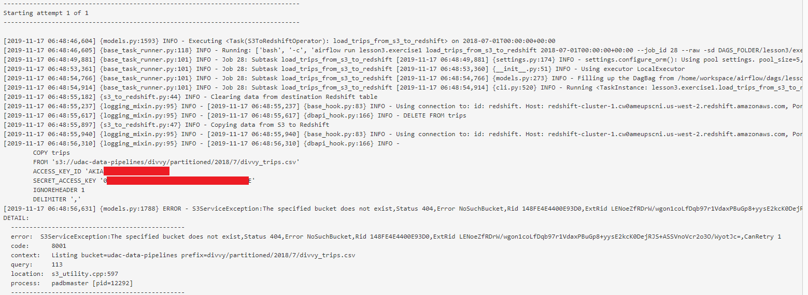  
  
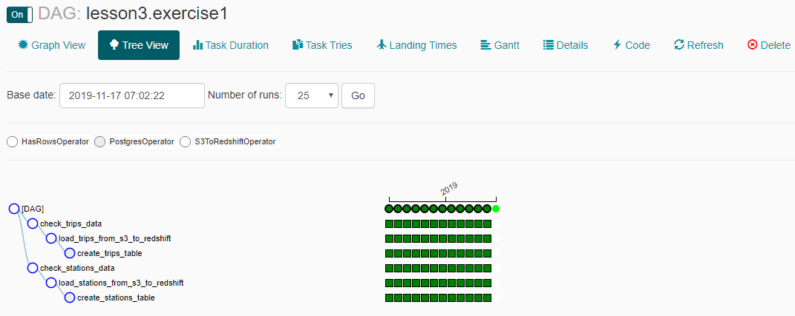  
  
  


Lesson 3 - Exercise 2 : Refactoring a DAG  
```
#Instructions
#In this exercise, we’ll refactor a DAG with a single overloaded task into a DAG with several tasks with well-defined boundaries
#1 - Read through the DAG and identify points in the DAG that could be split apart
#2 - Split the DAG into multiple PythonOperators
#3 - Run the DAG

import datetime
import logging

from airflow import DAG
from airflow.hooks.postgres_hook import PostgresHook

from airflow.operators.postgres_operator import PostgresOperator
from airflow.operators.python_operator import PythonOperator
from airflow.operators.dummy_operator import DummyOperator

#
# TODO: Finish refactoring this function into the appropriate set of tasks,
#       instead of keeping this one large task.
#

def ridesperbike():
    redshift_hook = PostgresHook("redshift")

    # Find out how often each bike is ridden
    redshift_hook.run("""
        BEGIN;
        DROP TABLE IF EXISTS lifetime_rides;
        CREATE TABLE lifetime_rides AS (
            SELECT bikeid, COUNT(bikeid)
            FROM trips
            GROUP BY bikeid
        );
        COMMIT;
    """)
    
    
def stationspercity():
    redshift_hook = PostgresHook("redshift")

    # Count the number of stations by city
    redshift_hook.run("""
        BEGIN;
        DROP TABLE IF EXISTS city_station_counts;
        CREATE TABLE city_station_counts AS(
            SELECT city, COUNT(city)
            FROM stations
            GROUP BY city
        );
        COMMIT;
    """)


def log_oldest():
    redshift_hook = PostgresHook("redshift")
    records = redshift_hook.get_records("""
        SELECT birthyear FROM older_riders ORDER BY birthyear ASC LIMIT 1
    """)
    if len(records) > 0 and len(records[0]) > 0:
        logging.info(f"Oldest rider was born in {records[0][0]}")

def log_youngest():
    redshift_hook = PostgresHook("redshift")
    records = redshift_hook.get_records("""
        SELECT birthyear FROM younger_riders ORDER BY birthyear DESC LIMIT 1
    """)
    if len(records) > 0 and len(records[0]) > 0:
        logging.info(f"Youngest rider was born in {records[0][0]}")


dag = DAG(
    "lesson3.exercise2",
    start_date=datetime.datetime.utcnow()
)

start_operator = DummyOperator(task_id='Begin_execution',  dag=dag)
end_operator = DummyOperator(task_id='Stop_execution',  dag=dag)


create_oldest_task = PostgresOperator(
    task_id="create_oldest",
    dag=dag,
    sql="""
        BEGIN;
        DROP TABLE IF EXISTS older_riders;
        CREATE TABLE older_riders AS (
            SELECT * FROM trips WHERE birthyear > 0 AND birthyear <= 1945
        );
        COMMIT;
    """,
    postgres_conn_id="redshift"
)

log_oldest_task = PythonOperator(
    task_id="log_oldest",
    dag=dag,
    python_callable=log_oldest
)

# Create youngest
# Find all trips where the rider was under 18
create_youngest_task = PostgresOperator(
    task_id="create_youngest",
    dag=dag,        
    sql="""
        BEGIN;
        DROP TABLE IF EXISTS younger_riders;
        CREATE TABLE younger_riders AS (
            SELECT * FROM trips WHERE birthyear > 2000
        );
        COMMIT;
    """,
    postgres_conn_id="redshift"
)

log_youngest_task = PythonOperator(
    task_id="log_youngest",
    dag=dag,
    python_callable=log_youngest
)

ridesperbike_task = PythonOperator(
    task_id="rides_per_bike",
    dag=dag,
    python_callable=ridesperbike
)

stationspercity_task = PythonOperator(
    task_id="stations_per_city",
    dag=dag,
    python_callable=stationspercity
)

start_operator >> create_oldest_task
start_operator >> create_youngest_task
start_operator >> ridesperbike_task
start_operator >> stationspercity_task

create_oldest_task >> log_oldest_task
create_youngest_task >> log_youngest_task

log_oldest_task >> end_operator
log_youngest_task >> end_operator
ridesperbike_task >> end_operator
stationspercity_task >> end_operator
```

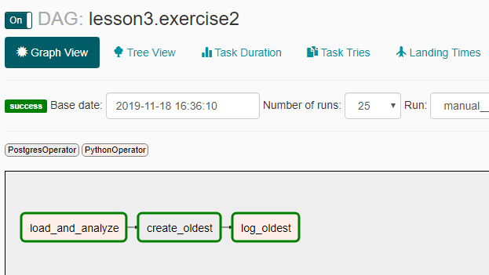  
  
  


Lesson 3 - Exercise 3 : SubDAGs  
```dag.py```
```
#Instructions
#In this exercise, we’ll place our S3 to RedShift Copy operations into a SubDag.
#1 - Consolidate HasRowsOperator into the SubDag
#2 - Reorder the tasks to take advantage of the SubDag Operators

import datetime

from airflow import DAG
from airflow.operators.postgres_operator import PostgresOperator
from airflow.operators.subdag_operator import SubDagOperator
from airflow.operators.udacity_plugin import HasRowsOperator

from lesson3.exercise3.subdag import get_s3_to_redshift_dag
import sql_statements


start_date = datetime.datetime.utcnow()

dag = DAG(
    "lesson3.exercise3",
    start_date=start_date,
)

trips_task_id = "trips_subdag"
trips_subdag_task = SubDagOperator(
    subdag=get_s3_to_redshift_dag(
        "lesson3.exercise3",
        trips_task_id,
        "redshift",
        "aws_credentials",
        "trips",
        sql_statements.CREATE_TRIPS_TABLE_SQL,
        #s3_bucket="udac-data-pipelines",
        s3_bucket="udacity-dend",
        #s3_key="divvy/unpartitioned/divvy_trips_2018.csv",
        s3_key="data-pipelines/divvy/unpartitioned/divvy_trips_2018.csv",
        start_date=start_date,
    ),
    task_id=trips_task_id,
    dag=dag,
)

stations_task_id = "stations_subdag"
stations_subdag_task = SubDagOperator(
    subdag=get_s3_to_redshift_dag(
        "lesson3.exercise3",
        stations_task_id,
        "redshift",
        "aws_credentials",
        "stations",
        sql_statements.CREATE_STATIONS_TABLE_SQL,
        #s3_bucket="udac-data-pipelines",
        s3_bucket="udacity-dend",
        #s3_key="divvy/unpartitioned/divvy_stations_2017.csv",
        s3_key="data-pipelines/divvy/unpartitioned/divvy_stations_2017.csv",
        start_date=start_date,
    ),
    task_id=stations_task_id,
    dag=dag,
)

#
# TODO: Consolidate check_trips and check_stations into a single check in the subdag
#       as we did with the create and copy in the demo
#
#check_trips = HasRowsOperator(
#    task_id="check_trips_data",
#    dag=dag,
#    redshift_conn_id="redshift",
#    table="trips"
#)

#check_stations = HasRowsOperator(
#    task_id="check_stations_data",
#    dag=dag,
#    redshift_conn_id="redshift",
#    table="stations"
#)

location_traffic_task = PostgresOperator(
    task_id="calculate_location_traffic",
    dag=dag,
    postgres_conn_id="redshift",
    sql=sql_statements.LOCATION_TRAFFIC_SQL
)

#
# TODO: Reorder the Graph once you have moved the checks
#
trips_subdag_task >> location_traffic_task
stations_subdag_task >> location_traffic_task
```

```subdag.py```
```
#Instructions
#In this exercise, we’ll place our S3 to RedShift Copy operations into a SubDag.
#1 - Consolidate HasRowsOperator into the SubDag
#2 - Reorder the tasks to take advantage of the SubDag Operators

import datetime

from airflow import DAG
from airflow.operators.postgres_operator import PostgresOperator
from airflow.operators.udacity_plugin import HasRowsOperator
from airflow.operators.udacity_plugin import S3ToRedshiftOperator

import sql


# Returns a DAG which creates a table if it does not exist, and then proceeds
# to load data into that table from S3. When the load is complete, a data
# quality  check is performed to assert that at least one row of data is
# present.
def get_s3_to_redshift_dag(
        parent_dag_name,
        task_id,
        redshift_conn_id,
        aws_credentials_id,
        table,
        create_sql_stmt,
        s3_bucket,
        s3_key,
        *args, **kwargs):
    dag = DAG(
        f"{parent_dag_name}.{task_id}",
        **kwargs
    )

    create_task = PostgresOperator(
        task_id=f"create_{table}_table",
        dag=dag,
        postgres_conn_id=redshift_conn_id,
        sql=create_sql_stmt
    )

    copy_task = S3ToRedshiftOperator(
        task_id=f"load_{table}_from_s3_to_redshift",
        dag=dag,
        table=table,
        redshift_conn_id=redshift_conn_id,
        aws_credentials_id=aws_credentials_id,
        s3_bucket=s3_bucket,
        s3_key=s3_key
    )

    #
    # TODO: Move the HasRowsOperator task here from the DAG
    #
    check_task = HasRowsOperator(
        task_id=f"check_{table}_data",
        dag=dag,
        redshift_conn_id=redshift_conn_id,
        table=table
    )
   
    create_task >> copy_task
    #
    # TODO: Use DAG ordering to place the check task
    #
    copy_task >> check_task
    
    return dag
```

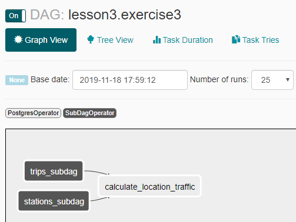  
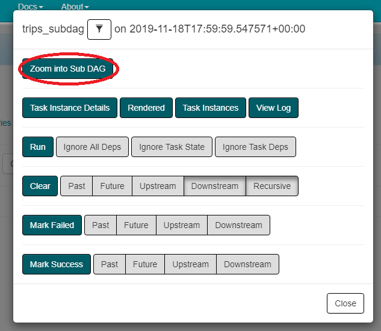  
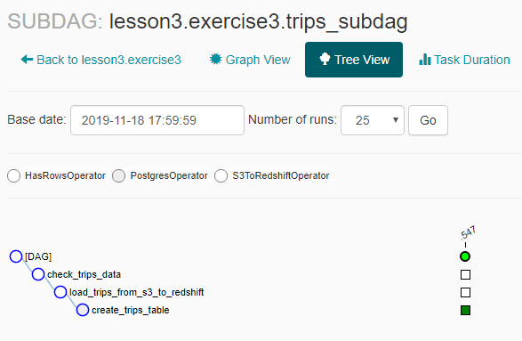  
  


Lesson 3 - Exercise 4 : Building a Full DAG  
In this exercise you will construct a DAG and custom operator end-to-end on your own. Our bikeshare company would like to create a trips facts table every time we update the trips data. You've decided to make the facts table creation a custom operator so that it can be reused for other tables in the future.

The skeleton of the custom operator, as well as the facts SQL statement has been created for you and can be found in ```plugins/operators/facts_calculator.py```. The DAG itself will be defined in ```dags/lesson3/exercise4.py```.

Using the previous exercises as examples, follow the instructions in the DAG and Operator file to complete the exercise.

DAG program : ```dags/lesson3/exercise4.py``` 

```
import datetime

from airflow import DAG

from airflow.operators import (
    FactsCalculatorOperator,
    HasRowsOperator,
    S3ToRedshiftOperator
)

#
# The following DAG performs the following functions:
#
#       1. Loads Trip data from S3 to RedShift
#       2. Performs a data quality check on the Trips table in RedShift
#       3. Uses the FactsCalculatorOperator to create a Facts table in Redshift
#           a. **NOTE**: to complete this step you must complete the FactsCalcuatorOperator
#              skeleton defined in plugins/operators/facts_calculator.py
#
dag = DAG("lesson3.exercise4", start_date=datetime.datetime.utcnow())

#
# The following code will load trips data from S3 to RedShift. Use the s3_key
#       "data-pipelines/divvy/unpartitioned/divvy_trips_2018.csv"
#       and the s3_bucket "udacity-dend"
#
copy_trips_task = S3ToRedshiftOperator(
    task_id="load_trips_from_s3_to_redshift",
    dag=dag,
    table="trips",
    redshift_conn_id="redshift",
    aws_credentials_id="aws_credentials",
    s3_bucket="udacity-dend",
    s3_key="data-pipelines/divvy/unpartitioned/divvy_trips_2018.csv"
)

#
#  Data quality check on the Trips table
#
check_trips = HasRowsOperator(
    task_id="check_trips_data",
    dag=dag,
    redshift_conn_id="redshift",
    table="trips"
)

#
# We use the FactsCalculatorOperator to create a Facts table in RedShift. The fact column is
#  `tripduration` and the groupby_column is `bikeid`
#
calculate_facts = FactsCalculatorOperator(
    task_id="calculate_facts_trips",
    dag=dag,
    redshift_conn_id="redshift",
    origin_table="trips",
    destination_table="trips_facts",
    fact_column="tripduration",
    groupby_column="bikeid"
)

#
# Task ordering for the DAG tasks 
#
copy_trips_task >> check_trips
check_trips >> calculate_facts
```

Custom Operator : ```plugins/operators/facts_calculator.py```
```
import logging

from airflow.hooks.postgres_hook import PostgresHook
from airflow.models import BaseOperator
from airflow.utils.decorators import apply_defaults


class FactsCalculatorOperator(BaseOperator):
    facts_sql_template = """
    DROP TABLE IF EXISTS {destination_table};
    CREATE TABLE {destination_table} AS
    SELECT
        {groupby_column},
        MAX({fact_column}) AS max_{fact_column},
        MIN({fact_column}) AS min_{fact_column},
        AVG({fact_column}) AS average_{fact_column}
    FROM {origin_table}
    GROUP BY {groupby_column};
    """

    @apply_defaults
    def __init__(self,
                 redshift_conn_id="",
                 origin_table="",
                 destination_table="",
                 fact_column="",
                 groupby_column="",
                 *args, **kwargs):

        super(FactsCalculatorOperator, self).__init__(*args, **kwargs)
        #
        # TODO: Set attributes from __init__ instantiation arguments
        #
        self.redshift_conn_id = redshift_conn_id
        self.origin_table = origin_table
        self.destination_table = destination_table
        self.fact_column = fact_column
        self.groupby_column = groupby_column        

    def execute(self, context):
        #
        # TODO: Fetch the redshift hook
        #
        redshift = PostgresHook(postgres_conn_id=self.redshift_conn_id)
        
        #
        # TODO: Format the `facts_sql_template` and run the query against redshift
        #
        facts_sql = FactsCalculatorOperator.facts_sql_template.format(
            origin_table=self.origin_table,
            destination_table=self.destination_table,
            fact_column=self.fact_column,
            groupby_column=self.groupby_column
        )
        redshift.run(facts_sql)
```

    

Basically understanding of Airflow from the above exercises is it does two things,
1. Handles ETL Workflow
1. Programs which it executes has to be written in the Airflow, there is **no** examples of setting up and running external programs and just handling the ETL workflow in Airflow. 

```
select 'songplays' as table_name, count(*) as rows from songplays
union all
select 'staging_events', count(*) from staging_events
union all
select 'staging_songs', count(*) from staging_songs
union all
select 'artists', count(*) from artists
union all
select 'songs', count(*) from songs
union all
select 'time', count(*) from time
union all
select 'users', count(*) from users;


truncate table songplays;
truncate table staging_events;
truncate table staging_songs;
truncate table artists;
truncate table songs;
truncate table time;
truncate table users;
```

### References
1. [Medium : Understanding Apache Airflow’s key concepts](https://medium.com/@dustinstansbury/understanding-apache-airflows-key-concepts-a96efed52b1a)