# Data Pipelines with Airflow ( AWS )

> ## Udacity Data Engineer Nano Degree Project 6

## Project Overview
A music streaming company, Sparkify, has decided that it is time to introduce more automation and monitoring to their data warehouse ETL pipelines and come to the conclusion that the best tool to achieve this is Apache Airflow.

They have decided to bring you into the project and expect you to create high grade data pipelines that are dynamic and built from reusable tasks, can be monitored, and allow easy backfills. They have also noted that the data quality plays a big part when analyses are executed on top the data warehouse and want to run tests against their datasets after the ETL steps have been executed to catch any discrepancies in the datasets.

The source data resides in S3 and needs to be processed in Sparkify's data warehouse in Amazon Redshift. The source datasets consist of JSON logs that tell about user activity in the application and JSON metadata about the songs the users listen to.

## Technical Overview
Project is implemented in AWS Cloud and uses the following, 
1. S3 Storage Buckets
1. AWS Redshift
1. [Airflow](./P6-Notes.md)
1. Python

## Goal
Build ETL Workflow using Airflow which should perform below tasks,
1. Read data from AWS S3 Buckets
1. Create & Load tables in AWS Redshift
1. Perform Data Quality Checks

## Project Specification

### **General**  
| CRITERIA                                                          | MEETS SPECIFICATIONS                                                                                                                                                       |
|-------------------------------------------------------------------|----------------------------------------------------------------------------------------------------------------------------------------------------------------------------|
| The dag and plugins do not give an error when imported to Airflow | DAG can be browsed without issues in the Airflow UI                                                                                                                        |
| All tasks have correct dependencies                               | The dag follows the data flow provided in the instructions, all the tasks have a dependency and DAG begins with a start_execution task and ends with a end_execution task. |

### **Dag configuration**  
| CRITERIA                               | MEETS SPECIFICATIONS                                                                                                                                                                                 |
|----------------------------------------|------------------------------------------------------------------------------------------------------------------------------------------------------------------------------------------------------|
| Default_args object is used in the DAG | DAG contains default_args dict, with the following keys:   <ul> <li> Owner </li> <li> Depends_on_past </li> <li> Start_date </li> <li> Retries </li> <li> Retry_delay </li> <li> Catchup </li> </ul> |
| Defaults_args are bind to the DAG      | The DAG object has default args set                                                                                                                                                                  |
| The DAG has a correct schedule         | The DAG should be scheduled to run once an hour                                                                                                                                                      |
### **Staging the data**  
| CRITERIA                                                                           | MEETS SPECIFICATIONS                                                                                                         |
|------------------------------------------------------------------------------------|------------------------------------------------------------------------------------------------------------------------------|
| Task to stage JSON data is included in the DAG and uses the RedshiftStage operator | There is a task that to stages data from S3 to Redshift. (Runs a Redshift copy statement)                                    |
| Task uses params                                                                   | Instead of running a static SQL statement to stage the data, the task uses params to generate the copy statement dynamically |
| Logging used                                                                       | The operator contains logging in different steps of the execution                                                            |
| The database connection is created by using a hook and a connection                | The SQL statements are executed by using a Airflow hook                                                                      |

### **Loading dimensions and facts**  
| CRITERIA                                                                                           | MEETS SPECIFICATIONS                                                                                                         |
|----------------------------------------------------------------------------------------------------|------------------------------------------------------------------------------------------------------------------------------|
| Set of tasks using the dimension load operator is in the DAG                                       | Dimensions are loaded with on the LoadDimension operator                                                                     |
| A task using the fact load operator is in the DAG                                                  | Facts are loaded with on the LoadFact operator                                                                               |
| Both operators use params                                                                          | Instead of running a static SQL statement to stage the data, the task uses params to generate the copy statement dynamically |
| The dimension task contains a param to allow switch between append and insert-delete functionality | The DAG allows to switch between append-only and delete-load functionality                                                   |

### **Data Quality Checks**  
| CRITERIA                                                                                         | MEETS SPECIFICATIONS                                                                            |
|--------------------------------------------------------------------------------------------------|-------------------------------------------------------------------------------------------------|
| A task using the data quality operator is in the DAG and at least one data quality check is done | Data quality check is done with correct operator                                                |
| The operator raises an error if the check fails pass                                             | The DAG either fails or retries n times                                                         |
| The operator is parameterized                                                                    | Operator uses params to get the tests and the results, tests are not hard coded to the operator |

### **Suggestions to Make Your Project Stand Out!**  
* Simple and dynamic operators, as little hard coding as possible
* Effective use of parameters in tasks
* Clean formatting of values in SQL strings
* Load dimensions with a subdag

## Project expected output


## Initial DAG look
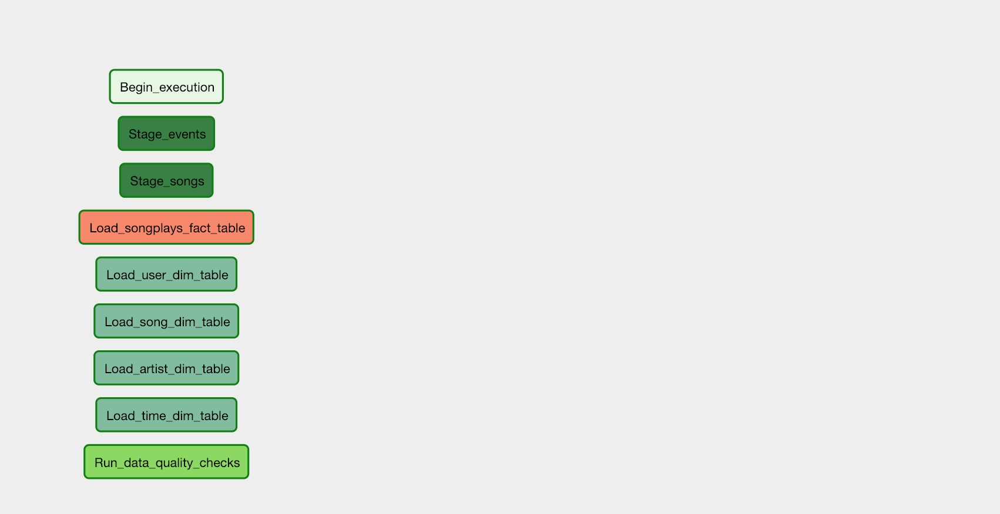

## Final Airflow DAG
Below are the initial analysis on the expected output and python program templates provided, 
* Redshift tables are created outside of airflow. Looking at the ```create_tables.sql``` confirms it as CREATE statements are pure SQL not initialized to python variable and file extension is ```.sql``. 

* Following changes are made to the udacity expected output to perform everything in airflow itself.

    * Tasks to create Redshift tables are added
    * In Project Rubic there was point saying "Load dimensions with a subdag" in "Suggestions to Make Your Project Stand Out!". So decided to use SUBDAG for dimension node and it does following : 

        * Create dimension table
        * Load dimension table
        * Verify table is not empty

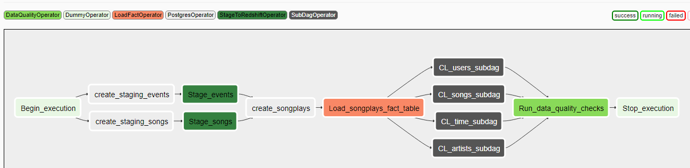


## Files in the folder
There are two folders
1. airflow-etl-workflow-with-DummyOperator  
Contains files with DummyOperator just to get started with the Job Workflow

1. airflow  
This contains the Project Files.


```./airflow```
```
root@9103b4177c12:/home/workspace# tree .
.
└── airflow
    ├── create_tables.sql
    ├── dags
    │   ├── load_dim_subdag.py
    │   ├── __pycache__
    │   │   ├── load_dim_subdag_1.cpython-36.pyc
    │   │   ├── load_dim_subdag.cpython-36.pyc
    │   │   ├── udac_example_dag_1.cpython-36.pyc
    │   │   └── udac_example_dag.cpython-36.pyc
    │   └── udac_example_dag.py
    └── plugins
        ├── helpers
        │   ├── create_tables.py
        │   ├── __init__.py
        │   ├── __pycache__
        │   │   ├── create_tables.cpython-36.pyc
        │   │   ├── __init__.cpython-36.pyc
        │   │   └── sql_queries.cpython-36.pyc
        │   └── sql_queries.py
        ├── __init__.py
        ├── operators
        │   ├── data_quality.py
        │   ├── has_rows.py
        │   ├── __init__.py
        │   ├── load_dimension.py
        │   ├── load_fact.py
        │   ├── __pycache__
        │   │   ├── data_quality.cpython-36.pyc
        │   │   ├── has_rows.cpython-36.pyc
        │   │   ├── __init__.cpython-36.pyc
        │   │   ├── load_dimension.cpython-36.pyc
        │   │   ├── load_fact.cpython-36.pyc
        │   │   └── stage_redshift.cpython-36.pyc
        │   └── stage_redshift.py
        └── __pycache__
            └── __init__.cpython-36.pyc

9 directories, 27 files
```

## How to run
### Create new AWS User & IAM Role
1. Create new IAM User for this project, this user Access key ID & Secret access key will be used in Airflow Admin Connections ```Udacity_DEND_Project6_DataPipelines_User```

1. Create IAM Role ( myRedshiftRole )
    * ARN(not used anywhere) : arn:aws:iam::164084742828:role/myRedshiftRole
    * Attach policies  
        * AmazonRedshiftQueryEditor  
        * AmazonS3ReadOnlyAccess                  

### Create Redshift Cluster
* Create Redshift Cluster ( Click Quick Launch Cluster )
    * Cluster Name : redshift-cluster-1
    * Node Type : dc2.large
    * Nodes : 2
    * Zone : us-west-2d
    * Endpoint : redshift-cluster-1.cw0ameupscni.us-west-2.redshift.amazonaws.com
    * Port : 5439
    * Database Name : udacity
    * User : awsuser
    * Password : C******1
    * Network : Default VPC

### Start Airflow & Setup Connections
* Start Project Workspace and  use below command to start Airflow ```/opt/airflow/start.sh```
In the top Airflow Menu, Admin -> Connections. Create below two new connections. See [Notes which has screenshots for setting up connections](./P6-Notes.md)
    * aws-creditials - IAM User
    * redshift - Database user & password

### Monitor DAGs
* Turn ON the toggle, DAG will automatically get triggered. 
* Dag starts running, Click the running Green circle in DAG Runs
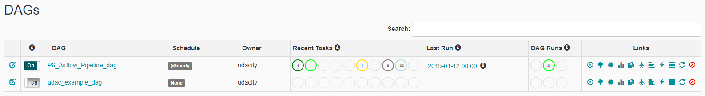

* Graph view
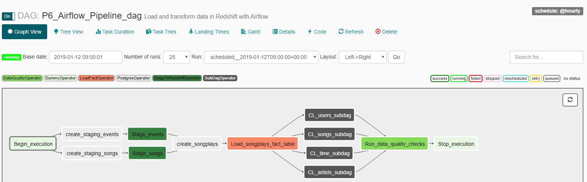

* Tree view( Yellow box is for retries, that occured because at that time, connections weren't setup. Once it was setup, retries were successful)
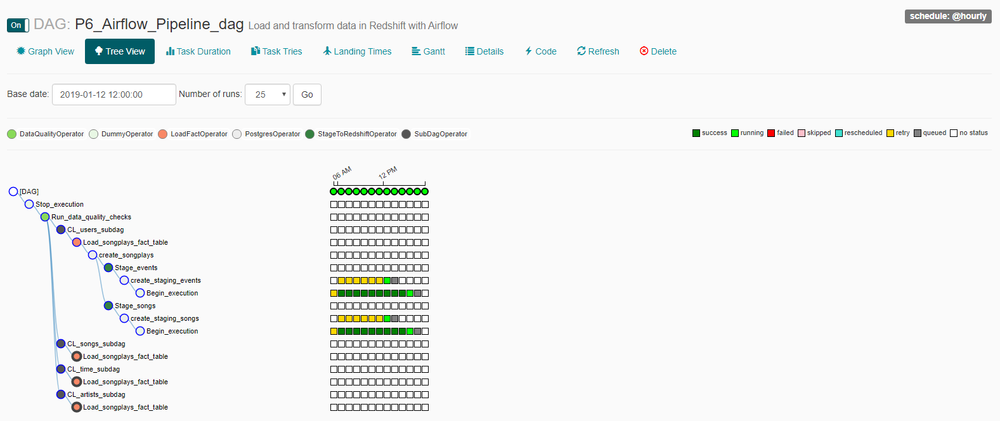

* CL_*_subdag are SUBDAGS, once you click below will popup, click "Zoom into Sub DAG" to see the running tasks
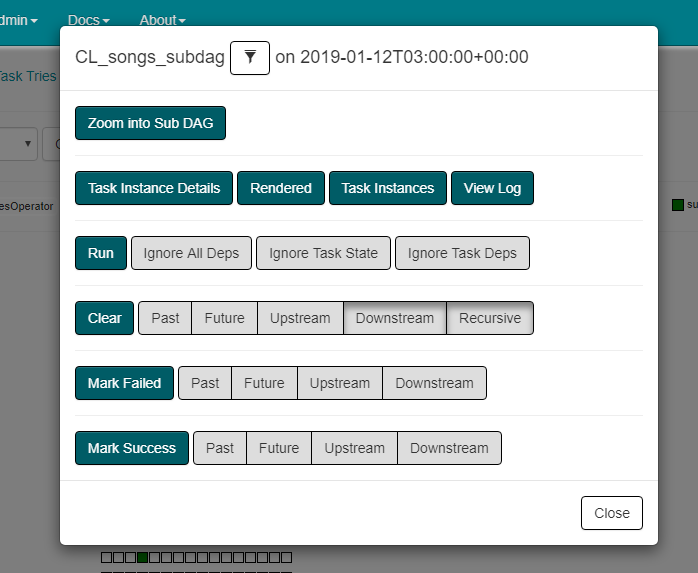

* Nodes in SUBDAG
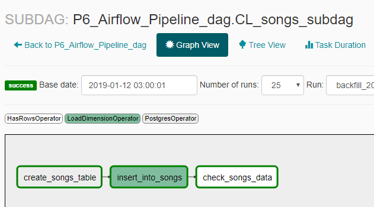

* Log of check_songs_data
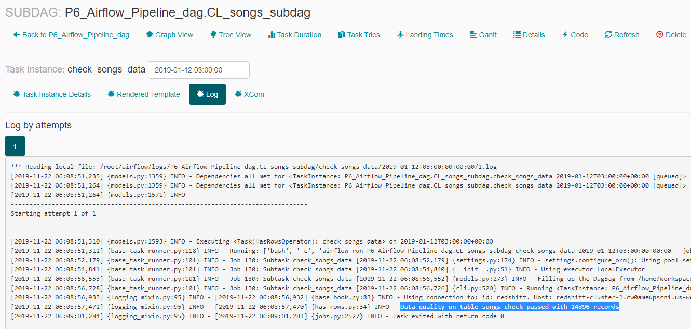

* Log of data_quality_checks
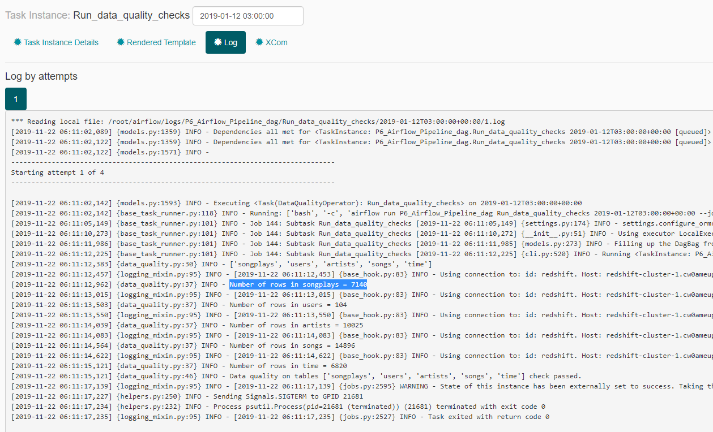

* Below is the failed messages, since all the DAGs were running parallely, at a certain point table was empty due to that this task had failed. 
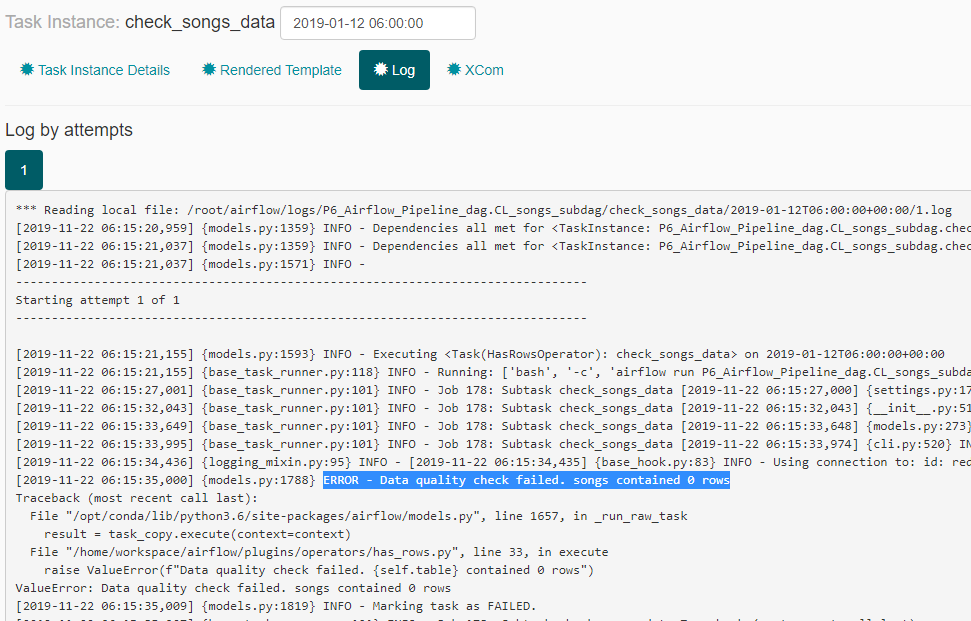

* Below is the screenshot from Redshift on rows count
```
select 'songplays' as table_name, count(*) as rows from songplays
union all
select 'staging_events', count(*) from staging_events
union all
select 'staging_songs', count(*) from staging_songs
union all
select 'artists', count(*) from artists
union all
select 'songs', count(*) from songs
union all
select 'time', count(*) from time
union all
select 'users', count(*) from users;
```
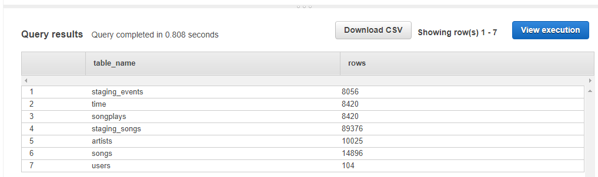

## Issues
### **start_execution dummyoperator failed**
This might be due to problem in the python code. Check the python code for syntax errors. 
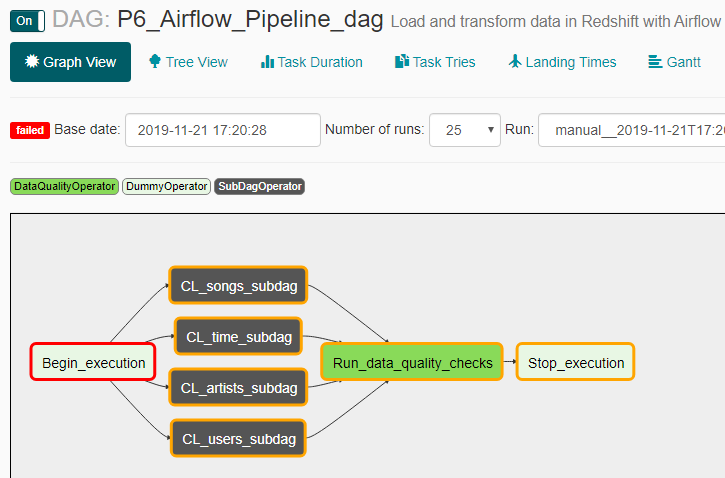

### **DAG isn't available**
This has occured due to one of the following reasons : 
* Code is not updated in the Airflow. So, keep refreshing
* Stop and Start the dag in Airflow UI
* Problem with the program. So best approach is to stop the airflow and restart the server. But, so far i haven't succesfully come accross to do so in the Udacity workspace. So I just wait it out till Workspace becomes idle. 

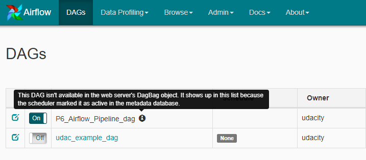
