# US Travels : Business / Pleasure / Education / All
## Data Engineering Capstone Project

### Project Summary
This is a Udacity Data Engineering Capstone project to showcase all the learning & skills that been acquired during the course of the nano-degree program. This is an open-ended project and for this udacity has provided four datasets that includes US immigration 2016 data, airport codes, temperature and US demographic data. If required, we can add more datasets to enrich information to suit our usecase which we like to analyze or present. 

Since this is an open-ended project, this can go in many directions based on  interests like,    
1. Analyze, Explore and Validate i94 dataset
2. Focus on infrastructure setup for the data pipelines, this involves, 
    - Using AWS Cloud formation to start EC2 instance, install Airflow in it, start EMR and Redshift
    - Installing Airflow in Udacity workspace and create EMR via Airflow to process data and Terminate EMR after finishing the processing. 
    - Both the above infra setup has it own usecase of which is efficient like,   
        + When you use Cloud formation, you have the ability to delete all the resources it had created in one-click. So, for testing scenarios this is very efficient
        + Second method, thats more real-time, that what a company would use. Start a EMR before processing and process data and Terminate EMR when done. Its very clean. 
3. Visualization, efficiently presenting analyzed information in a stunning manner which is easy to understand.

I am going to take this opportunity to work on point(1) and (3) from above, leaving the airflow & EMR for below reasons :   
1. Airflow Installation problems  
    * When directly installed in a EC2 instance, getting errors for subdags 
    * Shifted from direct install to Docker puckel/airflow, simple dags, getting data from Redshift are all working but i started to get lots of errors during EMR creation and eventually thought this is delaying the project. 
2. AWS Cloud formation
    * I was able to successfully setup SecurityGroups, EC2 instance, Install Airflow in EC2 instance, Create Redshift cluster and EMR as well. 
    * Again had some issues connecting to EMR and for same reason as above quitting this approach as well. Of these two solutions, i like the Cloud formation approach, due to the ability to delete all the resources in 1-Click. 

Getting the infra setup of airflow out of the picture, gives me more time to analyze, validate i94 and other datasets. Gathering the experience from previous projects in the technical side, Pandas are good in analyzing and Jupyter notebook is very good in executing the scripts step by step and lazy evaluation of spark takes lots of time during testing even with 10k-50k rows dataset. So approach i had taken is to use Pandas for all the inital assessment, cleaning and finally analyze if Spark will be required to process any big datasets. If big dataset is found, convert Panda codes to Spark codes, this is an additional step i am willing to take. So, finally all small datasets will be processed by Pandas and big datasets will be processed by Spark(PySpark). 

### Technical Overview
Project uses following technologies, 
1. S3 Storage : To store inputs & outputs
1. AWS Redshift as Warehousing database for Analytics
1. Python
1. Libraries : Pandas & Pyspark

### Files in the folder
+ i94 SAS datasets provided by Udacity ( around 6GB )  
```
root@1150c8c516d1:/home/workspace# du -h ../../data/18-83510-I94-Data-2016/*
451M    ../../data/18-83510-I94-Data-2016/i94_apr16_sub.sas7bdat
597M    ../../data/18-83510-I94-Data-2016/i94_aug16_sub.sas7bdat
500M    ../../data/18-83510-I94-Data-2016/i94_dec16_sub.sas7bdat
374M    ../../data/18-83510-I94-Data-2016/i94_feb16_sub.sas7bdat
415M    ../../data/18-83510-I94-Data-2016/i94_jan16_sub.sas7bdat
621M    ../../data/18-83510-I94-Data-2016/i94_jul16_sub.sas7bdat
684M    ../../data/18-83510-I94-Data-2016/i94_jun16_sub.sas7bdat
459M    ../../data/18-83510-I94-Data-2016/i94_mar16_sub.sas7bdat
501M    ../../data/18-83510-I94-Data-2016/i94_may16_sub.sas7bdat
424M    ../../data/18-83510-I94-Data-2016/i94_nov16_sub.sas7bdat
531M    ../../data/18-83510-I94-Data-2016/i94_oct16_sub.sas7bdat
543M    ../../data/18-83510-I94-Data-2016/i94_sep16_sub.sas7bdat
```
+ Ignored folders are, 
1. metastore_db : System folder
2. node_modules : created by NPM install
<details>
  <summary>Click here to see the TREE view of folders</summary>
<pre>
.
├── analytics_images
│   ├── Q10G1-legend.png
│   ├── Q10G1.svg
│   ├── Q11-Boston&Anchorage.png
│   ├── Q11-Chicago&Denver.png
│   ├── Q11G1.png
│   ├── Q11-Washington&Los Angeles.png
│   ├── Q1G1.png
│   ├── Q2G1.png
│   ├── Q4G1.png
│   ├── Q5bG1.png
│   ├── Q6G1.png
│   ├── Q6G2.png
│   ├── Q6G3.png
│   ├── Q7G1-legend.png
│   ├── Q7G1.svg
│   ├── Q8G1-legend.png
│   ├── Q8G1.svg
│   ├── Q9G1.png
│   └── us-map-test1.svg
├── archive
│   └── visatype.json
├── aws
│   └── aws-capstone.cfg
├── Capstone Project - A - Pandas.ipynb
├── Capstone Project - B - Spark.ipynb
├── Capstone Project - C - Spark tables.ipynb
├── Capstone Project - D - Analytics.ipynb
├── create_cluster.py
├── create_tables.py
├── data_dictionary
│   ├── Data_dictionary-Project_Capstone.pdf
├── Datasets Link.txt
├── ddl.txt
├── delete_cluster.py
├── etl.py
├── I94_SAS_Labels_Descriptions.SAS
├── images
│   ├── FactandDimension_Tables.png
│   └── Staging_Tables.png
├── inputs
│   ├── airline-codes.csv
│   ├── airport-codes_csv.csv
│   ├── counties.svg
│   ├── country-codes2.csv
│   ├── country-codes.csv
│   ├── i94addr.json
│   ├── i94cit.json
│   ├── i94port.json
│   ├── immigration_data_sample.csv
│   ├── InternationalAirports.csv
│   ├── staging-table-data.txt
│   ├── uscities.csv
│   ├── us-cities-demographics.csv
│   ├── us-states.csv
│   ├── uszips.csv
│   ├── visapost.csv
│   ├── visatype2.csv
│   ├── worldcities.csv
│   └── world_temperature.csv
├── outputs
│   ├── df_ac1.csv
│   ├── df_alc.csv
│   ├── df_alpha2countrycode.csv
│   ├── df_i94countrycode1.csv
│   ├── df_iap.csv
│   ├── df_temper1.csv
│   ├── df_uscd1.csv
│   ├── df_usdp.csv
│   ├── df_usdr.csv
│   ├── df_USPoE1.csv
│   ├── df_USstatecode.csv
│   ├── df_uszips1.csv
│   ├── df_visapost.csv
│   ├── df_visatype1.csv
│   └── df_wc1.csv
├── outputs-gzip
│   └── dfs_ids1.gzip
│       ├── part-00000-ace9dcb2-52e0-4bd4-aeb7-8a9ffdddad59-c000.csv.gz
│       ├── part-00043-ace9dcb2-52e0-4bd4-aeb7-8a9ffdddad59-c000.csv.gz
│       ├── part-00051-ace9dcb2-52e0-4bd4-aeb7-8a9ffdddad59-c000.csv.gz
│       ├── part-00174-ace9dcb2-52e0-4bd4-aeb7-8a9ffdddad59-c000.csv.gz
│       ├── part-00243-ace9dcb2-52e0-4bd4-aeb7-8a9ffdddad59-c000.csv.gz
│       ├── part-00251-ace9dcb2-52e0-4bd4-aeb7-8a9ffdddad59-c000.csv.gz
│       ├── part-00374-ace9dcb2-52e0-4bd4-aeb7-8a9ffdddad59-c000.csv.gz
│       ├── part-00443-ace9dcb2-52e0-4bd4-aeb7-8a9ffdddad59-c000.csv.gz
│       ├── part-00451-ace9dcb2-52e0-4bd4-aeb7-8a9ffdddad59-c000.csv.gz
│       ├── part-00574-ace9dcb2-52e0-4bd4-aeb7-8a9ffdddad59-c000.csv.gz
│       ├── part-00643-ace9dcb2-52e0-4bd4-aeb7-8a9ffdddad59-c000.csv.gz
│       ├── part-00651-ace9dcb2-52e0-4bd4-aeb7-8a9ffdddad59-c000.csv.gz
│       ├── part-00774-ace9dcb2-52e0-4bd4-aeb7-8a9ffdddad59-c000.csv.gz
│       ├── part-00843-ace9dcb2-52e0-4bd4-aeb7-8a9ffdddad59-c000.csv.gz
│       ├── part-00851-ace9dcb2-52e0-4bd4-aeb7-8a9ffdddad59-c000.csv.gz
│       ├── part-00974-ace9dcb2-52e0-4bd4-aeb7-8a9ffdddad59-c000.csv.gz
│       ├── part-01043-ace9dcb2-52e0-4bd4-aeb7-8a9ffdddad59-c000.csv.gz
│       ├── part-01051-ace9dcb2-52e0-4bd4-aeb7-8a9ffdddad59-c000.csv.gz
│       ├── part-01174-ace9dcb2-52e0-4bd4-aeb7-8a9ffdddad59-c000.csv.gz
│       ├── part-01243-ace9dcb2-52e0-4bd4-aeb7-8a9ffdddad59-c000.csv.gz
│       ├── part-01251-ace9dcb2-52e0-4bd4-aeb7-8a9ffdddad59-c000.csv.gz
│       ├── part-01374-ace9dcb2-52e0-4bd4-aeb7-8a9ffdddad59-c000.csv.gz
│       ├── part-01443-ace9dcb2-52e0-4bd4-aeb7-8a9ffdddad59-c000.csv.gz
│       ├── part-01451-ace9dcb2-52e0-4bd4-aeb7-8a9ffdddad59-c000.csv.gz
│       ├── part-01574-ace9dcb2-52e0-4bd4-aeb7-8a9ffdddad59-c000.csv.gz
│       ├── part-01643-ace9dcb2-52e0-4bd4-aeb7-8a9ffdddad59-c000.csv.gz
│       ├── part-01651-ace9dcb2-52e0-4bd4-aeb7-8a9ffdddad59-c000.csv.gz
│       ├── part-01774-ace9dcb2-52e0-4bd4-aeb7-8a9ffdddad59-c000.csv.gz
│       ├── part-01843-ace9dcb2-52e0-4bd4-aeb7-8a9ffdddad59-c000.csv.gz
│       ├── part-01851-ace9dcb2-52e0-4bd4-aeb7-8a9ffdddad59-c000.csv.gz
│       ├── part-01974-ace9dcb2-52e0-4bd4-aeb7-8a9ffdddad59-c000.csv.gz
│       ├── part-02043-ace9dcb2-52e0-4bd4-aeb7-8a9ffdddad59-c000.csv.gz
│       ├── part-02051-ace9dcb2-52e0-4bd4-aeb7-8a9ffdddad59-c000.csv.gz
│       ├── part-02174-ace9dcb2-52e0-4bd4-aeb7-8a9ffdddad59-c000.csv.gz
│       ├── part-02243-ace9dcb2-52e0-4bd4-aeb7-8a9ffdddad59-c000.csv.gz
│       ├── part-02251-ace9dcb2-52e0-4bd4-aeb7-8a9ffdddad59-c000.csv.gz
│       ├── part-02374-ace9dcb2-52e0-4bd4-aeb7-8a9ffdddad59-c000.csv.gz
│       └── _SUCCESS
├── printSchema.txt
├── process-df2.py
├── process-df.py
├── readme.md
├── S3Upload.py
├── sas_data
│   ├── part-00000-b9542815-7a8d-45fc-9c67-c9c5007ad0d4-c000.snappy.parquet
│   ├── part-00001-b9542815-7a8d-45fc-9c67-c9c5007ad0d4-c000.snappy.parquet
│   ├── part-00002-b9542815-7a8d-45fc-9c67-c9c5007ad0d4-c000.snappy.parquet
│   ├── part-00003-b9542815-7a8d-45fc-9c67-c9c5007ad0d4-c000.snappy.parquet
│   ├── part-00004-b9542815-7a8d-45fc-9c67-c9c5007ad0d4-c000.snappy.parquet
│   ├── part-00005-b9542815-7a8d-45fc-9c67-c9c5007ad0d4-c000.snappy.parquet
│   ├── part-00006-b9542815-7a8d-45fc-9c67-c9c5007ad0d4-c000.snappy.parquet
│   ├── part-00007-b9542815-7a8d-45fc-9c67-c9c5007ad0d4-c000.snappy.parquet
│   ├── part-00008-b9542815-7a8d-45fc-9c67-c9c5007ad0d4-c000.snappy.parquet
│   ├── part-00009-b9542815-7a8d-45fc-9c67-c9c5007ad0d4-c000.snappy.parquet
│   ├── part-00010-b9542815-7a8d-45fc-9c67-c9c5007ad0d4-c000.snappy.parquet
│   ├── part-00011-b9542815-7a8d-45fc-9c67-c9c5007ad0d4-c000.snappy.parquet
│   ├── part-00012-b9542815-7a8d-45fc-9c67-c9c5007ad0d4-c000.snappy.parquet
│   ├── part-00013-b9542815-7a8d-45fc-9c67-c9c5007ad0d4-c000.snappy.parquet
│   └── _SUCCESS
├── sas_inputs
│   └── i94_apr16_sub.sas7bdat
├── sql_queries.py
├── templates
│   └── Capstone Project Template.ipynb
└── zip-all.py
</pre>
</details>


### How to run
1. Open ./aws/aws-capstone.cfg and key in KEY, SECRET and KEYSECRET
1. Open Terminal and install   
    ```pip install fuzzywuzzy[speedup]```
1. Delete folders ```./outputs``` & ```./outputs-gzip/```  
    ```
    rm -r ./outputs
    rm -r ./outputs-gzip/
    ```

>Execute the below commands in Python 3 console
1. ```%run ```[process-df.py](./process-df.py)
1. ```%run ```[S3Upload.py](./S3Upload.py)
1. ```%run ```[create_cluster.py](./create_cluster.py)
1. ```%run ```[create_tables.py](./create_tables.py)
1. ```%run ```[etl.py](./etl.py)
1. Execute all the cells in [Capstone Project - D - Analytics.ipynb](./Capstone-Project---D---Analytics.ipynb)
1. ```%run ```[delete_cluster.py](./delete_cluster.py)


### Outputs
1. ```process-df.py```
<details>
  <summary>Click to see console messages</summary>
<pre>
%run process-df.py
2020-02-21 15:30:34.953972 : Starting to read datasets
2020-02-21 15:31:16.502263 : Starting to process df_i94countrycode
=== Process df_i94countrycode Total Elapsed time is 0.34 sec

2020-02-21 15:31:16.835996 : Starting to process df_USPoE
=== Process df_USPoE Total Elapsed time is 0.31 sec

2020-02-21 15:31:17.147094 : Starting to process df_ac
=== Process df_ac Total Elapsed time is 5.67 sec

2020-02-21 15:31:22.825244 : Starting to process df_visatype
=== Process df_visatype Total Elapsed time is 0.0 sec

Starting spark read of SAS datasets
 ==> 2020-02-21 15:31:22.832981 : Processing sas dataset ../../data/18-83510-I94-Data-2016/i94_apr16_sub.sas7bdat
2020-02-21 15:32:01.742204 : Starting to process dfs_ids
=== Process dfs_ids Total Elapsed time is 53.37 sec

 ==> 2020-02-21 15:32:55.110144 : Processing sas dataset ../../data/18-83510-I94-Data-2016/i94_sep16_sub.sas7bdat
2020-02-21 15:33:41.942190 : Starting to process dfs_ids
=== Process dfs_ids Total Elapsed time is 62.08 sec

 ==> 2020-02-21 15:34:44.029866 : Processing sas dataset ../../data/18-83510-I94-Data-2016/i94_nov16_sub.sas7bdat
2020-02-21 15:35:20.614703 : Starting to process dfs_ids
=== Process dfs_ids Total Elapsed time is 49.84 sec

 ==> 2020-02-21 15:36:10.467603 : Processing sas dataset ../../data/18-83510-I94-Data-2016/i94_mar16_sub.sas7bdat
2020-02-21 15:36:50.711200 : Starting to process dfs_ids
=== Process dfs_ids Total Elapsed time is 50.84 sec

 ==> 2020-02-21 15:37:41.560567 : Processing sas dataset ../../data/18-83510-I94-Data-2016/i94_jun16_sub.sas7bdat
2020-02-21 15:38:30.076105 : Starting to process dfs_ids
=== Process dfs_ids Total Elapsed time is 59.92 sec

 ==> 2020-02-21 15:39:30.021891 : Processing sas dataset ../../data/18-83510-I94-Data-2016/i94_aug16_sub.sas7bdat
2020-02-21 15:40:20.962596 : Starting to process dfs_ids
=== Process dfs_ids Total Elapsed time is 64.21 sec

 ==> 2020-02-21 15:41:25.204699 : Processing sas dataset ../../data/18-83510-I94-Data-2016/i94_may16_sub.sas7bdat
2020-02-21 15:42:07.838016 : Starting to process dfs_ids
=== Process dfs_ids Total Elapsed time is 54.84 sec

 ==> 2020-02-21 15:43:02.699143 : Processing sas dataset ../../data/18-83510-I94-Data-2016/i94_jan16_sub.sas7bdat
2020-02-21 15:43:37.813947 : Starting to process dfs_ids
=== Process dfs_ids Total Elapsed time is 46.17 sec

 ==> 2020-02-21 15:44:23.998634 : Processing sas dataset ../../data/18-83510-I94-Data-2016/i94_oct16_sub.sas7bdat
2020-02-21 15:45:09.952429 : Starting to process dfs_ids
=== Process dfs_ids Total Elapsed time is 57.24 sec

 ==> 2020-02-21 15:46:07.212672 : Processing sas dataset ../../data/18-83510-I94-Data-2016/i94_jul16_sub.sas7bdat
2020-02-21 15:47:00.969440 : Starting to process dfs_ids
=== Process dfs_ids Total Elapsed time is 65.9 sec

 ==> 2020-02-21 15:48:06.895225 : Processing sas dataset ../../data/18-83510-I94-Data-2016/i94_feb16_sub.sas7bdat
2020-02-21 15:48:39.340242 : Starting to process dfs_ids
=== Process dfs_ids Total Elapsed time is 41.6 sec

 ==> 2020-02-21 15:49:20.967705 : Processing sas dataset ../../data/18-83510-I94-Data-2016/i94_dec16_sub.sas7bdat
2020-02-21 15:50:04.134523 : Starting to process dfs_ids
=== Process dfs_ids Total Elapsed time is 63.13 sec

2020-02-21 16:15:09.263153 : Starting to process df_uszips
=== Process df_uszips Total Elapsed time is 0.09 sec

2020-02-21 16:15:09.350884 : Starting to process df_uscd
=== Process df_uscd Total Elapsed time is 5.77 sec

2020-02-21 16:15:15.122421 : Starting to process df_temper
=== Process df_temper Total Elapsed time is 2.97 sec

2020-02-21 16:15:18.492226 : Starting to process df_wc
=== Process df_wc Total Elapsed time is 0.01 sec

2020-02-21 16:15:18.498251 : Cleaned dataframes rows count
df_visatype1    = 108
df_ac1          = 113
df_USPoE1       = 526
df_uszips1      = 33099
df_i94countrycode1 = 236
df_uscd1        = 2883
df_usdp         = 594
df_usdr         = 594
df_temper1      = 639649
df_wc1          = 15493
2020-02-21 16:15:18.500103 : Datasets with no changes/updates
df_alc          = 1571
df_visapost     = 284
df_alpha2countrycode = 249
df_iap          = 1304
df_USstatecode  = 62
2020-02-21 16:15:18.506460 : Write non-i94 dataframes(CSV)
2020-02-21 16:15:25.014930 : Write i94 dataframes(gzip)
=== Main() Total Elapsed time is 7411.4 sec

2020-02-21 17:34:06.350763 : Done!
</pre>
</details>

2. ```S3Upload.py```
<details>
  <summary>Click to see console messages</summary>
<pre>
%run S3Upload.py
2020-02-21 18:36:44.788262 : Starting S3 Upload process
Current Working Directory :  /home/workspace
Scanning Directory :  /home/workspace/inputs
Scanning Directory :  /home/workspace/outputs
33 files found, 1 files ignored
Total Buckets =  15
1. aws-emr-resources-164084742828-ap-south-1
2. aws-emr-resources-164084742828-us-west-2
3. aws-logs-164084742828-ap-south-1
4. aws-logs-164084742828-us-west-2
5. cf-templates-1cr7hxyaaac8h-us-west-2
6. datalake-results
7. sushant-datalake-zip
8. sushanth-dend-capstone-ec2
9. sushanth-dend-capstone-emr
10. sushanth-dend-capstone-files2
11. sushanth-dend-datalake-files
12. sushanth-dend-datalake-parquet-files2
13. sushanth-dend-datalake-parquet-files4
14. sushanth-dend-datalake-programs
15. sushanth-testbucket
2020-02-21 18:36:45.271866 : Creating bucket sushanth-dend-capstone-files2
S3 : bucket sushanth-dend-capstone-files2 exists
2020-02-21 18:36:45.645879 : Uploading CSV files to bucket sushanth-dend-capstone-files2
Uploading 33 files to S3
2020-02-21 18:37:04.896839 : Uploading gzip files to bucket sushanth-dend-capstone-files2
Deleting crc & _SUCCESS files
Action        Date                        Size         Filename(Total scanned files=148) 
deleting file 2020-02-21 18:37:17+00:00 :          8 : dfs_ids1.gzip/._SUCCESS.crc 
deleting file 2020-02-21 18:37:13+00:00 :         12 : dfs_ids1.gzip/.part-00000-ace9dcb2-52e0-4bd4-aeb7-8a9ffdddad59-c000.csv.gz.crc 
deleting file 2020-02-21 18:37:24+00:00 :      27740 : dfs_ids1.gzip/.part-00043-ace9dcb2-52e0-4bd4-aeb7-8a9ffdddad59-c000.csv.gz.crc 
deleting file 2020-02-21 18:37:12+00:00 :       3076 : dfs_ids1.gzip/.part-00051-ace9dcb2-52e0-4bd4-aeb7-8a9ffdddad59-c000.csv.gz.crc 
deleting file 2020-02-21 18:37:28+00:00 :     117820 : dfs_ids1.gzip/.part-00174-ace9dcb2-52e0-4bd4-aeb7-8a9ffdddad59-c000.csv.gz.crc 
deleting file 2020-02-21 18:37:09+00:00 :      49296 : dfs_ids1.gzip/.part-00243-ace9dcb2-52e0-4bd4-aeb7-8a9ffdddad59-c000.csv.gz.crc 
deleting file 2020-02-21 18:37:24+00:00 :       8580 : dfs_ids1.gzip/.part-00251-ace9dcb2-52e0-4bd4-aeb7-8a9ffdddad59-c000.csv.gz.crc 
deleting file 2020-02-21 18:37:14+00:00 :     272724 : dfs_ids1.gzip/.part-00374-ace9dcb2-52e0-4bd4-aeb7-8a9ffdddad59-c000.csv.gz.crc 
deleting file 2020-02-21 18:37:23+00:00 :      36812 : dfs_ids1.gzip/.part-00443-ace9dcb2-52e0-4bd4-aeb7-8a9ffdddad59-c000.csv.gz.crc 
deleting file 2020-02-21 18:37:12+00:00 :       4368 : dfs_ids1.gzip/.part-00451-ace9dcb2-52e0-4bd4-aeb7-8a9ffdddad59-c000.csv.gz.crc 
deleting file 2020-02-21 18:37:08+00:00 :     185088 : dfs_ids1.gzip/.part-00574-ace9dcb2-52e0-4bd4-aeb7-8a9ffdddad59-c000.csv.gz.crc 
deleting file 2020-02-21 18:37:06+00:00 :      25564 : dfs_ids1.gzip/.part-00643-ace9dcb2-52e0-4bd4-aeb7-8a9ffdddad59-c000.csv.gz.crc 
deleting file 2020-02-21 18:37:12+00:00 :       7708 : dfs_ids1.gzip/.part-00651-ace9dcb2-52e0-4bd4-aeb7-8a9ffdddad59-c000.csv.gz.crc 
deleting file 2020-02-21 18:37:20+00:00 :     125540 : dfs_ids1.gzip/.part-00774-ace9dcb2-52e0-4bd4-aeb7-8a9ffdddad59-c000.csv.gz.crc 
deleting file 2020-02-21 18:37:17+00:00 :      25320 : dfs_ids1.gzip/.part-00843-ace9dcb2-52e0-4bd4-aeb7-8a9ffdddad59-c000.csv.gz.crc 
deleting file 2020-02-21 18:37:23+00:00 :       3048 : dfs_ids1.gzip/.part-00851-ace9dcb2-52e0-4bd4-aeb7-8a9ffdddad59-c000.csv.gz.crc 
deleting file 2020-02-21 18:37:07+00:00 :     152440 : dfs_ids1.gzip/.part-00974-ace9dcb2-52e0-4bd4-aeb7-8a9ffdddad59-c000.csv.gz.crc 
deleting file 2020-02-21 18:37:15+00:00 :      32000 : dfs_ids1.gzip/.part-01043-ace9dcb2-52e0-4bd4-aeb7-8a9ffdddad59-c000.csv.gz.crc 
deleting file 2020-02-21 18:37:21+00:00 :       5112 : dfs_ids1.gzip/.part-01051-ace9dcb2-52e0-4bd4-aeb7-8a9ffdddad59-c000.csv.gz.crc 
deleting file 2020-02-21 18:37:26+00:00 :     271544 : dfs_ids1.gzip/.part-01174-ace9dcb2-52e0-4bd4-aeb7-8a9ffdddad59-c000.csv.gz.crc 
deleting file 2020-02-21 18:37:12+00:00 :      29156 : dfs_ids1.gzip/.part-01243-ace9dcb2-52e0-4bd4-aeb7-8a9ffdddad59-c000.csv.gz.crc 
deleting file 2020-02-21 18:37:28+00:00 :       3316 : dfs_ids1.gzip/.part-01251-ace9dcb2-52e0-4bd4-aeb7-8a9ffdddad59-c000.csv.gz.crc 
deleting file 2020-02-21 18:37:27+00:00 :     139520 : dfs_ids1.gzip/.part-01374-ace9dcb2-52e0-4bd4-aeb7-8a9ffdddad59-c000.csv.gz.crc 
deleting file 2020-02-21 18:37:21+00:00 :      26848 : dfs_ids1.gzip/.part-01443-ace9dcb2-52e0-4bd4-aeb7-8a9ffdddad59-c000.csv.gz.crc 
deleting file 2020-02-21 18:37:24+00:00 :       7828 : dfs_ids1.gzip/.part-01451-ace9dcb2-52e0-4bd4-aeb7-8a9ffdddad59-c000.csv.gz.crc 
deleting file 2020-02-21 18:37:23+00:00 :      84528 : dfs_ids1.gzip/.part-01574-ace9dcb2-52e0-4bd4-aeb7-8a9ffdddad59-c000.csv.gz.crc 
deleting file 2020-02-21 18:37:14+00:00 :      40624 : dfs_ids1.gzip/.part-01643-ace9dcb2-52e0-4bd4-aeb7-8a9ffdddad59-c000.csv.gz.crc 
deleting file 2020-02-21 18:37:20+00:00 :       3416 : dfs_ids1.gzip/.part-01651-ace9dcb2-52e0-4bd4-aeb7-8a9ffdddad59-c000.csv.gz.crc 
deleting file 2020-02-21 18:37:17+00:00 :     215440 : dfs_ids1.gzip/.part-01774-ace9dcb2-52e0-4bd4-aeb7-8a9ffdddad59-c000.csv.gz.crc 
deleting file 2020-02-21 18:37:22+00:00 :      32192 : dfs_ids1.gzip/.part-01843-ace9dcb2-52e0-4bd4-aeb7-8a9ffdddad59-c000.csv.gz.crc 
deleting file 2020-02-21 18:37:23+00:00 :       3420 : dfs_ids1.gzip/.part-01851-ace9dcb2-52e0-4bd4-aeb7-8a9ffdddad59-c000.csv.gz.crc 
deleting file 2020-02-21 18:37:13+00:00 :     311724 : dfs_ids1.gzip/.part-01974-ace9dcb2-52e0-4bd4-aeb7-8a9ffdddad59-c000.csv.gz.crc 
deleting file 2020-02-21 18:37:23+00:00 :      22624 : dfs_ids1.gzip/.part-02043-ace9dcb2-52e0-4bd4-aeb7-8a9ffdddad59-c000.csv.gz.crc 
deleting file 2020-02-21 18:37:15+00:00 :       1916 : dfs_ids1.gzip/.part-02051-ace9dcb2-52e0-4bd4-aeb7-8a9ffdddad59-c000.csv.gz.crc 
deleting file 2020-02-21 18:37:14+00:00 :      81484 : dfs_ids1.gzip/.part-02174-ace9dcb2-52e0-4bd4-aeb7-8a9ffdddad59-c000.csv.gz.crc 
deleting file 2020-02-21 18:37:06+00:00 :      22652 : dfs_ids1.gzip/.part-02243-ace9dcb2-52e0-4bd4-aeb7-8a9ffdddad59-c000.csv.gz.crc 
deleting file 2020-02-21 18:37:10+00:00 :       4148 : dfs_ids1.gzip/.part-02251-ace9dcb2-52e0-4bd4-aeb7-8a9ffdddad59-c000.csv.gz.crc 
deleting file 2020-02-21 18:37:15+00:00 :     286380 : dfs_ids1.gzip/.part-02374-ace9dcb2-52e0-4bd4-aeb7-8a9ffdddad59-c000.csv.gz.crc 
deleting file 2020-02-21 18:37:15+00:00 :          0 : dfs_ids1.gzip/_SUCCESS 
=== S3 Upload process Total Elapsed time is 46.8 sec

2020-02-21 18:37:31.584957 : Done!
</pre>
</details>

3. ```create_cluster.py```
<details>
  <summary>Click here to see console messages</summary>
<pre>
%run create_cluster.py
                    Param       Value
0  DWH_CLUSTER_TYPE        multi-node
1  DWH_NUM_NODES           4         
2  DWH_NODE_TYPE           dc2.large 
3  DWH_CLUSTER_IDENTIFIER  dwhCluster
4  DWH_DB                  dwh       
5  DWH_DB_USER             dwhuser   
6  DWH_DB_PASSWORD         Passw0rd  
7  DWH_PORT                5439      
8  DWH_IAM_ROLE_NAME       dwhRole   
1.1 Creating a new IAM Role
1.2 Attaching Policy
1.3 Get the IAM role ARN
      ARN : arn:aws:iam::164084742828:role/dwhRole
1.4 Starting Redshift Cluster Creation
     Waited for 0 seconds. Redshift Cluster Creation in-progress...Cluster Status =  creating
     Waited for 5 seconds. Redshift Cluster Creation in-progress...Cluster Status =  creating
     Waited for 10 seconds. Redshift Cluster Creation in-progress...Cluster Status =  creating
     Waited for 15 seconds. Redshift Cluster Creation in-progress...Cluster Status =  creating
     Waited for 20 seconds. Redshift Cluster Creation in-progress...Cluster Status =  creating
     Waited for 25 seconds. Redshift Cluster Creation in-progress...Cluster Status =  creating
     Waited for 30 seconds. Redshift Cluster Creation in-progress...Cluster Status =  creating
     Waited for 35 seconds. Redshift Cluster Creation in-progress...Cluster Status =  creating
     Waited for 40 seconds. Redshift Cluster Creation in-progress...Cluster Status =  creating
     Waited for 45 seconds. Redshift Cluster Creation in-progress...Cluster Status =  creating
     Waited for 50 seconds. Redshift Cluster Creation in-progress...Cluster Status =  creating
     Waited for 55 seconds. Redshift Cluster Creation in-progress...Cluster Status =  creating
     Waited for 60 seconds. Redshift Cluster Creation in-progress...Cluster Status =  creating
     Waited for 65 seconds. Redshift Cluster Creation in-progress...Cluster Status =  creating
     Waited for 70 seconds. Redshift Cluster Creation in-progress...Cluster Status =  creating
     Waited for 75 seconds. Redshift Cluster Creation in-progress...Cluster Status =  creating
     Waited for 80 seconds. Redshift Cluster Creation in-progress...Cluster Status =  creating
     Waited for 85 seconds. Redshift Cluster Creation in-progress...Cluster Status =  creating
     Waited for 90 seconds. Redshift Cluster Creation in-progress...Cluster Status =  creating
     Waited for 95 seconds. Redshift Cluster Creation in-progress...Cluster Status =  creating
     Waited for 100 seconds. Redshift Cluster Creation in-progress...Cluster Status =  creating
     Waited for 105 seconds. Redshift Cluster Creation in-progress...Cluster Status =  creating
     Waited for 110 seconds. Redshift Cluster Creation in-progress...Cluster Status =  creating
     Waited for 115 seconds. Redshift Cluster Creation in-progress...Cluster Status =  creating
     Waited for 120 seconds. Redshift Cluster Creation in-progress...Cluster Status =  creating
     Waited for 125 seconds. Redshift Cluster Creation in-progress...Cluster Status =  creating
     Waited for 135 seconds. Redshift Cluster Creation in-progress...Cluster Status =  creating
     Waited for 135 seconds. Redshift Cluster Creation in-progress...Cluster Status =  creating
     Waited for 140 seconds. Redshift Cluster Creation in-progress...Cluster Status =  creating
     Waited for 145 seconds. Redshift Cluster Creation in-progress...Cluster Status =  available
     Cluster creation completed. Took 150 seconds.
DWH_ENDPOINT ::  dwhcluster.cw0ameupscni.us-west-2.redshift.amazonaws.com
DWH_ROLE_ARN ::  arn:aws:iam::164084742828:role/dwhRole
DWH_ENDPOINT = dwhcluster.cw0ameupscni.us-west-2.redshift.amazonaws.com
DWH_ROLE_ARN = arn:aws:iam::164084742828:role/dwhRole
ec2.SecurityGroup(id='sg-00e8450b90f49fb8c')
An error occurred (InvalidPermission.Duplicate) when calling the AuthorizeSecurityGroupIngress operation: the specified rule "peer: 0.0.0.0/0, TCP, from port: 5439, to port: 5439, ALLOW" already exists
Connected
Done!
</pre>
</details>

4. ```create_tables.py```
<details>
  <summary>Click here to see console messages</summary>
<pre>
%run create_tables.py
Setting the schema path
     Since schema itself is not there. Guessing table wont be there as well.
DROP schema
CREATE schema
Setting the schema path
CREATE TABLE staging_ids
CREATE TABLE staging_visatype
CREATE TABLE staging_ac
CREATE TABLE staging_USPoE
CREATE TABLE staging_uszips
CREATE TABLE staging_i94countrycode
CREATE TABLE staging_usdp
CREATE TABLE staging_usdr
CREATE TABLE staging_temper
CREATE TABLE staging_alc
CREATE TABLE staging_visapost
CREATE TABLE staging_alpha2countrycode
CREATE TABLE staging_iap
CREATE TABLE staging_wc
CREATE TABLE staging_USstatecode
CREATE TABLE fact_ids
CREATE TABLE dim_visatype
CREATE TABLE dim_ac
CREATE TABLE dim_USPoE
CREATE TABLE dim_uszips
CREATE TABLE dim_i94countrycode
CREATE TABLE dim_usdp
CREATE TABLE dim_usdr
CREATE TABLE dim_temper
CREATE TABLE dim_alc
CREATE TABLE dim_visapost
CREATE TABLE dim_alpha2countrycode
CREATE TABLE dim_iap
CREATE TABLE dim_wc
CREATE TABLE dim_USstatecode
Done!
</pre>
</details>

5. ```etl.py```
<details>
  <summary>Click here to see console messages</summary>
<pre>
%run etl.py
1. Loading Staging tables
     * Setting the schema path
Loading staging_visatype with data from 's3://sushanth-dend-capstone-files2/outputs/df_visatype1.csv'
Loading staging_ac with data from 's3://sushanth-dend-capstone-files2/outputs/df_ac1.csv'
Loading staging_USPoE with data from 's3://sushanth-dend-capstone-files2/outputs/df_USPoE1.csv'
Loading staging_uszips with data from 's3://sushanth-dend-capstone-files2/outputs/df_uszips1.csv'
Loading staging_i94countrycode with data from 's3://sushanth-dend-capstone-files2/outputs/df_i94countrycode1.csv'
Loading staging_usdp with data from 's3://sushanth-dend-capstone-files2/outputs/df_usdp.csv'
Loading staging_usdr with data from 's3://sushanth-dend-capstone-files2/outputs/df_usdr.csv'
Loading staging_temper with data from 's3://sushanth-dend-capstone-files2/outputs/df_temper1.csv'
Loading staging_alc with data from 's3://sushanth-dend-capstone-files2/outputs/df_alc.csv'
Loading staging_visapost with data from 's3://sushanth-dend-capstone-files2/outputs/df_visapost.csv'
Loading staging_alpha2countrycode with data from 's3://sushanth-dend-capstone-files2/outputs/df_alpha2countrycode.csv'
Loading staging_iap with data from 's3://sushanth-dend-capstone-files2/outputs/df_iap.csv'
Loading staging_wc with data from 's3://sushanth-dend-capstone-files2/outputs/df_wc1.csv'
Loading staging_USstatecode with data from 's3://sushanth-dend-capstone-files2/outputs/df_USstatecode.csv'
2. Loading Staging i94 table
     * Setting the schema path
COPY staging_ids FROM 's3://sushanth-dend-capstone-files2/dfs_ids1.gzip' IAM_ROLE 'arn:aws:iam::164084742828:role/dwhRole' csv gzip IGNOREHEADER 1 region 'us-west-2' ;
3. Insert into Fact & Dimension tables
     * Setting the schema path
     * INSERT INTO dim_visatype TABLE
     * INSERT INTO dim_iap TABLE
     * INSERT INTO dim_usstatecode TABLE
     * INSERT INTO dim_uszips TABLE
     * INSERT INTO dim_ac TABLE
     * INSERT INTO dim_USPoE TABLE
     * INSERT INTO dim_alpha2countrycode TABLE
     * INSERT INTO dim_i94countrycode TABLE
     * INSERT INTO dim_usdp TABLE
     * INSERT INTO dim_usdr TABLE
     * INSERT INTO dim_temper TABLE
     * INSERT INTO dim_wc TABLE
     * INSERT INTO dim_alc TABLE
     * INSERT INTO dim_visapost TABLE
     * INSERT INTO fact_ids TABLE
4. Count Rows
     * Setting the schema path
         staging_ids               - 56435218
         staging_visatype          - 108
         staging_ac                - 113
         staging_USPoE             - 526
         staging_uszips            - 33099
         staging_i94countrycode    - 236
         staging_usdp              - 594
         staging_usdr              - 594
         staging_temper            - 639649
         staging_alc               - 1571
         staging_visapost          - 284
         staging_alpha2countrycode - 249
         staging_iap               - 1304
         staging_wc                - 15493
         staging_USstatecode       - 62
         fact_ids                  - 12111470
         dim_visatype              - 108
         dim_ac                    - 113
         dim_USPoE                 - 526
         dim_uszips                - 33099
         dim_i94countrycode        - 236
         dim_usdp                  - 594
         dim_usdr                  - 594
         dim_temper                - 625002
         dim_alc                   - 1570
         dim_visapost              - 284
         dim_alpha2countrycode     - 249
         dim_iap                   - 1304
         dim_wc                    - 15493
         dim_USstatecode           - 62
Done!
</pre>
</details>


### Table of contents
<ul style="list-style-type:disc;">
<li> <h4><a href="#step1">Step 1: Scope the Project and Gather Data</a></h4> </li>
<li> <h4><a href="#step2">Step 2: Explore and Assess the Data</a></h4> </li>
<ul style="list-style-type:circle;">
<li> <h4><a href="#step2-id">Immigration data - df_ids</a></h4> </li>
<li> <h4><a href="#step2-countrycode">Country code - df_i94countrycode</a></h4> </li>
<li> <h4><a href="#step2-poe">Port of entry - df_USPoE</a></h4> </li>
<li> <h4><a href="#step2-uszip">US Zipcodes - df_uszips</a></h4> </li>
<li> <h4><a href="#step2-ac">Airport codes - df_ac</a></h4> </li>
<li> <h4><a href="#step2-uscd">US Cities demographic - df_uscd</a></h4> </li>
<li> <h4><a href="#step2-temper">Temperature - df_temper</a></h4> </li>
<li style="list-style-type:disc;"> <h4><a href="#step2-aa">After Exploring, Assessment &amp; Cleaning</a></h4> </li>
</ul>
<li> <h4><a href="#step3">Step 3: Define the Data Model</a></h4> </li>
<li> <h4><a href="#step4">Step 4: Run ETL to Model the Data</a></h4> </li>
<li> <h4><a href="#step5">Step 5: Complete Project Write Up</a></h4> </li>
</ul>

<a id="step1"></a>
### Step 1: Scope the Project and Gather Data

### Scope 
This is Udacity Capstone project for Data Engineering. In this project, we will be gathering, assessing, cleaning, creating data models, setup and push data to a data warehouse where it will be analyzed to produce informative reports. 

Above raw datasets will be cleaned, enriched to add more information and will be loaded into a data warehouse for this we will use following tools & technologies, 
1. Python
2. Juypter Notebooks
3. AWS S3
4. AWS Redshift

### Describe and Gather Data 

Below are the major datasets used in the project, 
<table>
<thead>
<tr>
<th>Source name</th>
<th>Filename</th>
<th>Format</th>
<th>Description</th>
</tr>
</thead>
<tbody>
<tr>
<td>I94 Immigration Sample Data</td>
<td>immigration_data_sample.csv</td>
<td>csv</td>
<td>This is a sample data which is from the US National Tourism and Trade Office.</td>
</tr>
<tr>
<td><a href="https://travel.trade.gov/research/reports/i94/historical/2016.html">I94 Immigration Data</a></td>
<td>../../data/18-83510-I94-Data-2016/i94_apr16_sub.sas7bdat</td>
<td>SAS</td>
<td>This data comes from the US National Tourism and Trade Office.</td>
</tr>
<tr>
<td><a href="https://www.kaggle.com/berkeleyearth/climate-change-earth-surface-temperature-data">World Temperature Data</a></td>
<td>world_temperature.csv</td>
<td>csv</td>
<td>This dataset contains temperature data of various cities from 1700&#39;s - 2013. This dataset came from Kaggle.</td>
</tr>
<tr>
<td><a href="https://public.opendatasoft.com/explore/dataset/us-cities-demographics/export/">U.S. City Demographic Data</a></td>
<td>us-cities-demographics.csv</td>
<td>csv</td>
<td>This dataset contains population details of all US Cities and census-designated places includes gender &amp; race informatoin. This data came from OpenSoft.</td>
</tr>
<tr>
<td><a href="https://datahub.io/core/airport-codes#data">Airport Codes</a></td>
<td>airport-codes_csv.csv</td>
<td>csv</td>
<td>This is a simple table of airport codes and corresponding cities.</td>
</tr>
<tr>
<td>I94CIT &amp; I94RES</td>
<td>i94cit.json</td>
<td>json</td>
<td>Shows corresponding i94 Country of Citizenship &amp; Country of Residence codes. Source : I94_SAS_Labels_Descriptions.SAS</td>
</tr>
<tr>
<td>I94PORT</td>
<td>i94port.json</td>
<td>json</td>
<td>Shows US Port of Entry city names and their corresponding codes. Source : I94_SAS_Labels_Descriptions.SAS</td>
</tr>
<tr>
<td>I94ADDR</td>
<td>i94addr.json</td>
<td>json</td>
<td>Shows US State codes. Source : I94_SAS_Labels_Descriptions.SAS</td>
</tr>
</tbody>
</table>

Other smaller & additional datasets are, 
<table>
<thead>
<tr>
<th>Source name</th>
<th>Filename</th>
<th>Format</th>
<th>Description</th>
</tr>
</thead>
<tbody>
<tr>
<td>Visa Type</td>
<td>visatype2.csv</td>
<td>csv</td>
<td>Contains US Visa types codes. This dataset is manually prepared by getting the data from multiple sites like below, <a href="https://www.irs.gov/individuals/international-taxpayers/taxation-of-aliens-by-visa-type-and-immigration-status">IRS:Taxation of Aliens by VISA Type and Immigration Status</a> , <a href="https://www.hplct.org/assets/uploads/files/Library%20Services/Immigration/BLOGS/INS_CLASS_of_Admissions.pdf">INS_CLASS_of_Admissions.pdf</a> , <a href="https://www.dshs.wa.gov/sites/default/files/ESA/eaz-manual/USCIS%20I-94%20Table.pdf">USCIS I-94 Table.pdf</a> , [Reading I-94.pdf](<a href="https://www.dshs.wa.gov/sites/default/files/ESA/eaz-manual/Reading%20I-94.pdf">https://www.dshs.wa.gov/sites/default/files/ESA/eaz-manual/Reading%20I-94.pdf</a>]</td>
</tr>
<tr>
<td>Airline Codes</td>
<td>airline-codes.csv</td>
<td>csv</td>
<td>Airliner codes taken from multiple sites like <a href="https://www.tvlon.com/resources/airlinecodes.htm">Airline Codes 1</a> , <a href="https://github.com/beanumber/airlines/blob/master/data-raw/airlines.csv">Github: CSV from beanumber</a></td>
</tr>
<tr>
<td><a href="https://fam.state.gov/FAM/09FAM/09FAM010205.html">Visa Post</a></td>
<td>visapost.csv</td>
<td>csv</td>
<td>Visa issuing post symbols</td>
</tr>
<tr>
<td><a href="https://simplemaps.com/data/us-zips">US Zipcodes</a></td>
<td>uszips.csv</td>
<td>csv</td>
<td>US Zipcodes database</td>
</tr>
<tr>
<td><a href="https://simplemaps.com/data/us-cities">US Cities</a></td>
<td>uscities.csv</td>
<td>csv</td>
<td>US Cities database</td>
</tr>
<tr>
<td><a href="https://www.iban.com/country-codes">Country codes 1</a></td>
<td>country-codes.csv</td>
<td>csv</td>
<td>Country Codes 1</td>
</tr>
<tr>
<td><a href="http://www.statoids.com/wab.html">Country codes 2</a></td>
<td>country-codes2.csv</td>
<td>csv</td>
<td>Country Codes 2</td>
</tr>
<tr>
<td><a href="https://en.wikipedia.org/wiki/List_of_international_airports_by_country#United_States">International Airports</a></td>
<td>InternationalAirports.csv</td>
<td>csv</td>
<td>Manually prepared from wikipedia(Unicode conversion issues might be here)</td>
</tr>
<tr>
<td><a href="https://datahub.io/core/continent-codes">List of continent codes</a></td>
<td>stored in dictionary</td>
<td>-</td>
<td>dictionary contains code and respective continent name</td>
</tr>
<tr>
<td><a href="https://simplemaps.com/data/world-cities">SimpleMaps : World Cities Database</a></td>
<td>worldcities.csv</td>
<td>csv</td>
<td><filler></td>
</tr>
<tr>
<td><a href="">US States</a></td>
<td>us-states.csv</td>
<td>csv</td>
<td>US States code <em> <a href="https://simple.wikipedia.org/wiki/U.S._postal_abbreviations">U.S. postal abbreviations</a> , <a href="http://www.factiva.com/CP_Developer/ProductHelp/FDK/FDK20/registration/shared_code_tables/state_province_table/united_states_state_province_table.htm">United States of America (US) - State/Province Table</a> , </em> <a href="http://apps.cybersource.com/library/documentation/dev_guides/SmallBusiness/Intershop_NT/html/appC.html">State, Province, and Territory Codes for the United States and Canada</a></td>
</tr>
<tr>
<td>Other unused datasets</td>
<td>-</td>
<td>-</td>
<td><a href="https://hifld-geoplatform.opendata.arcgis.com/">Homeland Infrastructure Foundation-Level Data (HIFLD)</a> , <a href="https://hifld-geoplatform.opendata.arcgis.com/datasets/us-coast-guard-uscg-maritime-differential-gps-dgps-locations">HIFLD - US Coast Guard (USCG) Maritime Differential GPS (DGPS) Locations</a></td>
</tr>
</tbody>
</table>


<a id="step2"></a>  

### Step 2: Explore and Assess the Data 

<div> After exploration &amp; assessment below data quality issues, missing values, duplicates and other issues have been identified</div>

<div>

<ul>
<a id="step2-id"></a>
<li><b>fact_ids : Processed via Pyspark as its a huge data</b></li>
<ul>
    <li>invalid : matflag is null</li>
    <li>invalid : visatype GMT</li>
    <li>invalid : i94mode other than 1, 2, 3 can be removed. </li>
    <li>incomplete : gender is null</li>
    <li>invalid : Remove rows having invalid CoC & CoR</li>
    <li>invalid : Remove Non-US Port of entry data</li>
    <li>invalid : Delete Port of Entries which lacks International Passenger Handling Facility operated by US Customs.</li>
    <li>Keeping only these columns keep_columns = [i94cit, i94res, i94port, arrdate, i94mode, i94addr, depadate, i94bir, i94visa, dtadfile, visapost, occup, biryear, dtaddto, gender, airline, admnum, fltno, visatype]</li>
    <li>Convert these columns (i94cit, i94res, arrdate, i94mode, depdate, i94bir, i94visa, biryear, admnum)</li>
    <li>i94mode - How they arrived - arrival_mode</li>
    <li>i94visa - Purpose of visit - visit_purpose</li>
    <li>Convert date formats  <br>
        (+) SAS encoded date ( arrdate & depdate )  <br>
        (+) For column dtaddto from mmddyyyy to yyyy-mm-dd)   </li>
    <li>Rename columns (i94bir=age, i94cit=CoC, i94res=CoR, i94port=PoE, i94addr=landing_state)</li>
    <li>Adding a new column(entry_exit) to determine the row is ENTRY or EXIT of a person from US. If there is no departure_dt, it states person is in U.S</li>
    <li>As per i94 there can be three categories for gender M/F/O and in the i94 rows, its found there are rows with gender X(third gender). Those rows are updated as O</li>
    <li>Drop final set columns i94mode, i94visa, arrdate, depdate, dtadfile, dtaddto</li>
</ul>

<br>

<li><b>dim_visatype : Processed by pandas</b></li>
<ul>
    <li>code column contains spaces, it needs to be stripped. </li>
</ul>

<br>
<a id="step2-ac"></a>
<li><b>dim_ac : Processed by pandas</b></li>
<ul>
    <li>Keep only US Airports</li>
    <li>Correcting wrong continent value </li>
    <li>Eliminate rows which has iata code as null</li>
    <li>Keep only airport which is of type small_airport, medium_airport &amp; large_airport</li>
    <li>Removing rows having 'Duplicate' in airport names</li>
    <li>Dropping unused columns gps_code, ident</li>
    <li>Split geo-coordinates into separate columns</li>
    <li>Extract state code from iso_region(country-state)</li>
    <li>Add new column facilities to indicate whether airport has Customs &amp; Immigration</li>
</ul>

<br>
<a id="step2-poe"></a>
<li><b>dim_USPoE : Processed by pandas</b></li>
<ul>
    <li>Split column city,state to city and state</li>
    <li>Correct incorrect state code values</li>
    <li>state with null values</li>
    <li>Rows with strings "no port", "collapsed", "unknown", "unidentified"</li>
    <li>Ports outside U.S as we are focussing only US ( state code > length(2) )</li>
</ul>

<br>
<a id="step2-uszip"></a>
<li><b>dim_uszips : Processed by pandas</b></li>
<ul>
    <li>Drop unused columns in df_uszips </li>
</ul>

<br>
<a id="step2-countrycode"></a>
<li><b>dim_i94countrycode : Processed by pandas</b></li>
<ul>
    <li>Remove invalid codes / Collapsed / No Country</li>
    <li>MEXICO text will be updated - MEXICO Air Sea, and Not Reported (I-94, no land arrivals)</li>
</ul>

<br>
<a id="step2-uscd"></a>
<li><b>dim_usdp &amp; dim_usdr : Processed by pandas</b></li>
<ul>
    <li>Convert floats to ints for columsn 'Male Population', 'Female Population', 'Number of Veterans', 'Foreign-born', 'Total Population', 'Count'</li>
    <li>Keeping only rows where MP + FP = TP </li>
    <li>Checking if any cities are misspelled, if so correct spelling and sum up duplicates if they are in same city but divided by directions(ie., N/E/S/W)</li>
    <li>Split main demographic table into two, i) based on population ii) based on race</li>
    <li>Unmelting to converts Race rows to columns</li>
</ul>

<br>
<a id="step2-temper"></a>
<li><b>dim_temper : Processed by pandas</b></li>
<ul>
    <li>Convert dt to datetime from object</li>
    <li>drop columns AverageTemperatureUncertainty, Latitude, Longitude</li>
    <li>Removing missing temperatures</li>
    <li>Eliminating the duplicates(ie., multiple locations in same city)</li>
    <li>Keeping only USA</li>
</ul>

</ul>
</div>

<a id="step2-aa"></a>

<div>
After exploring, assessing &amp; cleaning data, lots of questions arised and below are a few, i would like to get answers and produce a report, 
<ol>
    <li>Most tourists are from which country</li>
    <li>Most visited state in US </li>
    <li>How long do they stay in US </li>
    <li>Travellers avg age graph</li>
    <li>Tourism by months </li>
    <li>States and their average temperature</li>
    <li>Less diversed states</li>
</ol>
<div>

<div> To speed up the cleansing process, initially all the datasets were cleaned using <b>Pandas</b> and later for i94 dataset alone Pandas code were converted to <b>Pyspark</b> code to perform cleaning efficiently on a bigger dataset. This process for quite challenging as i had to get similar results which i had got in Pandas.
</div>
Below are the Jupyter Notebooks used for the exercise : <br>
<ol>
<li><a href="./Capstone Project - A - Pandas.ipynb">Capstone Project - A - Pandas.ipynb</a> - Primary</li> 
<li><a href="./Capstone Project - B - Spark.ipynb">Capstone Project - B - Spark.ipynb</a> - Contains code mostly related or required for i94 dataset processing</li>
<li><a href="./Capstone Project - C - Spark tables.ipynb">Capstone Project - C - Spark tables.ipynb</a> - Did not go with this approach as queries were slow due to the massive scans on big datasets</li>
<li><a href="./Capstone Project - D - Analytics.ipynb">Capstone Project - D - Analytics.ipynb</a> - This notebook will query Redshift and generate graphs</li>
</ol>


<a id="step3"></a>

### Step 3: Define the Data Model

<a id="step3-cdm"></a>
### 3.1 Conceptual Data Model
<div>After reviewing and cleaning all the datasets, it seems i94 data will be center of this data model. <div>
<br>
<div>
    <b>We may require two different types of tables, </b>
    <ol>
        <li> Staging tables : This can be used for preprocessing the data before loading into the main Data Warehousing tables. Here will filter complex conditions which may be tedious in Spark/Pandas. </li>
        <li> Data warehouse tables : This will be the main Fact &amp; Dimension tables </li>
    </ol>   
</div>

<br>
    


<a id="step3-mdp"></a>
### 3.2 Mapping Out Data Pipelines
<div>Lots of thoughts and efforts have been put in identifying valid, invalid, unknown data and lot of assumptions also been made in giving meaning to the data as well during assessment it had helped in discarding dirty rows. If it was a real system, that data wouldn't be discarded it would be moved into unclean data table to further analyze why the data was invalid and setup systems, steps &amp; procedures in-place to reduce these kind of rows. <div>
<br>

<div> All the issues, thats been identified during "<a href="#step2">Step 2: Explore and Assess the Data</a>" will be processed and issues will be handled in this stage by program <code>process-df.py</code> </div>
<br>
<div>
    <code>process-df.py</code> performs the following : <br>
    1. Reads all the CSV/JSON files found in <code>./inputs</code> folder into pandas dataframe and processe them.<br>    
    2. Reads i94 SAS datasets from directory <code>../../data/18-83510-I94-Data-2016/</code> one-by-one and process it using Pyspark and append the temporary processed dataframe to another spark dataframe. <br>
    3. All the final Panda dataframes are saved in CSV format in folder <code>./outputs/</code> and i94 spark dataframe is saved to <code>./outputs-gzip/dfs_ids1.gzip</code> folder in zipped CSV format.
</div>


<a id="step4"></a>
### Step 4: Run Pipelines to Model the Data 
<a id="step4-cdm"></a>
### 4.1 Create the data model
<div>Using the final dataframe, we can create the relational data model.</div><br>

<div> Below are the Fact & Dimension tables, we will be using for this project</div>
<div>
    <b>Fact table</b><br>
    <ul>
        <li><b>fact_ids</b> : Contain details on person entering US</li>
    </ul>
</div>
<div>    
    <b>Dimension tables</b><br>
    <ol>
        <li><b>dim_visatype</b> : This is a reference table contains information on US Visa type code & description</li>
        <li><b>dim_ac</b> : Contains information on US airports </li>
        <li><b>dim_USPoE</b> : This is a reference table contains information on US Port of Entry code, city & state names</li>
        <li><b>dim_uszips</b> : This is a reference table contains information of all US city details</li>
        <li><b>dim_i94countrycode</b> : This is a reference table contains i94 country code & name</li>
        <li><b>dim_usdp</b> : This table contains population details of state and cities in US. Helps analyze to which cities people like to travel to for Business/Pleasure</li>
        <li><b>dim_usdr</b> : This table contains racial information</li>
        <li><b>dim_temper</b> : This table contains information on US temperature details by City, helps analyzing at what season people like visiting</li>
        <li><b>dim_alc</b> : This is a reference table contains information on Airliners</li>
        <li><b>dim_visapost</b> : This is a reference table contains code & place name where the visa was issued</li>
        <li><b>dim_alpha2countrycode</b> : This is a reference table </li>
        <li><b>dim_iap</b> : This is a reference table contains information on Airport name & IATA code</li>
        <li><b>dim_wc</b> : This is a reference table containing geographic details of world cities </li>
        <li><b>dim_USstatecode</b> : This is a reference table contains information on a US state, its two character code, status of the place whether its state or territory</li>
    </ol>

</div>

<div> By reviewing the dataframes, we can write DDL statements for the Fact &amp; Dimensional tables. I have found an easy process (<code>pd.io.sql.get_schema</code>) to generate DDL statements from a dataframe.</div>
<br>
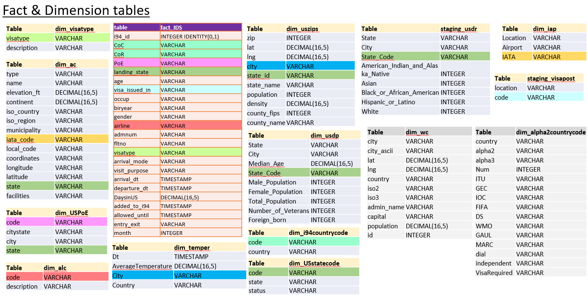

<a id="step4-dqc"></a>
### 4.2 Data Quality Checks
Data Quality Check is performed at two stages, 
1. In ```process-df.py```, after processing the dataframes, assert statements are added to validate if the dataframe has rows or not. 
2. In ```etl.py```, after loading, SQL statements to display counts are executed. 

<a id="step4-dd"></a>
### 4.3 Data dictionary 
<div>
Simple and straight forward table design is chosen which will help in building simple to complex queries for analytics. Some of the data fields name have been renamed to make it meaningful and easy to understand. 
</div>
<br>

[Click here to see the "Project Capstone - Data dictionary"](./data_dictionary/Data_dictionary-Project_Capstone.pdf)


<a id="step4-analytics"></a>
### 4.4 Analytics
<h4>Top visitors to US are from Mexico, China, Brazil and India.</h4>
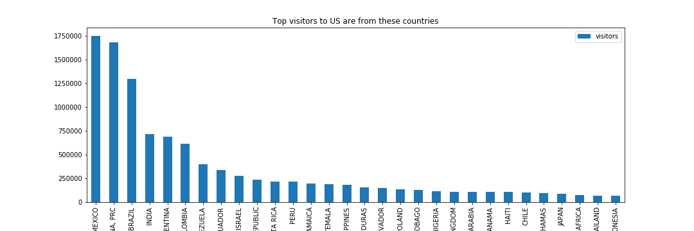

<h4>Most visited state in US seems to be Florida & California</h4>
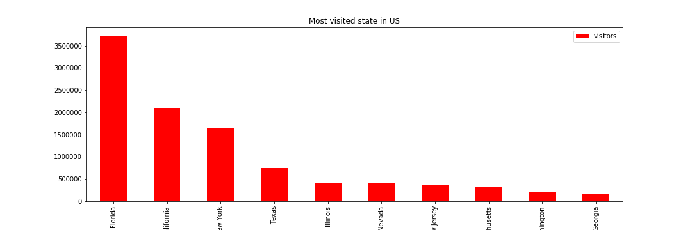

**Florida** is also sometimes referred to as the Sunshine State, and is a major tourist attraction due to its various beaches and parks. For example, Amelia Island is home to Fernandina Beach, which has unique features and a charming shrimping village that attracts vast numbers of travelers to the region. Other notable sites in Florida include the Castillo de San Marcos, Walt Disney World, the Everglades, South Beach, and the famous Overseas Highway, which connects the Florida Keys to the mainland.

**California** is the most visited state in the United States. The state's vast area is home to various vibrant cities, amusement parks, beaches and natural wonders that are popular among travelers from America and the rest of the world. Both Los Angeles and San Francisco are considered Gateway Cities, and are home to some of the most popular and recognizable tourist spots in the country. These include the Golden Gate Bridge, Disneyland, and Hollywood. Additionally, some of the national parks located in California are also significant tourist destinations. For example, Yosemite National Park in Northern California is well know for its tall mountains, valleys, and beautiful waterfalls.

<h4>Top reason to visit US seems to be for Pleasure</h4>


<h4>Tourists by Country & Age range</h4>
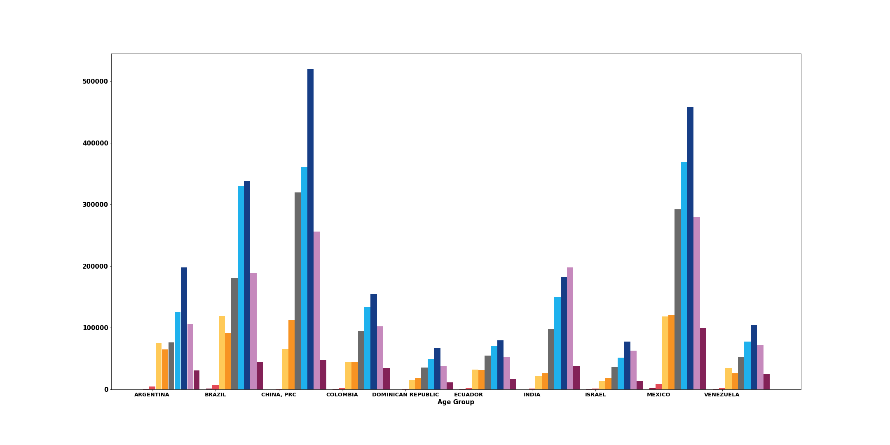
This graphs gives a lot of valuable information like,    

1. People of age between 40 - 55, travel a lot as that age range has the highest count except india.
2. In Indian bars, people between age 55-70 travel to US more(To visit kids, after retirement travel may be)

<h4>Visit purpose & Number of days stay in US </h4>
<h4>Student : Next to chinese are the indians</h4>
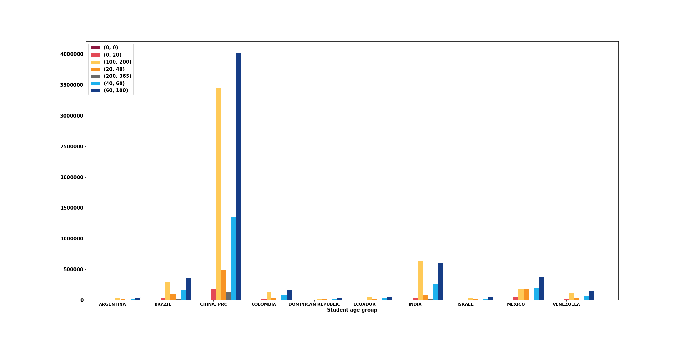

<h4>Business : In business again China tops, next is india, mexico and brazil</h4>
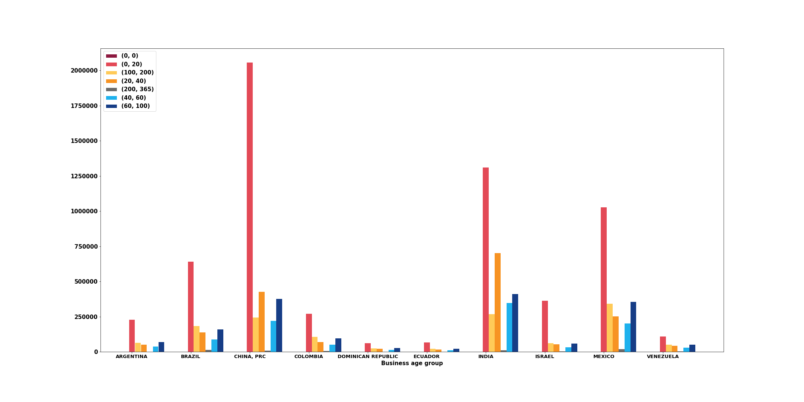

<h4>Pleasure : Indian tend to stay longer in US when compare to other countries in the range beween 60-100 & 100-200</h4>
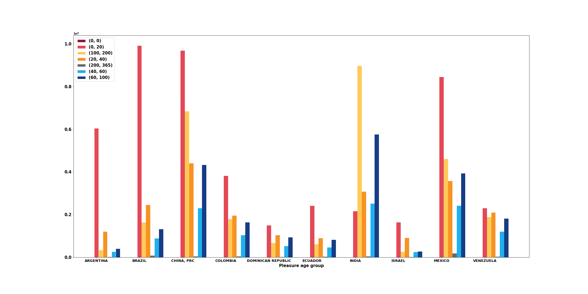

<h4>Gender by county - There are more females in US than males. :D Interesting</h4>
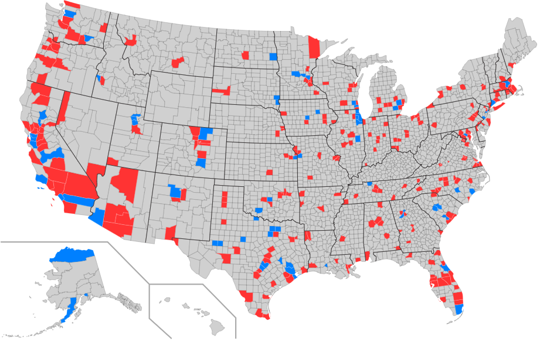


<h4>Major race in US is White</h4>
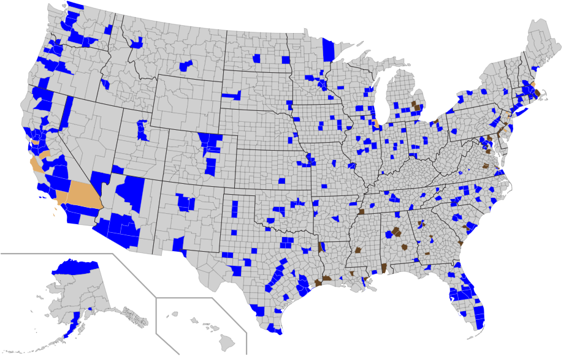
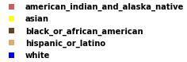

<h4>People like visiting Us during holiday season and other than Feb every month around 800k visitors are entering US.</h4>
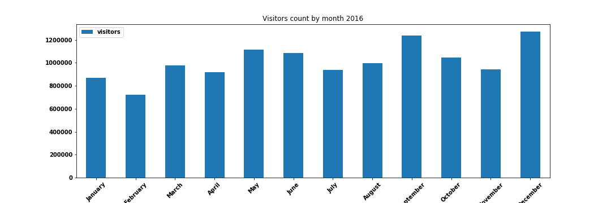

<h4>Weather map with Min, Avg & Max weather</h4>
<table>
<tr>
<td>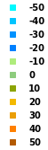</td>
<td>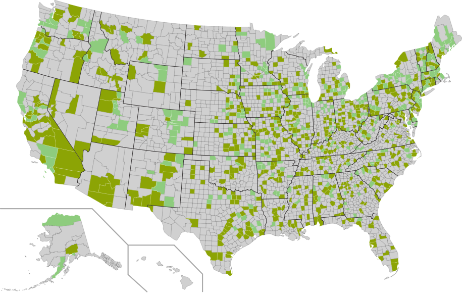</td>
</tr>
<tr>
<td></td>
<td>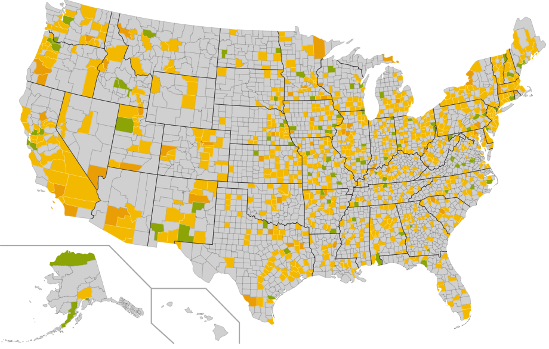</td>
</tr>
<tr>
<td></td>
<td>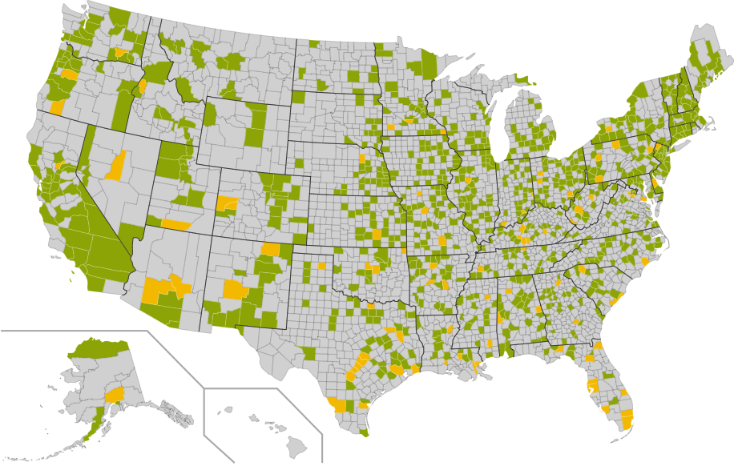</td>
</tr>
</table>

<h4>Global warming is happening!</h4>
There is a continous trend of increasing temperature in the last 100+ years 
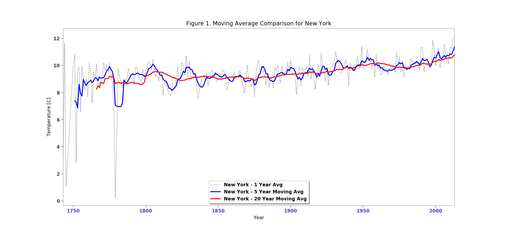
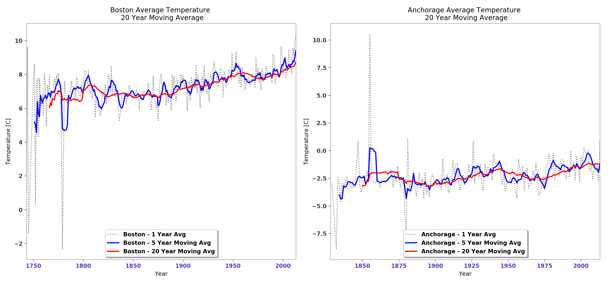


<a id="step5"></a>
### Step 5: Complete Project Write Up
<b>Tools &amp; Technologies</b>
<div>
    <ul>
        <li><b>Python</b> : Python is used as the programming language to perform the data analysis as it supports wide variety of libraries to perform tasks faster and community in Stack Overflow to help with any issues. </li>
        <li><b>Pandas</b> : Panda in Jupyter is used for initial data analysis. </li>
        <li><b>Spark</b> : Pyspark is used to process the Big data. </li>
        <li><b>AWS S3</b> : S3 used  for Storing processed outputs. </li>
        <li><b>AWS Redshift</b> : Redshift is used as warehousing database to perform query analysis. </li>
    </ul>
</div>

<b>Data updates</b>
<div>
    This being a Warehouse environment, all new data will be appended to the Fact &amp; Dimension tables not replaced.
    <ul>
        <li><b>Weekly</b> : Below tables hold static/reference data which can be updated once a week.</li>
            <ol>
                <li>dim_visatype</li>
                <li>dim_ac</li>
                <li>dim_USPoE</li>
                <li>dim_uszips</li>
                <li>dim_i94countrycode</li>
                <li>dim_alc</li>
                <li>dim_visapost</li>
                <li>dim_alpha2countrycode</li>
                <li>dim_iap</li>
                <li>dim_wc</li>
                <li>dim_USstatecode</li>            
            </ol>   
        <br>
        <li><b>Monthly</b> : Temperature data is collected 1st of every month and demographic data can be updated once a month </li>        
            <ul>
                <li>dim_temper</li>
                <li>dim_usdp</li>
                <li>dim_usdr</li>
            </ul>
    </ul>
</div>
<br>

### Alternative approach to solve problem under different scenarios
### The data was increased by 100x
To process 28Million rows by ```process-df.py``` takes around 9500-10k seconds thats around 2.5hrs in Udacity workspace. 100x more data probably would take 10x - 100x more time, thats lot of time. So approach would be, input data should be stored in S3 and data processing should be done in EMR. If the input data is zipped, it would save on S3 storage and Pyspark can read zip files. Redshift can handle 2.8 Billion rows easily as Single node of Redshift can handle of about 160GB and max 128 Compute nodes. Being a warehousing database of choice in AWS, it should handle it.

### The data populates a dashboard that must be updated on a daily basis by 7am every day
Scheduling can be setup based on answers following questions,
1. How often data is updated ?     
2. How clean input data will be ? 
3. Will the input data be available on time ?

If the scheduling is complex and if scheduler should handle failures, retries, backfills, logical conditions to run a job, retreive data from multiple databases or sources, it is better to go with a familiar tool like Airflow. For other simplistic purposes, CRON will suit. 

For this Capstone project, if data needs to be updated everyday to be presented in a dashboard, a simple cron job can be started at 3AM as the ```process-df.py``` could take around 3hours to complete and ```etl.py``` could take few minutes. It should complete before 7AM. 

If the data is increased by 100x, then we would need Airflow to handle error, retries and start EMR on demand to process huge volume of data. 

### The database needed to be accessed by 100+ people</b><br>
Redshift can support upto 500 connections, so 100+ people can easily connect to Redshift. 

But question should be, how much of data will be accessed by 100+ people ? 

**Pricing Analysis**     
```
Redshift : $5.00 per terabyte of data scanned
S3 Pricing : First 50 TB / Month is $0.023 per GB, So 1TB = $23

Udacity Capstone Data Size = 6GB

Redshift Cost for 6GB = $0.03
Redshift Cost for 100x data = 600GB = $3
If 100+ people scan 100x(600GB) data once = 100 * 600GB = 60TB = $5 * 60TB = $300

S3 Cost for 6GB = $0.138
S3 Cost for 100x data = 600GB = $13.8
If 100+ people scan 100x data(600GB) once = 100 * 600GB = 60TB = $133.68
```

For above calculation [AWS Pricing Calculator](https://calculator.s3.amazonaws.com/index.html) was used. S3 seems cheaper, but things can go pretty expensive quickly, if the environment is not controlled. So, users must be allowed to access only limited data. Volumes similar to production can be kept in UAT environment and development environment should have smaller subset of data. 

### Issues faced
* .CRC files : While uploading files to s3, it creates these CRC files, so when i try to run redshift ```COPY``` statement when those .CRC files are in the folder, COPY statement would fail.   
    **Solution** : Delete all those .CRC & _SUCCESS files from s3 bucket before running COPY statement.    

* Parquet files : Null fields will not be present in the parquet format, so COPY statement will fail wiith below error. Found the fields are missing the in the parquet format by using s3 "Select From" technique where in the s3 console you can select the file and see a preview of that file.

    ```
        COPY staging_ids FROM 's3://sushanth-dend-capstone-files/i94-apr16.parquet/' IAM_ROLE 'arn:aws:iam::164084742828:role/dwhRole' FORMAT AS PARQUET ;
        
    S3 Query Exception (Fetch)
    DETAIL:  
      -----------------------------------------------
      error:  S3 Query Exception (Fetch)
      code:      15001
      context:   Task failed due to an internal error. Unmatched number of columns between table and file. Table columns: 23, Data columns: 22, File name: https://s3.us-west-2.amazonaws.com/sushanth-dend-capstone-files/i94-apr16.parquet/part-00000-6034cb60-860e-4a6c-a86d-6
      query:     1867
      location:  dory_util.cpp:1119
      process:   fetchtask_thread [pid=1331]
      -----------------------------------------------
    ```
    **Solution** : Use CSV GZIP

* Plotly : Tried installing plotly for maps(```Choropleth Maps in Python```). Could get to run in Udacity Workspace. Lots of errors. So, went for other simpler approach, but issue with that approach is Legends it comes as a separate picture, but works. 


### Lessons learned
* Indentations : When copying code from jupyter to python file, need to take care of indentations. 
* Assertions : When processing dataframe via functions(i., input raw dataframe, output processed dataframe), check on all the factors you think that would make a valid processed dataframe, simplest is checking the counts. So add ```assert``` after retreiving dataframe from a function.
* [Redshift Uniqueness](https://docs.aws.amazon.com/redshift/latest/dg/t_Defining_constraints.html) : Uniqueness, primary key, and foreign key constraints are informational only; they are not enforced by Amazon Redshift.
* Redshift COPY statement : Unload data column order in dataset should match with Redshift table columns order. Otherwise COPY statement should be like ```copy venue(venueid, venuecity, venuestate) ``` meaning unload column order is ```venueid, venuecity, venuestate```
* Jupyter Graph Images : Sometimes cells don't refresh images even if the image is changed. You will have to copy the code and paste it in another cell. 

### Reference 
1. Distance Between Two Locations (Sphere) - https://simplemaps.com/resources/location-distance
1. World Cities - https://www.nationsonline.org/oneworld/cities.htm
1. https://catalog.data.gov/dataset/us-ports-of-entry
1. [Passport Number - i94 - Excel template](https://i94.cbp.dhs.gov/I94/assets/templates/I94-File-Upload-Template.xls)
    - Information from excel sheet
        * State code(char(2)) & State name
        * Country code(char(3)), country name, visa wavier indicator
        * Gender can be M/F/O
            * [According to facebook there are 58 genders](https://abcnews.go.com/blogs/headlines/2014/02/heres-a-list-of-58-gender-options-for-facebook-users)
1. [i94 travel/border crossing FAQs](https://travel.trade.gov/research/programs/i94/faqs.asp)
1. [U.S Demographics 2015](https://www.census.gov/acs/www/data/1.data-tables-and-tools/data-profiles/2015/)    
1. [Advanced Choropleth Maps - Kepler.gl](https://kepler.gl/)
1. [Weather Charts inspiration](http://berkeleyearth.lbl.gov/locations/39.38N-104.05W)
1. [Weather data analysis](https://www.shanelynn.ie/analysis-of-weather-data-using-pandas-python-and-seaborn/)
1. [fuzzywuzzy](https://github.com/seatgeek/fuzzywuzzy) - [Finding fuzzy duplicates](https://towardsdatascience.com/fuzzy-string-matching-in-python-68f240d910fe)
1. [Air Categories](https://www.faa.gov/airports/planning_capacity/passenger_allcargo_stats/categories/)
    <details>
    <summary>Click to see definition of Airport Categories</summary>
    <b>Definition of Airport Categories</b><br>
    <div>
    Commercial Service Airports are publicly owned airports that have at least 2,500 passenger boardings each calendar year and receive scheduled passenger service. Passenger boardings refer to revenue passenger boardings on an aircraft in service in air commerce whether or not in scheduled service. The definition also includes passengers who continue on an aircraft in international flight that stops at an airport in any of the 50 States for a non-traffic purpose, such as refueling or aircraft maintenance rather than passenger activity. Passenger boardings at airports that receive scheduled passenger service are also referred to as Enplanements.

    Nonprimary Commercial Service Airports are Commercial Service Airports that have at least 2,500 and no more than 10,000 passenger boardings each year.

    Primary Airports are Commercial Service Airports that have more than 10,000 passenger boardings each year. Hub categories for Primary Airports are defined as a percentage of total passenger boardings within the United States in the most current calendar year ending before the start of the current fiscal year. For example, calendar year 2014 data are used for fiscal year 2016 since the fiscal year began 9 months after the end of that calendar year. The table above depicts the formulae used for the definition of airport categories based on statutory provisions cited within the table, including Hub Type described in 49 USC 47102.

    Cargo Service Airports are airports that, in addition to any other air transportation services that may be available, are served by aircraft providing air transportation of only cargo with a total annual landed weight of more than 100 million pounds. "Landed weight" means the weight of aircraft transporting only cargo in intrastate, interstate, and foreign air transportation. An airport may be both a commercial service and a cargo service airport.

    Reliever Airports are airports designated by the FAA to relieve congestion at Commercial Service Airports and to provide improved general aviation access to the overall community. These may be publicly or privately-owned.

    General Aviation Airports are public-use airports that do not have scheduled service or have less than 2,500 annual passenger boardings (49 USC 47102(8)). Approximately 88 percent of airports included in the NPIAS are general aviation.

    * Terms : 1 Enplanement equal to 1 passenger boards an aircraft

    </div>
    </details>
1. [List of states and territories of the United States](https://en.wikipedia.org/wiki/List_of_states_and_territories_of_the_United_States#Territories)    
US consists of 50 states, 48 contiguous states and Washington, D.C., are in North America between Canada and Mexico, while Alaska is in the far northwestern part of North America and Hawaii is an archipelago in the mid-Pacific.

    United States has sovereignty over 14 territories of which only 5 are inhabited(American Samoa, Guam, Northern Mariana Islands, Puerto Rico, US Virgin Islands)

1. Difference between ICA0 & IATA Codes ?    
* ICAO (International Civil Aviation Organization) is a UN-body which focusses on international harmonization of civil aviation regulations.
ICAO codes are used for "official" purposes such as Air Traffic Control; E.g. flight plans use ICAO codes for airports and airline flight identification.

* IATA (International Air Transport Association) is a trade association that focusses on making air traffic businesses safe, secure, reliable and efficient. IATA codes are mainly used for ticketing. E.g. travel itineraries use IATA codes for airports and IATA flight numbers.